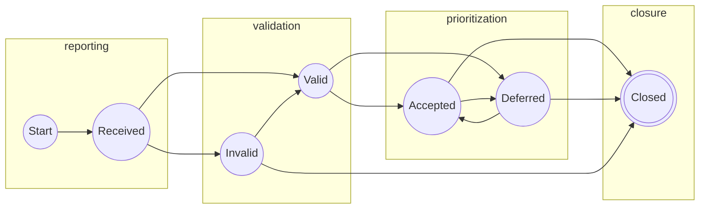
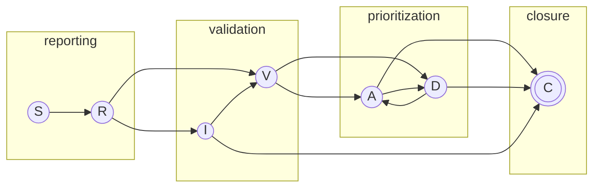
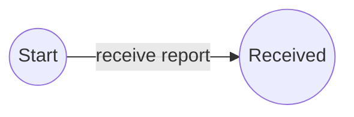
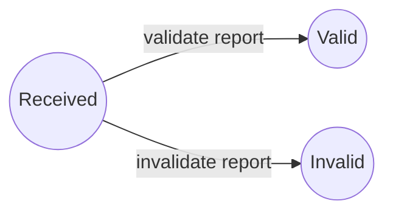
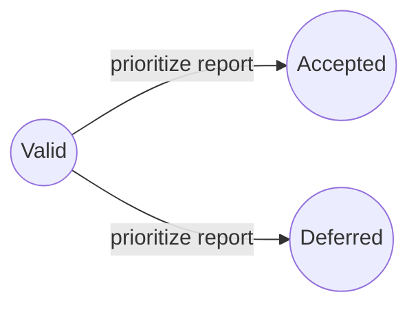
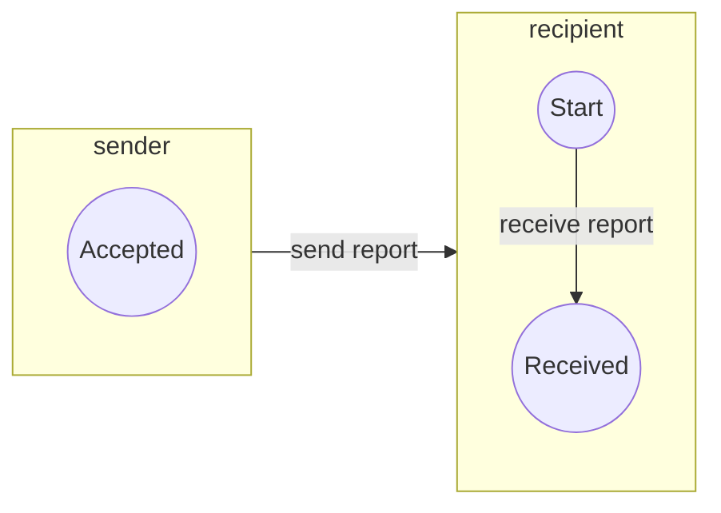
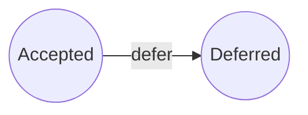
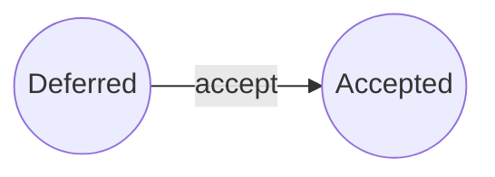
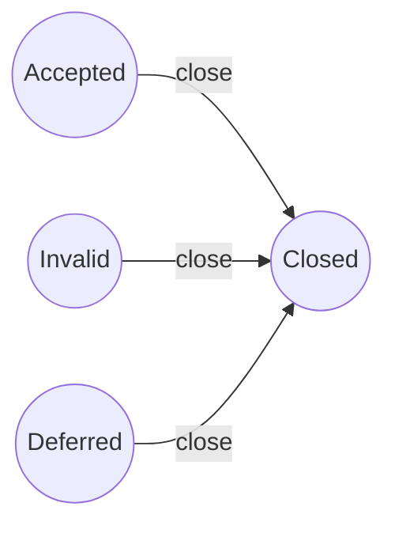
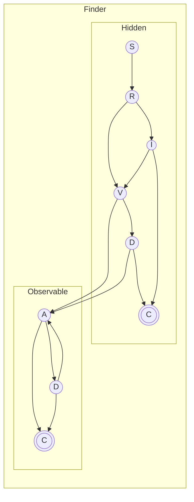

# Report Management Process Model

In this page, we describe a high-level workflow for
CVD
RM. The
RM process should be
reasonably familiar to anyone familiar with ITSM workflows such as problem, change,
incident or service request management. In particular, any workflow in
which work items (e.g., incident reports, problem tickets, change
requests) are received, validated, prioritized, and work is subsequently
completed, should map onto the RM process outlined in this chapter.

In the interest of maintaining the potential for interoperability among
different organizations' internal processes, our protocol does not
specify intra-organizational subprocesses within each state, although we
give examples of such subprocesses in
§[\[sec:do_work\]](#sec:do_work){reference-type="ref"
reference="sec:do_work"}. For further reference, ISO/IEC 30111:2019(E)
[@ISO30111] provides recommendations for Vendors' *internal* processes
that can be mapped into the RM process. We provide such a mapping in
Appendix
[\[app:iso_crosswalk\]](#app:iso_crosswalk){reference-type="ref"
reference="app:iso_crosswalk"}.

## RM State Machine

In this section, we first cover the states themselves before proceeding
to a discussion of the transitions between them. Next, we provide a
discussion of the Participant-specific semantics of the state
transitions. We use DFA notation to describe our
RM model.

is defined as a 5-tuple $(\mathcal{Q},q_0,\mathcal{F},\Sigma,\delta)
~$[@kandar2013automata]:

-   $\mathcal{Q}$ is a finite set of states.

-   $q_0 \in \mathcal{Q}$ is an initial state.

-   $\mathcal{F} \subseteq \mathcal{Q}$ is a set of final (or accepting)
    states.

-   $\Sigma$ is a finite set of input symbols.

-   $\delta$ is a transition function
    $\delta: \mathcal{Q} \times \Sigma \xrightarrow{} \mathcal{Q}$.

### RM States

Our proposed RM DFA models a report lifecycle containing seven states, defined below.

$$\label{eq:rm_states}
    \begin{split}
    \mathcal{Q}^{rm} = \{ & \underline{S}tart,
                            ~\underline{R}eceived,
                            ~\underline{I}nvalid,
                            ~\underline{V}alid, \\
                          & ~\underline{A}ccepted,
                            ~\underline{D}eferred, 
                            ~\underline{C}losed \}
    \end{split}$$

In this example, we use underlined capital letters as a shorthand for
the state names. We use this convention throughout the remainder of this
report. Each Participant in a CVD case will have their own
RM state.

RM states are not the same as CVD case states. Case states follow the Householder-Spring model summarized
in §[\[sec:model\]](#sec:model){reference-type="ref" reference="sec:model"}, as originally described in the 2021 report
[@householder2021state]. Further discussion of the interactions of the RM and CS models is found
in §[\[sec:rm_cvd\]](#sec:rm_cvd){reference-type="ref"
reference="sec:rm_cvd"}.

#### The _Start_ (_S_) State

The $Start$ state is a simple placeholder state for reports that have
yet to be received. It is, in effect, a null state that no
CVD Participant
would be expected to reflect in their report tracking system. We include
it here because it will become useful when we are modeling coordination
that spans multiple Participants in a formal protocol in Chapter
[\[sec:formal_protocol\]](#sec:formal_protocol){reference-type="ref"
reference="sec:formal_protocol"}. Otherwise, the discussion until then
will mostly ignore it.

#### The _Received_ (_R_) State

Reports initially arrive in the $Received$ state.

Vendors lacking the ability to receive reports will find it exceedingly
difficult if not impossible to participate in the
CVD process.
Therefore,

-   Vendors SHOULD have a clearly defined and publicly available
    mechanism for receiving reports.

Similarly, those who coordinate others' responses to vulnerability
reports also need to have a report receiving capability; otherwise, they
are not capable of coordinating vulnerability disclosures. Hence,

-   Coordinators MUST have a clearly defined and publicly available
    mechanism for receiving reports.

Exiting the $Received$ state requires a Participant to assess the
validity of a report. Note that validation is distinct from
prioritization, as covered in
§[1.1.1.4](#sec:rm_state_v){reference-type="ref"
reference="sec:rm_state_v"}. As an example, a Vendor might later choose
to $defer$ further response on a $Valid$ report due to other priorities.

Validity criteria need not be limited to technical analysis. For
instance, a Coordinator might only accept reports within their specific
scope of concern and consider reports outside their scope to be
$Invalid$ even if they believe the report accurately describes a real
vulnerability. Alternatively, a Vendor might institute a policy
designating reports unaccompanied by a working proof-of-concept exploit
as $Invalid$ by default.

-   All Participants SHOULD have a clearly defined process for
    validating reports in the $Received$ state.

-   Participants SHOULD perform at least a minimal credibility check on
    reports as a minimum validation process before exiting the
    $Received$ state.

-   Participants MAY perform a more technical report validation process
    before exiting the $Received$ state.

-   Regardless of the technical rigor applied in the validation process,
    Participants SHOULD proceed only after validating the reports they
    receive.

-   Participants SHOULD transition all valid reports to the $Valid$
    state and all invalid reports to the $Invalid$ state.

-   Regardless of the content or quality of the initial report, once a
    Vendor confirms that a reported vulnerability affects one or more of
    their product(s) or service(s), the Vendor SHOULD designate the
    report as $Valid$.

#### The _Invalid_ (_I_) State

Reports in the $Invalid$ state have been evaluated and found lacking by
the recipient. This state allows time for the Reporter to provide
additional information and for the receiver to revisit the validation
before moving the report to $Closed$.

The reasons for a report to be put in this state will vary based on each
recipient's validation criteria, and their technical capability and
available resources. The $Invalid$ state is intended to be used as a
temporary holding place to allow for additional evidence to be sought to
contradict that conclusion.

-   Participants SHOULD temporarily hold reports that they cannot
    validate pending additional information.

-   Participants SHOULD provide Reporters an opportunity to update their
    report with additional information in support of its validity before
    closing the report entirely.

-   Participants MAY set a timer to move reports from $Invalid$ to
    $Closed$ after a set period of inactivity.

#### The _Valid_ (_V_) State

Reports in the $Valid$ state are ready to be prioritized for possible
future work. The result of this prioritization process will be to either
accept the report for follow-up or defer further effort.

-   Once a report is in the $Valid$ state, Participants MAY choose to
    perform a shallow technical analysis on it to prioritize any further
    effort relative to other work.

-   Participants SHOULD have a bias toward accepting rather than
    deferring cases up to their work capacity limits.

In other words, prioritization is only necessary if the workload
represented by active valid reports exceeds the organization's capacity
to process those reports.

Prioritization schemes, such as SSVC [@spring2021ssvc] or the
CVSS [@first2019cvss31], are commonly used to
prioritize work within the CVD process; however, specific details are
left to Participant-specific implementation.[^1]

#### The _Accepted_ (_A_) State

The $Accepted$ state is where the bulk of the work for a given
CVD Participant
occurs. Reports reach this state for a Participant only once the
Participant has deemed the report to be both valid and of sufficient
priority to warrant further action. The $Accepted$ state has a different
meaning for each different Participant.

-   For our purposes, Finders/Reporters enter the $Accepted$ state only
    for reports that they intend to put through the
    CVD process. If
    they have no intention of pursuing CVD, there is no need for them to track
    their actions using this protocol. See
    §[1.2.1](#sec:finder_hidden){reference-type="ref"
    reference="sec:finder_hidden"}.

-   Vendors usually do root cause analysis, understand the problem, and
    produce a fix or mitigation.

-   Coordinators typically identify potentially affected Vendors, notify
    them, and possibly negotiate embargoes.

We provide additional elaboration on the sorts of activities that might
happen in the $Accept$ state in
§[\[sec:do_work\]](#sec:do_work){reference-type="ref"
reference="sec:do_work"}.

-   A report MAY enter and exit the $Accepted$ state a number of times
    in its lifespan as a Participant resumes or pauses work (i.e.,
    transitions to/from the $Deferred$ state).

#### The _Deferred_ (_D_) State

The $Deferred$ state is reserved for valid, unclosed reports that are
otherwise not being actively worked on (i.e., those in $Accepted$). It
parallels the $Invalid$ state for reports that fail to meet the
necessary validation criteria in that both states are awaiting closure
once it is determined that no further action is necessary.

For example, a Participant might use the $Deferred$ state when a valid
report fails to meet their prioritization criteria
[\[eq:prioritize_report\]](#eq:prioritize_report){reference-type="eqref"
reference="eq:prioritize_report"}, or when a higher priority task takes
precedence over an active report, as in
[\[eq:pause_report\]](#eq:pause_report){reference-type="eqref"
reference="eq:pause_report"}.

-   A report MAY enter and exit the $Deferred$ state a number of times
    in its lifespan as a Participant pauses or resumes work (i.e.,
    transitions from/to the $Accepted$ state).

-   Reports SHOULD exit the $Deferred$ state when work is resumed
    [\[eq:resume_report\]](#eq:resume_report){reference-type="eqref"
    reference="eq:resume_report"}, or when the Participant has
    determined that no further action will be taken
    [\[eq:close_report\]](#eq:close_report){reference-type="eqref"
    reference="eq:close_report"}.

-   CVD Participants MAY set a policy timer on reports in the $Deferred$
    state to ensure they are moved to $Closed$ after a set period of
    inactivity.

#### The _Closed_ (_C_) State

The $Closed$ state implies no further work is to be done; therefore, any
pre-closure review (e.g., for quality assurance purposes) should be
performed before the case moves to the $Closed$ state (i.e., while the
report is in $Invalid$, $Deferred$, or $Accepted$).

-   Reports SHOULD be moved to the $Closed$ state once a Participant has
    completed all outstanding work tasks and is fairly sure that they
    will not be pursuing any further action on it.

#### RM Start and End States

The RM process
starts in the $Start$ state.

$$\label{eq:rm_start_state}
    q^{rm}_0 = Start$$

The RM process ends
in the $Closed$ state.

$$\label{eq:rm_end_states}
    \mathcal{F}^{rm} = \{Closed\}$$

### RM

The actions performed in the RM process represent the allowed state
transitions in the corresponding DFA.

-   A Participant's RM process begins when the Participant
    $receive$s a report.

-   Each Participant SHOULD subject each $Received$ report to some sort
    of validation process, resulting in the report being designated as
    $valid$ or $invalid$ based on the Participant's particular criteria.

In other words, the $Received$ state corresponds to the Validation phase
of *The CERT Guide to Coordinated Vulnerability Disclosure*
[@householder2017cert].

-   For $Valid$ reports, the Participant SHOULD perform a prioritization
    evaluation to decide whether to $accept$ or $defer$ the report for
    further work.

Similarly, the $Valid$ state is equivalent to the Prioritization
(Triage) phase of the *CVD Guide* [@householder2017cert]. The
SSVC model is
illustrative here, although any prioritization scheme could be
substituted as long as it emits a result that can be mapped onto the
semantics of "continue work" or "defer further
action" [@spring2021ssvc]. Appendix
[\[app:ssvc_mpcvd_protocol\]](#app:ssvc_mpcvd_protocol){reference-type="ref"
reference="app:ssvc_mpcvd_protocol"} takes a closer look at how
SSVC fits into the
protocol we are defining.

-   Participants SHOULD $close$ reports that require no further work
    (e.g., those that have been in $Invalid$ or $Deferred$ for some
    length of time, or those in $Accepted$, where all necessary tasks
    are complete.)

These actions constitute the set of symbols for the
RM
DFA, as shown in
[\[eq:rm_transitions\]](#eq:rm_transitions){reference-type="eqref"
reference="eq:rm_transitions"}.

$$\label{eq:rm_transitions}
    \Sigma^{rm} = \{\underline{r}eceive,~\underline{v}alidate,~\underline{i}nvalidate,~\underline{a}ccept,~\underline{d}efer,~\underline{c}lose \}$$

#### RM Transitions Defined

In this section, we define the allowable transitions between states in
the RM process
model. The RM
process, including its states and transitions, is depicted in Figure
[\[fig:rm_states\]](#fig:rm_states){reference-type="ref"
reference="fig:rm_states"}.

To begin, a Participant must receive a report. Recall that the $Start$
state is a placeholder, so this action simply puts the receiving
Participant into the $Received$ state at the beginning of their
involvement in the case. $$\label{eq:receive_report}
     

The Participant must validate the report to exit the $Received$ state.
Depending on the validation outcome, the report will be in either the
$Valid$ or $Invalid$ state. $$\label{eq:report_validation}

Once a report has been validated (i.e., it is in the
RM $Valid$ state,
$q^{rm} \in V$), the Participant must prioritize it to determine what
further effort, if any, is necessary. Appendix
[\[app:ssvc_mpcvd_protocol\]](#app:ssvc_mpcvd_protocol){reference-type="ref"
reference="app:ssvc_mpcvd_protocol"} contains an example of how the
SSVC model can be
applied here, although any prioritization scheme could be substituted.
Prioritization ends with the report in either the $Accepted$ or
$Deferred$ state.

Some Participants (e.g., Finders and Coordinators) need to engage
someone else (e.g., a Vendor) to resolve a case. To do this, the
$sender$ Participants must also be in the $Accepted$ state; otherwise,
why are they working on the case? In the following equation, we use
brackets and subscripts to indicate the interaction between two
instances of the RM
model: one bracket represents the $sender$ and $receiver$ states before
the message is transmitted, while the other is for the end state of both
Participants. Although the $sender$'s state does not change, the
$recipient$'s state moves from $Start$ to $Received$.

A Participant might choose to pause work on a previously $Accepted$
report after revisiting their prioritization decision. When this
happens, the Participant moves the report to the $Deferred$ state.

Similarly, a Participant might resume work on a $Deferred$ report,
moving it to the $Accepted$ state.

Finally, a Participant can complete work on an $Accepted$ report or
abandon further work on an $Invalid$ or $Deferred$ report.

Our model assumes that $Valid$ reports cannot be closed directly without
first passing through either $Accepted$ or $Deferred$. It is reasonable
to wonder why $close$ is not a valid transition from the $Valid$ state.
The answer is that we wanted to allow prioritization and closure to be
distinct activities; deferral is reversible, whereas closure is not.
Often a Participant might initially $defer$ a case only to resume work
later, once more information has arrived. However, there is nothing
stopping a Participant from instituting a process that goes from $Valid$
to $Deferred$ to $Closed$ in rapid (even immediate) succession.

#### RM

Following the state machine diagram in Figure
[\[fig:rm_states\]](#fig:rm_states){reference-type="ref"
reference="fig:rm_states"}, equation
[\[eq:rm_grammar\]](#eq:rm_grammar){reference-type="eqref"
reference="eq:rm_grammar"} represents the RM process model as a right-linear grammar:

$$\label{eq:rm_grammar}
\delta^{rm} = 
\begin{cases}
S & \to rR \\
R & \to vV~|~iI \\
I & \to vV~|~cC \\
V & \to aA~|~dD \\
A & \to dD~|~cC \\
D & \to aA~|~cC \\
C & \to \epsilon \\
\end{cases}$$

The strings generated in the language defined by this grammar can be
useful for exploring the possible sequences of states each report might
encounter for each Participant. The 15 shortest paths are $ric$, $rvac$,
$rvdc$, $rivac$, $rivdc$, $rvadc$, $rvdac$, $rivadc$, $rvadac$,
$rvdadc$, $rivdac$, $rivdadc$, $rvdadac$, $rivadac$, and $rvadadc$. Due
to the structure of the RM DFA, longer strings just add more
$defer$-$accept$ ($da$) or $accept$-$defer$ ($ad$) cycles prior to
closure ($c$). The usually limited duration of the
RM process coupled
with the tendency for CVD Participants to prefer to avoid frequent
starts and stops means that we expect the vast majority of reports to
follow one of the above paths, with the remainder falling into marginal
extensions. Further discussion of a reward function to evaluate
RM
DFA strings is
discussed as future work in
§[\[sec:rm_reward_function\]](#sec:rm_reward_function){reference-type="ref"
reference="sec:rm_reward_function"}.

### RM]{acronym-label="RM" acronym-form="singular+short"} [DFA Fully Defined

Taken in combination, the full definition of the RM DFA
$(\mathcal{Q},q_0,\mathcal{F},\Sigma,\delta)^{rm}$ is given by equations
[\[eq:rm_states\]](#eq:rm_states){reference-type="eqref"
reference="eq:rm_states"},
[\[eq:rm_start_state\]](#eq:rm_start_state){reference-type="eqref"
reference="eq:rm_start_state"},
[\[eq:rm_end_states\]](#eq:rm_end_states){reference-type="eqref"
reference="eq:rm_end_states"},
[\[eq:rm_transitions\]](#eq:rm_transitions){reference-type="eqref"
reference="eq:rm_transitions"}, and
[\[eq:rm_grammar\]](#eq:rm_grammar){reference-type="eqref"
reference="eq:rm_grammar"}. For convenience, we assembled them into
[\[eq:rm_dfa\]](#eq:rm_dfa){reference-type="eqref"
reference="eq:rm_dfa"}.

$$\label{eq:rm_dfa}
    RM = 
    \begin{pmatrix}
            \begin{aligned}
                \mathcal{Q}^{rm} = & \{ S,R,I,V,A,D,C \}, &\textrm{\small{\eqref{eq:rm_states}}} \\
                q^{rm}_0 = & S, &\textrm{\small{\eqref{eq:rm_start_state}}} \\
                \mathcal{F}^{rm} = & \{ C \}, &\textrm{\small{\eqref{eq:rm_end_states}}} \\
                \Sigma^{rm} = & \{ r,i,v,a,d,c \}, &\textrm{\small{\eqref{eq:rm_transitions}}} \\
                \delta^{rm} = &
                    \begin{cases}
                        S \to & rR \\
                        R \to & vV~|~iI \\
                        I \to & vV~|~cC \\
                        V \to & aA~|~dD \\
                        A \to & dD~|~cC \\
                        D \to & aA~|~cC \\
                        C \to & \epsilon \\
                    \end{cases}
                    &\textrm{\small{\eqref{eq:rm_grammar}}}
            \end{aligned}
    \end{pmatrix}$$

## RM

State transitions represent messaging opportunities to communicate CVD
case status among Participants.

-   CVD Participants SHOULD announce their RM state transitions to the other
    Participants in a case.

This is the lynchpin that makes the RM model point toward a technical
protocol. Every state transition implies a different message type.

### The Secret Lives of Finders {#sec:finder_hidden}

While the Finder's $Received$, $Valid$, and $Invalid$ states are useful
for modeling and simulation purposes, they are less useful to us as part
of a potential CVD
protocol. Why? Because for anyone else to know about the vulnerability
(and as a prerequisite to CVD happening at all), the Finder must have
already validated the report and prioritized it as worthy of further
effort to have any reason to attempt to coordinate its disclosure. In
other words, CVD only starts *after* the Finder has already reached the
$Accepted$ state for any given vulnerability to be reported.
Correspondingly, this also represents their transition from *Finder* to
*Reporter*. Nevertheless, for now, we retain these states for
completeness. We revisit this topic in our derivation of a protocol
state model for Reporters in
§[\[sec:other_participants\]](#sec:other_participants){reference-type="ref"
reference="sec:other_participants"}.

### RM Interactions Between CVD Participants

Each Participant in a case has their own instance of the RM state model.
Participants can change their local state independent of the state of other Participants.
Events within a CVD case may trigger a state transition in one Participant while no transition occurs in another.
For example, the *notify another Participant* action in [\[eq:notify_participant\]](#eq:notify_participant){reference-type="eqref"
reference="eq:notify_participant"} shows that even though the $sender$
is the one taking the action, it is the $recipient$'s state that
changes. Table
[\[tab:participant_rm_actions\]](#tab:participant_rm_actions){reference-type="ref"
reference="tab:participant_rm_actions"} lists role-based actions. A few
examples of this model applied to common CVD and MPCVD case scenarios follow.

##### Finder-Vendor CVD.

A simple Finder-Vendor CVD scenario is shown in Figure
[\[fig:rm_states_chain\]](#fig:rm_states_chain){reference-type="ref"
reference="fig:rm_states_chain"}. As explained in
§[1.2.1](#sec:finder_hidden){reference-type="ref"
reference="sec:finder_hidden"}, many of the Finder's states would be
hidden from view until they reach the $Accepted$ ($A_f$) state. The
$receive$ action bridging $A_f \xrightarrow{r} R_v$ corresponds to the
*notify other participants* action defined by
[\[eq:notify_participant\]](#eq:notify_participant){reference-type="eqref"
reference="eq:notify_participant"}.

##### Finder-Coordinator-Vendor CVD.

A slightly more complicated scenario in which a Finder engages a
Coordinator after failing to reach a Vendor is shown in Figure
[\[fig:rm_states_chain_3\]](#fig:rm_states_chain_3){reference-type="ref"
reference="fig:rm_states_chain_3"}. This scenario is very common in our
experience at the CERT/CC, which should come as no surprise
considering our role as a Coordinator means that we do not participate
in cases following the previous example. Here we see three notification
actions corresponding to
[\[eq:notify_participant\]](#eq:notify_participant){reference-type="eqref"
reference="eq:notify_participant"}:

-   First, $A_f \xrightarrow{r_0} R_v$ represents the Finder's initial
    attempt to reach the Vendor.

-   Next, $A_f \xrightarrow{r_1} R_c$ is the Finder's subsequent attempt
    to engage with the Coordinator.

-   Finally, the Coordinator contacts the Vendor in
    $A_c \xrightarrow{r_2} R_v$.

##### MPCVD with a Coordinator and Multiple Vendors.

A small MPCVD
scenario is shown in Figure
[\[fig:rm_states_chain_4\]](#fig:rm_states_chain_4){reference-type="ref"
reference="fig:rm_states_chain_4"}. As with the other examples, each
notification shown is an instance of the *notify other participants*
action from
[\[eq:notify_participant\]](#eq:notify_participant){reference-type="eqref"
reference="eq:notify_participant"}. Contrary to the previous example,
this scenario starts with the Finder contacting a Coordinator, perhaps
because they recognize the increased complexity of coordinating multiple
Vendors' responses.

-   First, $A_f \xrightarrow{r_0} R_c$ represents the Finder's initial
    report to the Coordinator.

-   Next, $A_c \xrightarrow{r_1} R_{v_1}$ shows the Coordinator
    contacting the first Vendor.

-   Finally, the Coordinator contacts a second Vendor in
    $A_c \xrightarrow{r_2} R_{v_2}$.

##### A Menagerie of MPCVD Scenarios.

Other MPCVD
RM interaction
configurations are possible, of course. We demonstrate a few such
scenarios in Figure
[\[fig:mpcvd_menagerie\]](#fig:mpcvd_menagerie){reference-type="ref"
reference="fig:mpcvd_menagerie"}, where this time each circle represents
a Participant's entire RM model. We have observed all of the
following interactions at the CERT/CC:

-   A Finder notifies multiple Vendors without engaging a Coordinator
    (Figure
    [\[fig:mpcvd_finder_vendors_no_coord\]](#fig:mpcvd_finder_vendors_no_coord){reference-type="ref"
    reference="fig:mpcvd_finder_vendors_no_coord"}).

-   A Finder notifies a Vendor, who, in turn, notifies other Vendors
    (Figure
    [\[fig:mpcvd_vendor_vendors_no_coord\]](#fig:mpcvd_vendor_vendors_no_coord){reference-type="ref"
    reference="fig:mpcvd_vendor_vendors_no_coord"}) or engages a
    Coordinator to do so (Figure
    [\[fig:mpcvd_vendor_with_coord\]](#fig:mpcvd_vendor_with_coord){reference-type="ref"
    reference="fig:mpcvd_vendor_with_coord"}).

-   Supply-chain oriented MPCVD often has two or more tiers of
    Vendors being notified by their upstream component suppliers, with
    or without one or more Coordinators' involvement (Figure
    [\[fig:mpcvd_supply_chain\]](#fig:mpcvd_supply_chain){reference-type="ref"
    reference="fig:mpcvd_supply_chain"}).

We intend the RM
model to be sufficiently composable to accommodate all such
permutations.

### RM State Subsets

Before proceeding, we pause to define a few useful subsets of
RM states
($\dots \subset \mathcal{Q}^{rm}$) for future use:

$$\label{eq:Qrm_subsets}
    \begin{align}
        Open &= \{ R,I,V,D,A \} \\
        Valid~Yet~Unclosed &= \{ V,D,A \} \\
        Potentially~Valid~Yet~Unclosed &= \{ R,V,D,A\} \\
        Active &= \{ R,V,A \} \\
        Inactive &= \{ I,D,C \} 
    \end{align}$$

[^1]: See also Appendix
    [\[app:ssvc_mpcvd_protocol\]](#app:ssvc_mpcvd_protocol){reference-type="ref"
    reference="app:ssvc_mpcvd_protocol"}, where we connect a few of the
    dots between SSVC and this protocol model.
