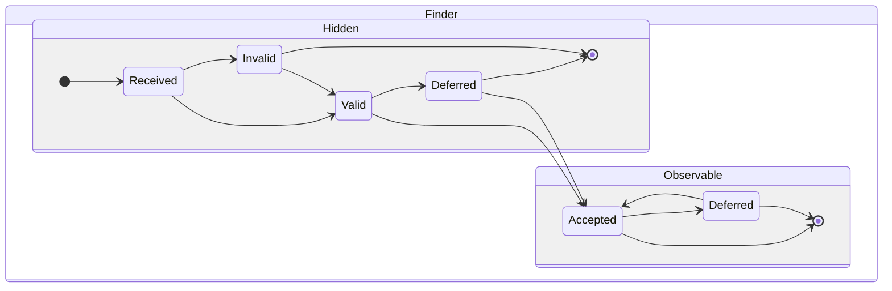
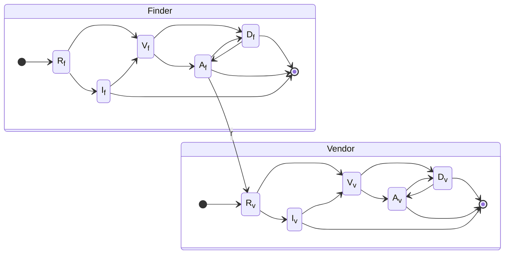
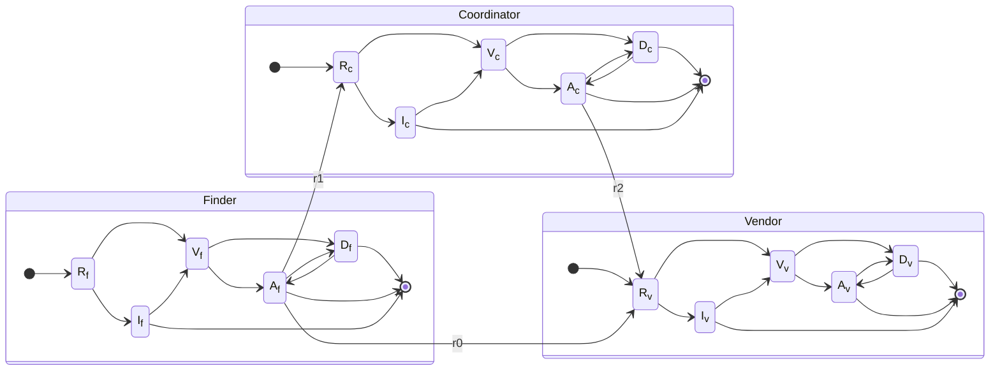
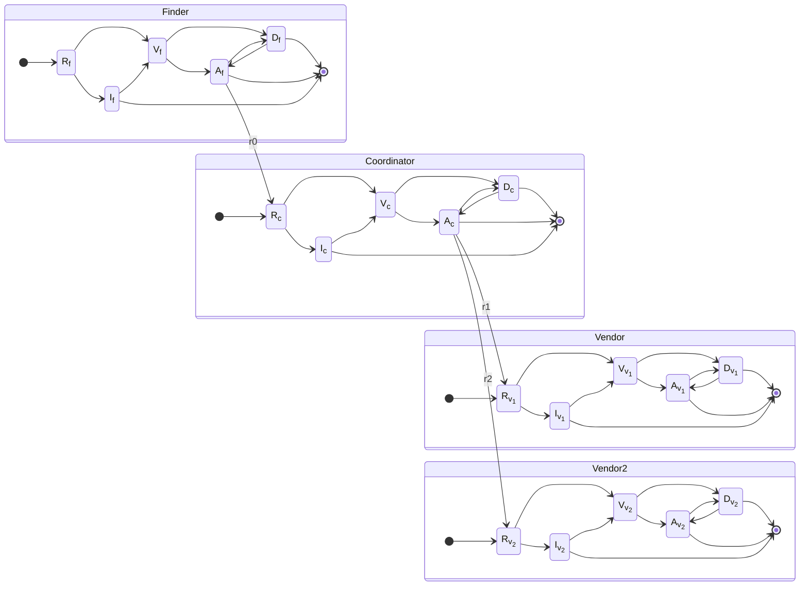
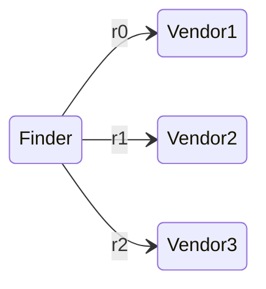
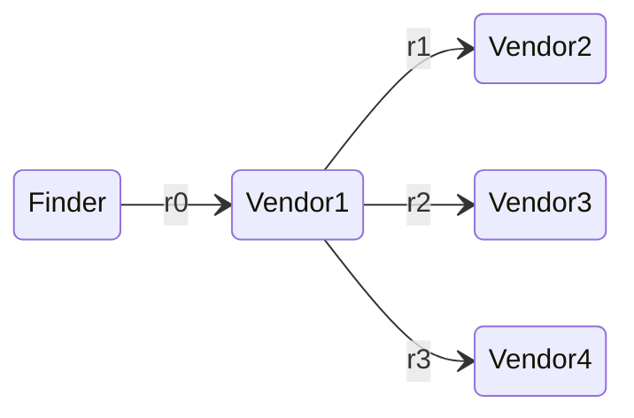
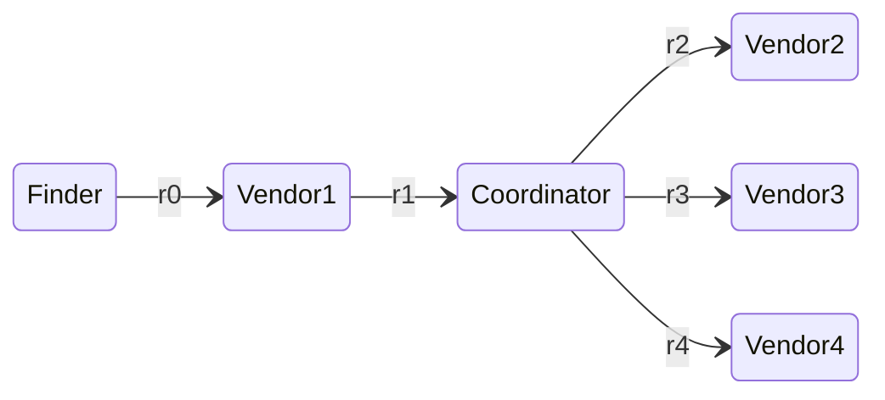
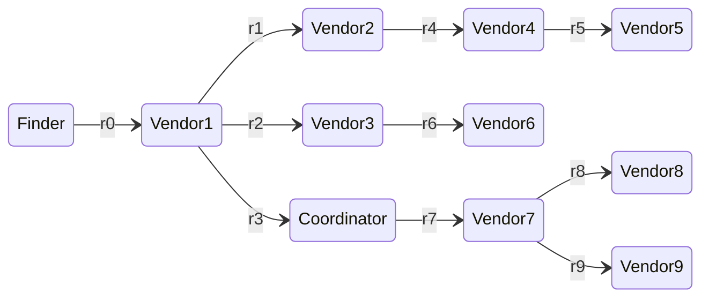

# Report Management Interactions Between CVD Participants

Each Participant in a case has their own instance of the RM state model.
Participants can change their local state independent of the state of other Participants.
Events within a CVD case may trigger a state transition in one Participant while no transition occurs in another.
For example, in [particpants interact from the accepted state](#participants-interact-from-the-accepted-state) we showed
that even though the _sender_ is the one taking the action, it is the _recipient_'s state that changes.
The table below lists role-based actions. 

| Finder/Reporter  |      Vendor       |    Coordinator    | Action                                  | RM Transition  |
|:----------------:|:-----------------:|:-----------------:|-----------------------------------------|:-------------:|
| :material-check: |                   |                   | Discover Vulnerability (hidden)         |            |
| :material-check: |                   |                   | Analyze Discovery (hidden)              |            |
| :material-check: |                   |                   | Decide whether to initiate CVD (hidden) |            |
| :material-check: | :material-check: | :material-check: | Notify Vendor                           |            |
| :material-check: | :material-check: | :material-check: | Notify Coordinator                      |            |
|         | :material-check: | :material-check: | Receive Report                          |            |
|         | :material-check: | :material-check: | Validate Report                         |            |
| :material-check: | :material-check: | :material-check: | Prioritize Report                       |            |
| :material-check: | :material-check: | :material-check: | Pause Work                              |            |
| :material-check: | :material-check: | :material-check: | Resume Work                             |            |
| :material-check: | :material-check: | :material-check: | Close Report                            |            |

A few examples of this model applied to common CVD and MPCVD case scenarios follow.

## The Secret Lives of Finders

While the Finder's _Received_, _Valid_, and _Invalid_ states are useful
for modeling and simulation purposes, they are less useful to us as part
of a potential CVD protocol. Why? Because for anyone else to know about the vulnerability
(and as a prerequisite to CVD happening at all), the Finder must have
already validated the report and prioritized it as worthy of further
effort to have any reason to attempt to coordinate its disclosure. In
other words, CVD only starts *after* the Finder has already reached the
_Accepted_ state for any given vulnerability to be reported.
Correspondingly, this also represents their transition from *Finder* to
*Reporter*. Nevertheless, for now, we retain these states for
completeness. We revisit this topic in our derivation of a protocol
state model for Reporters in
{== §[\[sec:other_participants\]](#sec:other_participants){reference-type="ref"
reference="sec:other_participants"} ==}.

## Finder-Vendor CVD.

A simple Finder-Vendor CVD scenario is shown below.
As explained [above](#the-secret-lives-of-finders), many of the Finder's states would be
hidden from view until they reach the _Accepted_ ($A_f$) state. The
_receive_ action bridging $A_f \xrightarrow{r} R_v$ corresponds to the
[participants interact from the accepted state](#participants-interact-from-the-accepted-state) scenario above.

## Finder-Coordinator-Vendor CVD.

A slightly more complicated scenario in which a Finder engages a
Coordinator after failing to engage a Vendor is shown in the next diagram.
This scenario is very common in our
experience at the CERT/CC, which should come as no surprise
considering our role as a Coordinator means that we do not participate
in cases following the previous example. Here we see three notification
actions corresponding to [participants interacting from the accepted state](#participants-interact-from-the-accepted-state):

-   First, $A_f \xrightarrow{r_0} R_v$ represents the Finder's initial
    attempt to reach the Vendor.

-   Next, $A_f \xrightarrow{r_1} R_c$ is the Finder's subsequent attempt
    to engage with the Coordinator.

-   Finally, the Coordinator contacts the Vendor in
    $A_c \xrightarrow{r_2} R_v$.

## MPCVD with a Coordinator and Multiple Vendors.

A small MPCVD scenario is shown below. As with the other examples, each
notification shown is an instance of [participants interacting from the accepted state](#participants-interact-from-the-accepted-state).
Contrary to the previous example, this scenario starts with the Finder contacting a Coordinator, perhaps
because they recognize the increased complexity of coordinating multiple Vendors' responses.

-   First, $A_f \xrightarrow{r_0} R_c$ represents the Finder's initial
    report to the Coordinator.

-   Next, $A_c \xrightarrow{r_1} R_{v_1}$ shows the Coordinator
    contacting the first Vendor.

-   Finally, the Coordinator contacts a second Vendor in
    $A_c \xrightarrow{r_2} R_{v_2}$.

## A Menagerie of MPCVD Scenarios.

Other MPCVD RM interaction configurations are possible, of course. We demonstrate a few such
scenarios in the following figures.
This time each node represents a Participant's entire RM model. We have observed all of the
following interactions at the CERT/CC.
We intend the RM model to be sufficiently composable to accommodate all such permutations.

### Finder coordinates MPCVD with Multiple Vendors

A Finder notifies multiple Vendors without engaging a Coordinator.

### Vendor coordinates MPCVD 

A Finder notifies a Vendor, who, in turn, notifies other Vendors.

### Vendor Engages a Coordinator for MPCVD

A Finder notifies a Vendor, who, in turn, engages a Coordinator to reach other Vendors.

### Supply-chain oriented MPCVD.

Supply-chain oriented MPCVD often has two or more tiers of
Vendors being notified by their upstream component suppliers, with
or without one or more Coordinators' involvement.

