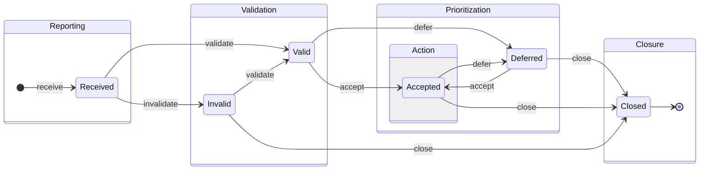

```mermaid
stateDiagram-v2
    direction LR
    state Reporting {
        R: Received
        [*] --> R : receive
    }
    state Validation {
        I: Invalid
        V: Valid
    }
    state Prioritization {   
        D: Deferred
        state Action {
            A: Accepted
        }
    }
    
    state Closure {
        C: Closed
        C --> [*]
    }

    R --> I: invalidate
    R --> V : validate
    I --> V : validate
    V --> A : accept
    V --> D : defer
    A --> D : defer
    D --> A : accept
    D --> C : close
    A --> C : close
    I --> C : close
```
