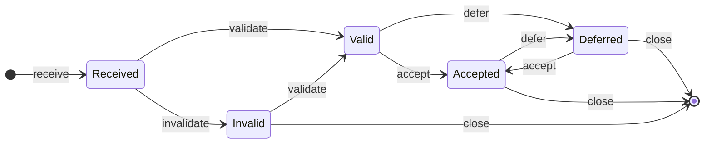

```mermaid
stateDiagram-v2
    direction LR
    R: Received
    I: Invalid
    V: Valid
    D: Deferred
    A: Accepted

    [*] --> R : receive
    R --> I: invalidate
    R --> V : validate
    I --> V : validate
    V --> A : accept
    V --> D : defer
    A --> D : defer
    D --> A : accept
    D --> [*] : close
    A --> [*] : close
    I --> [*] : close
```
