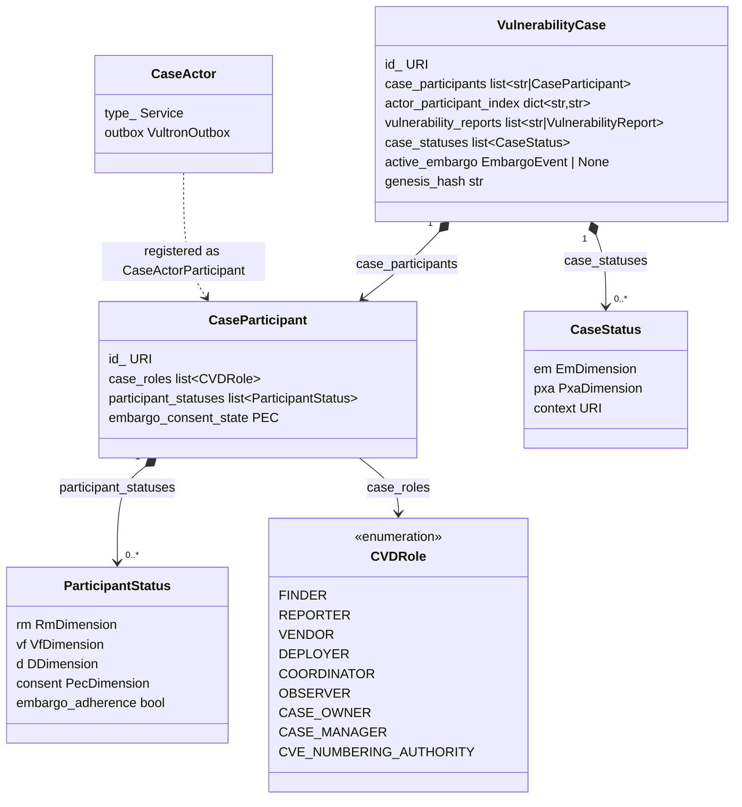

# Case Model Fields

This page lists the fields of the core domain objects that make up a Vultron case, as the reference implementation defines them in `vultron/core/models/`.
For what these objects are for and how a case uses them, read [The Case Model](../topics/case_lifecycle/case_model.md) first.
For how the same objects appear on the wire, see [Vultron AS Objects](activitypub/objects.md).

!!! note "Implementation fields, not wire properties"
    The names below are the Python field names.
    On the wire they are rendered in camelCase, and fields the implementation keeps only for its own bookkeeping are not sent.

## `VulnerabilityCase`

Defined in `vultron/core/models/case.py`.

| Field | Description |
|---|---|
| `case_participants` | `CaseParticipant` records (or their URIs) |
| `actor_participant_index` | Fast-lookup map: actor URI → participant URI |
| `vulnerability_reports` | Reports associated with this case (objects or URIs) |
| `case_statuses` | Append-only history of `CaseStatus` snapshots |
| `notes` | URIs of notes attached to the case |
| `active_embargo` | The currently active `EmbargoEvent` (at most one) |
| `proposed_embargoes` | URIs of embargoes under negotiation |
| `pending_embargo_proposal_index` | Map: embargo URI → the proposal activity that offered it |
| `recommendation_recommender_index` | Map: actor-recommendation URI → the participant who made it |
| `case_activity` | Activity IDs recorded against this case (not the case ledger — see `genesis_hash`) |
| `genesis_hash` | SHA-256 hash binding the ledger to this case's origin identity |
| `parent_cases`, `child_cases`, `sibling_cases` | URIs of related cases, held as IDs only (ADR-0017); no protocol flow sets them yet |

## `CaseActor`

Defined in `vultron/core/models/case_actor.py`.

| Field | Description |
|---|---|
| `type_` | Always `Service` |
| `outbox` | The actor's outbox; kept locally and not sent on the wire |

The `CaseActor` is also registered in the case as a `CaseActorParticipant`, which holds both `CVDRole.COORDINATOR` and `CVDRole.CASE_MANAGER` (ADR-0051).

## `CaseParticipant`

Defined in `vultron/core/models/case_participant.py`.

| Field | Description |
|---|---|
| `case_roles` | `list[CVDRole]` — the roles this actor holds in this case |
| `participant_statuses` | Append-only history of `ParticipantStatus` snapshots |
| `embargo_consent_state` | This participant's current Participant Embargo Consent (PEC) state |
| `accepted_embargo_ids` | URIs of embargoes the participant has accepted |
| `participant_case_name` | Optional human-readable name for this participant in this case |
| `invite_rsvp_deadline` | Local bookkeeping: when this actor wants an answer to an invitation; not sent on the wire |

Role-specific subclasses (`VendorParticipant`, `CoordinatorParticipant`, `ObserverParticipant`, `CaseActorParticipant`, and others) set `case_roles` for convenience.
All of them share the same `type_` value, `"CaseParticipant"`.

## `CaseStatus`

Defined in `vultron/core/models/case_status.py`.
Stored in `VulnerabilityCase.case_statuses`.

| Field | Description |
|---|---|
| `em` | `EmDimension` — the Embargo Management (EM) state (None / Proposed / Active / Revise / eXited) |
| `pxa` | `PxaDimension` — the Publication/eXploit/Active-attacks (PXA) state |
| `context` | The URI of the case this status belongs to |
| `attributed_to` | The actor who reported this status (optional) |

## `ParticipantStatus`

Defined in `vultron/core/models/participant_status.py`.
Stored in `CaseParticipant.participant_statuses`.

| Field | Description |
|---|---|
| `context` | The URI of the case this status belongs to |
| `rm` | `RmDimension` — the participant's Report Management (RM) state (Start → Received → … → Closed) |
| `vf` | `VfDimension` — Vendor-awareness / Fix-readiness state (vf → Vf → VF); present only for VENDOR participants |
| `d` | `DDimension` — Fix-deployment state (d → D); present only for DEPLOYER participants |
| `consent` | `PecDimension` — this participant's Participant Embargo Consent (PEC) state |
| `cvd_role` | The CVD roles this participant held at the time of the snapshot |
| `case_engagement` | Whether this participant is actively engaged |
| `tracking_id` | Optional identifier this participant uses for the case in its own tracker |
| `case_status` | Optional `CaseStatus` the participant believes the case to be in |
| `embargo_adherence` | Computed `True` iff `consent.state == SIGNATORY` (ADR-0056); never set directly |

## Dimension objects

Defined in `vultron/core/models/dimensions.py` (ADR-0036).

| Dimension | Full name | State machine | Used in |
|---|---|---|---|
| `EmDimension` | Embargo Management (EM) | None/Proposed/Active/Revise/eXited | `CaseStatus` |
| `PxaDimension` | Publication/eXploit/Active-attacks (PXA) | public awareness, exploit, active-attacks | `CaseStatus` |
| `RmDimension` | Report Management (RM) | Start → Received → … → Closed | `ParticipantStatus` |
| `VfDimension` | Vendor-awareness / Fix-readiness (VF) | vf → Vf → VF | `ParticipantStatus` (VENDOR only) |
| `DDimension` | Fix-deployment (D) | d → D | `ParticipantStatus` (DEPLOYER only) |
| `PecDimension` | Participant Embargo Consent (PEC) | UNBOUND / INVITED / SIGNATORY / LAPSED / DECLINED | `ParticipantStatus` |

## `CVDRole`

Defined in `vultron/enums/roles.py` as a `StrEnum`.
Participants hold zero or more roles as `list[CVDRole]`.

| Role | Meaning |
|---|---|
| `FINDER` | Discovered the vulnerability (deprecated — see ADR-0078) |
| `REPORTER` | Submitted the vulnerability report to others |
| `VENDOR` | Supplies the affected product; has Vendor Fix Path obligations |
| `DEPLOYER` | Deploys the vendor's fix; has deployment obligations |
| `COORDINATOR` | Neutral third party facilitating coordination |
| `OBSERVER` | Base role — admitted via Invite/Accept; no VFD obligations (ADR-0057) |
| `CASE_OWNER` | Decision-maker who administers the case |
| `CASE_MANAGER` | The case's single-writer authority for the ledger; usually held alongside `COORDINATOR` (CBT-01-003); any actor type may hold it |
| `CVE_NUMBERING_AUTHORITY` | Holds CNA status; may assign CVE IDs directly |

!!! warning "Do not use `CVDRolesFlag`"
    `CVDRolesFlag` is a legacy bitmask enum retained only for the `vultron.bt` simulator layer.
    Always use `list[CVDRole]` in new code.

## How the objects relate

## See also

- [The Case Model](../topics/case_lifecycle/case_model.md) — what each object is for
- [The CASE_MANAGER and the Case Ledger](../topics/case_lifecycle/case_manager_and_ledger.md) — who writes the case history
- ADR-0036: Per-Machine Dimension Objects for `CaseStatus` and `ParticipantStatus`
- ADR-0051: CaseActor Has Its Own RM Lifecycle Tracked via CaseParticipant
- ADR-0056: `embargo_adherence` is derived from consent
- ADR-0057: Observer role (`CVDRole.OBSERVER`)
- ADR-0078: Retire `CVDRole.FINDER` — Reporter Is the Protocol-Salient Role
