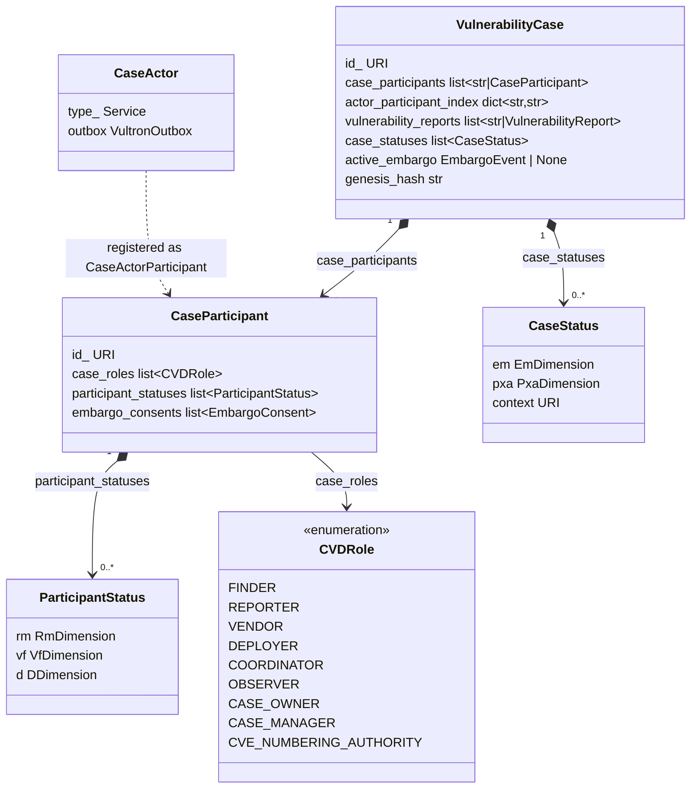

# Case Model Fields

This page lists the fields of the core domain objects that make up a Vultron case, as the reference implementation defines them in `vultron/core/models/`.
For what these objects are for and how a case uses them, read [The Case Model](../topics/case_lifecycle/case_model.md) first.
For how the same objects appear on the wire, see [Vultron AS Objects](activitypub/objects.md).

!!! note "Implementation fields, not wire properties"
    The names below are the Python field names.
    On the wire they are rendered in camelCase, and fields the implementation keeps only for its own bookkeeping are not sent.

## `VulnerabilityCase`

Defined in `vultron/core/models/case.py`.

| Field | Description |
|---|---|
| `attributed_to` | The actor the case is attributed to: set when the case is created, where it is an input to `genesis_hash`, and changed to the new owner when an ownership transfer is accepted ([CM-21-002](specs/protocol.md#cm-21-002)) |
| `case_participants` | `CaseParticipant` records (or their URIs) |
| `actor_participant_index` | Fast-lookup map: actor URI → participant URI |
| `vulnerability_reports` | Reports associated with this case (objects or URIs) |
| `case_statuses` | Append-only history of `CaseStatus` snapshots |
| `notes` | URIs of notes attached to the case |
| `active_embargo` | The currently active `EmbargoEvent` (at most one) |
| `proposed_embargoes` | URIs of embargoes under negotiation |
| `pending_embargo_proposal_index` | Map: embargo URI → the proposal activity that offered it |
| `recommendation_recommender_index` | Map: actor-recommendation URI → the participant who made it |
| `case_activity` | Activity IDs recorded against this case (not the case ledger — see `genesis_hash`) |
| `genesis_hash` | SHA-256 hash binding the ledger to this case's origin identity: the case id, creation time and owner (`attributed_to`), computed when the case is created; a replica keeps the hash it receives, or derives the same value from the carried case when none arrives ([CLP-08-002](specs/protocol.md#clp-08-002)) |
| `stub_summary` | Owner-chosen, human-readable description of the case used as the `summary` of the `VulnerabilityCaseStub` carried in a stub Invite. Must be set before emitting an `Invite(Actor, target=VulnerabilityCaseStub)` — the factory raises if absent ([CM-17-010](specs/protocol.md#cm-17-010), [MV-10-001](specs/protocol.md#mv-10-001)) |
| `parent_cases`, `child_cases`, `sibling_cases` | URIs of related cases, held as IDs only (ADR-0017); no protocol flow sets them yet |
| `active_participants` | Computed, not stored: the ids of the inline participant records that `is_active_participant` finds active, in roster order. Sent on the wire as `activeParticipants` only; the AS2 form leaves it out while any `case_participants` entry is a bare URI, so it is never a partial list. A received value that contradicts the recomputed one is refused (CM-31-003, ARCH-23-005) |

## `CaseActor`

Defined in `vultron/core/models/case_actor.py`.

| Field | Description |
|---|---|
| `type_` | Always `Service` |
| `outbox` | The actor's outbox; kept locally and not sent on the wire |

The `CaseActor` is also registered in the case as a `CaseActorParticipant`, which holds both `CVDRole.COORDINATOR` and `CVDRole.CASE_MANAGER` (ADR-0051).

## `CaseParticipant`

Defined in `vultron/core/models/case_participant.py`.

| Field | Description |
|---|---|
| `attributed_to` | The actor this record stands for; `actor_participant_index` is keyed on it |
| `case_roles` | `list[CVDRole]` — the roles this actor holds in this case |
| `participant_statuses` | Append-only history of `ParticipantStatus` snapshots |
| `embargo_consents` | `list[EmbargoConsent]` — one Participant Embargo Consent (PEC) row for each embargo this participant was asked about, each holding the embargo URI and `INVITED`, `ACCEPTED`, `DECLINED` or `EXPIRED` (ADR-0122). "Signatory" and "lapsed" are read from these rows and the case's active embargo, never stored |
| `joined` | Whether the participant has joined the case: it was seated by case initialization or accepted its stub Invite. Defaults to `true`. One input to `VulnerabilityCase.is_active_participant`, which decides whether the participant is sent case content (CM-10-004, ADR-0114) |
| `removal_activity` | The removal fact: the id of the `Remove(CaseParticipant)` activity that took this participant out of active participation, or `None` when it is not removed. The record stays on the roster. One input to `VulnerabilityCase.is_active_participant`: a removed participant is inert whatever its embargo consent (CM-31-001, ADR-0116) |
| `participant_case_name` | Optional human-readable name for this participant in this case |
| `invite_rsvp_deadline` | The RSVP deadline the CASE_MANAGER stamped as `Invite.end_time` on this participant's `Invite(EmbargoEvent)`; recorded at the manager's commit of that Invite and reaching replicas through the ledger, never derived on receipt (CM-28-012, CM-28-013) |

Role-specific subclasses (`VendorParticipant`, `CoordinatorParticipant`, `ObserverParticipant`, `CaseActorParticipant`, and others) set `case_roles` for convenience.
All of them share the same `type_` value, `"CaseParticipant"`.

## `CaseStatus`

Defined in `vultron/core/models/case_status.py`.
Stored in `VulnerabilityCase.case_statuses`.

| Field | Description |
|---|---|
| `em` | `EmDimension` — the Embargo Management (EM) state (None / Proposed / Active / Revise / eXited) |
| `pxa` | `PxaDimension` — the Publication/eXploit/Active-attacks (PXA) state |
| `context` | The URI of the case this status belongs to |
| `attributed_to` | The actor who reported this status (optional) |

## `ParticipantStatus`

Defined in `vultron/core/models/participant_status.py`.
Stored in `CaseParticipant.participant_statuses`.

| Field | Description |
|---|---|
| `context` | The URI of the case this status belongs to |
| `rm` | `RmDimension` — the participant's Report Management (RM) state (Start → Received → … → Closed) |
| `vf` | `VfDimension` — Vendor-awareness / Fix-readiness state (vf → Vf → VF); present only for VENDOR participants |
| `d` | `DDimension` — Fix-deployment state (d → D); present only for DEPLOYER participants |
| `cvd_role` | The CVD roles this participant held at the time of the snapshot |
| `case_engagement` | Whether this participant is actively engaged |
| `tracking_id` | Optional identifier this participant uses for the case in its own tracker |
| `case_status` | Optional `CaseStatus` the participant believes the case to be in |

## Dimension objects

Defined in `vultron/core/models/dimensions.py` (ADR-0036).

| Dimension | Full name | State machine | Used in |
|---|---|---|---|
| `EmDimension` | Embargo Management (EM) | None/Proposed/Active/Revise/eXited | `CaseStatus` |
| `PxaDimension` | Publication/eXploit/Active-attacks (PXA) | public awareness, exploit, active-attacks | `CaseStatus` |
| `RmDimension` | Report Management (RM) | Start → Received → … → Closed | `ParticipantStatus` |
| `VfDimension` | Vendor-awareness / Fix-readiness (VF) | vf → Vf → VF | `ParticipantStatus` (VENDOR only) |
| `DDimension` | Fix-deployment (D) | d → D | `ParticipantStatus` (DEPLOYER only) |

## `CVDRole`

Defined in `vultron/enums/roles.py` as a `StrEnum`.
Participants hold zero or more roles as `list[CVDRole]`.

| Role | Meaning |
|---|---|
| `FINDER` | Discovered the vulnerability (deprecated — see ADR-0078) |
| `REPORTER` | Submitted the vulnerability report to others |
| `VENDOR` | Supplies the affected product; has Vendor Fix Path obligations |
| `DEPLOYER` | Deploys the vendor's fix; has deployment obligations |
| `COORDINATOR` | Neutral third party facilitating coordination |
| `OBSERVER` | Base role — admitted via Invite/Accept; no VFD obligations (ADR-0057) |
| `CASE_OWNER` | Decision-maker who administers the case |
| `CASE_MANAGER` | The case's single-writer authority for the ledger; usually held alongside `COORDINATOR` (CBT-01-003); any actor type may hold it |
| `CVE_NUMBERING_AUTHORITY` | Holds CNA status; may assign CVE IDs directly |

!!! warning "Do not use `CVDRolesFlag`"
    `CVDRolesFlag` is a legacy bitmask enum retained only for the `vultron.bt` simulator layer.
    Always use `list[CVDRole]` in new code.

## How the objects relate

```mermaid
classDiagram
    direction TB

    class VulnerabilityCase {
        id_ URI
        case_participants list~str|CaseParticipant~
        actor_participant_index dict~str,str~
        vulnerability_reports list~str|VulnerabilityReport~
        case_statuses list~CaseStatus~
        active_embargo EmbargoEvent | None
        genesis_hash str
    }

    class CaseActor {
        type_ Service
        outbox VultronOutbox
    }

    class CaseParticipant {
        id_ URI
        case_roles list~CVDRole~
        participant_statuses list~ParticipantStatus~
        embargo_consents list~EmbargoConsent~
    }

    class CaseStatus {
        em EmDimension
        pxa PxaDimension
        context URI
    }

    class ParticipantStatus {
        rm RmDimension
        vf VfDimension
        d DDimension
    }

    class CVDRole {
        <<enumeration>>
        FINDER
        REPORTER
        VENDOR
        DEPLOYER
        COORDINATOR
        OBSERVER
        CASE_OWNER
        CASE_MANAGER
        CVE_NUMBERING_AUTHORITY
    }

    VulnerabilityCase "1" *--> "0..*" CaseParticipant : case_participants
    VulnerabilityCase "1" *--> "0..*" CaseStatus : case_statuses
    CaseParticipant "1" *--> "0..*" ParticipantStatus : participant_statuses
    CaseParticipant --> CVDRole : case_roles
    CaseActor ..> CaseParticipant : registered as CaseActorParticipant
```

## See also

- [The Case Model](../topics/case_lifecycle/case_model.md) — what each object is for
- [The CASE_MANAGER and the Case Ledger](../topics/case_lifecycle/case_manager_and_ledger.md) — who writes the case history
- ADR-0036: Per-Machine Dimension Objects for `CaseStatus` and `ParticipantStatus`
- ADR-0051: CaseActor Has Its Own RM Lifecycle Tracked via CaseParticipant
- ADR-0122: Participant embargo consent is recorded per (participant, embargo)
- ADR-0057: Observer role (`CVDRole.OBSERVER`)
- ADR-0078: Retire `CVDRole.FINDER` — Reporter Is the Protocol-Salient Role
