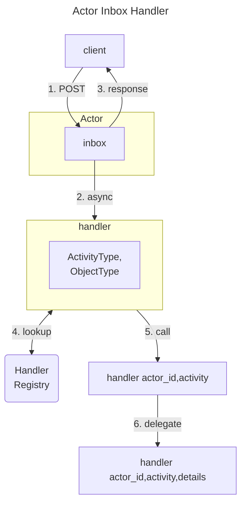

# Actor Inbox Handler

The Actor Inbox Handler is the hub that processes incoming activities.
It

- receives activities sent to an actor's inbox
- looks up the appropriate handler based on the activity type and object type
- invokes the handler to process the activity
- if necessary, delegates to sub-handlers for more specific processing

!!! note "Some `Activity`/`Object` handlers have more than one job"

    For some `Activity`/`Object` pairs, there may be multiple jobs to select from.
    For example, handling an `Accept(Invite(VulnerabilityCase))` activity
    is different from handling an `Accept(Invite(Embargo))` activity.
    In such cases, the Actor Inbox Handler will invoke a handler for the Accept(Invite) activity,
    which will then delegate to the appropriate sub-handler based on the details of the offer being accepted.

