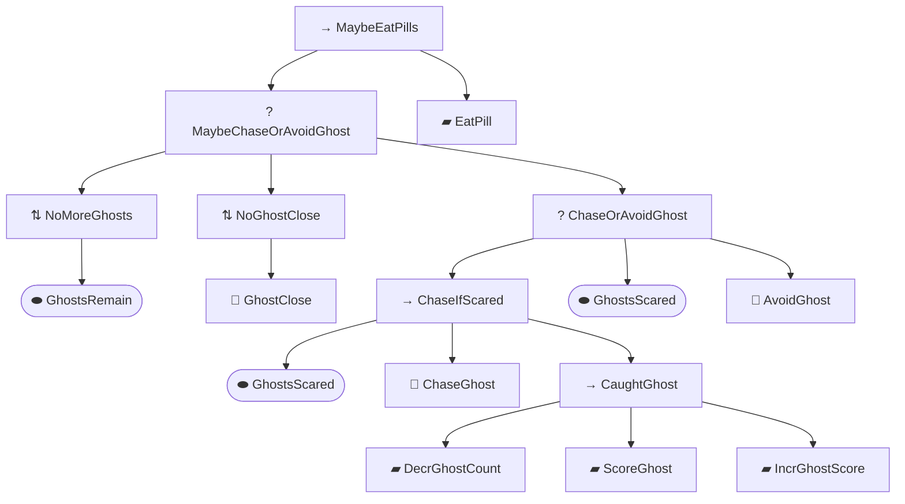

```mermaid
graph TD
  MaybeEatPills_1["&rarr; MaybeEatPills"]
  MaybeChaseOrAvoidGhost_2["? MaybeChaseOrAvoidGhost"]
  MaybeEatPills_1 --> MaybeChaseOrAvoidGhost_2
  NoMoreGhosts_3["#8645; NoMoreGhosts"]
  MaybeChaseOrAvoidGhost_2 --> NoMoreGhosts_3
  GhostsRemain_4(["#11052; GhostsRemain"])
  NoMoreGhosts_3 --> GhostsRemain_4
  NoGhostClose_5["#8645; NoGhostClose"]
  MaybeChaseOrAvoidGhost_2 --> NoGhostClose_5
  GhostClose_6["#127922; GhostClose"]
  NoGhostClose_5 --> GhostClose_6
  ChaseOrAvoidGhost_7["? ChaseOrAvoidGhost"]
  MaybeChaseOrAvoidGhost_2 --> ChaseOrAvoidGhost_7
  ChaseIfScared_8["&rarr; ChaseIfScared"]
  ChaseOrAvoidGhost_7 --> ChaseIfScared_8
  GhostsScared_9(["#11052; GhostsScared"])
  ChaseIfScared_8 --> GhostsScared_9
  ChaseGhost_10["#127922; ChaseGhost"]
  ChaseIfScared_8 --> ChaseGhost_10
  CaughtGhost_11["&rarr; CaughtGhost"]
  ChaseIfScared_8 --> CaughtGhost_11
  DecrGhostCount_12["#9648; DecrGhostCount"]
  CaughtGhost_11 --> DecrGhostCount_12
  ScoreGhost_13["#9648; ScoreGhost"]
  CaughtGhost_11 --> ScoreGhost_13
  IncrGhostScore_14["#9648; IncrGhostScore"]
  CaughtGhost_11 --> IncrGhostScore_14
  GhostsScared_15(["#11052; GhostsScared"])
  ChaseOrAvoidGhost_7 --> GhostsScared_15
  AvoidGhost_16["#127922; AvoidGhost"]
  ChaseOrAvoidGhost_7 --> AvoidGhost_16
  EatPill_17["#9648; EatPill"]
  MaybeEatPills_1 --> EatPill_17
```
