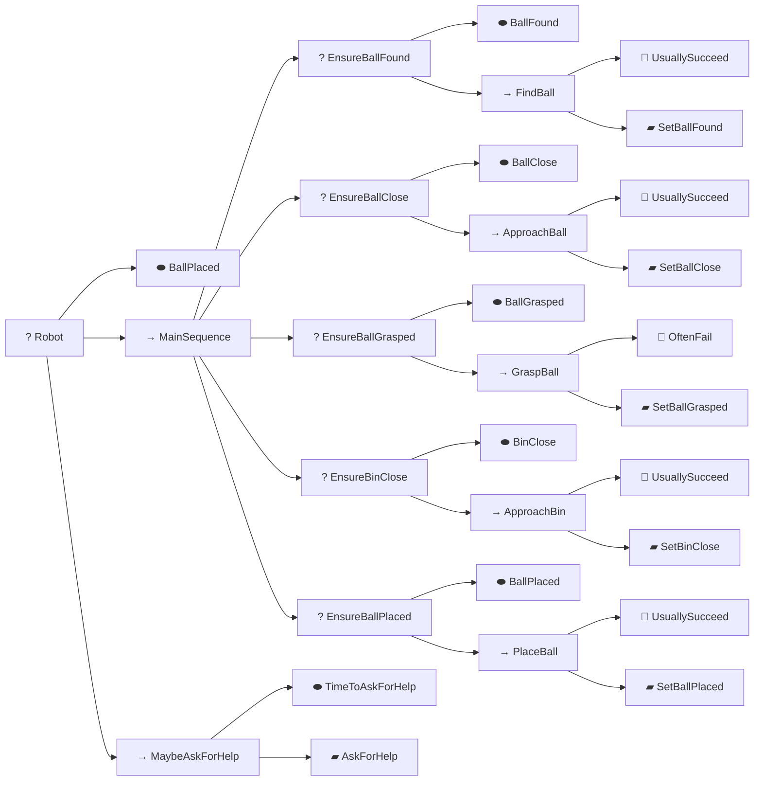

```mermaid
graph LR
  Robot_1["? Robot"]
  BallPlaced_2["#11052; BallPlaced"]
  Robot_1 --> BallPlaced_2
  MainSequence_3["&rarr; MainSequence"]
  Robot_1 --> MainSequence_3
  EnsureBallFound_4["? EnsureBallFound"]
  MainSequence_3 --> EnsureBallFound_4
  BallFound_5["#11052; BallFound"]
  EnsureBallFound_4 --> BallFound_5
  FindBall_6["&rarr; FindBall"]
  EnsureBallFound_4 --> FindBall_6
  UsuallySucceed_7["#127922; UsuallySucceed"]
  FindBall_6 --> UsuallySucceed_7
  SetBallFound_8["#9648; SetBallFound"]
  FindBall_6 --> SetBallFound_8
  EnsureBallClose_9["? EnsureBallClose"]
  MainSequence_3 --> EnsureBallClose_9
  BallClose_10["#11052; BallClose"]
  EnsureBallClose_9 --> BallClose_10
  ApproachBall_11["&rarr; ApproachBall"]
  EnsureBallClose_9 --> ApproachBall_11
  UsuallySucceed_12["#127922; UsuallySucceed"]
  ApproachBall_11 --> UsuallySucceed_12
  SetBallClose_13["#9648; SetBallClose"]
  ApproachBall_11 --> SetBallClose_13
  EnsureBallGrasped_14["? EnsureBallGrasped"]
  MainSequence_3 --> EnsureBallGrasped_14
  BallGrasped_15["#11052; BallGrasped"]
  EnsureBallGrasped_14 --> BallGrasped_15
  GraspBall_16["&rarr; GraspBall"]
  EnsureBallGrasped_14 --> GraspBall_16
  OftenFail_17["#127922; OftenFail"]
  GraspBall_16 --> OftenFail_17
  SetBallGrasped_18["#9648; SetBallGrasped"]
  GraspBall_16 --> SetBallGrasped_18
  EnsureBinClose_19["? EnsureBinClose"]
  MainSequence_3 --> EnsureBinClose_19
  BinClose_20["#11052; BinClose"]
  EnsureBinClose_19 --> BinClose_20
  ApproachBin_21["&rarr; ApproachBin"]
  EnsureBinClose_19 --> ApproachBin_21
  UsuallySucceed_22["#127922; UsuallySucceed"]
  ApproachBin_21 --> UsuallySucceed_22
  SetBinClose_23["#9648; SetBinClose"]
  ApproachBin_21 --> SetBinClose_23
  EnsureBallPlaced_24["? EnsureBallPlaced"]
  MainSequence_3 --> EnsureBallPlaced_24
  BallPlaced_25["#11052; BallPlaced"]
  EnsureBallPlaced_24 --> BallPlaced_25
  PlaceBall_26["&rarr; PlaceBall"]
  EnsureBallPlaced_24 --> PlaceBall_26
  UsuallySucceed_27["#127922; UsuallySucceed"]
  PlaceBall_26 --> UsuallySucceed_27
  SetBallPlaced_28["#9648; SetBallPlaced"]
  PlaceBall_26 --> SetBallPlaced_28
  MaybeAskForHelp_29["&rarr; MaybeAskForHelp"]
  Robot_1 --> MaybeAskForHelp_29
  TimeToAskForHelp_30["#11052; TimeToAskForHelp"]
  MaybeAskForHelp_29 --> TimeToAskForHelp_30
  AskForHelp_31["#9648; AskForHelp"]
  MaybeAskForHelp_29 --> AskForHelp_31
```
