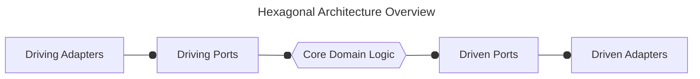
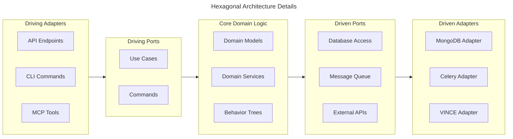

# Hexagonal Architecture

Our prototype implementation of the Vultron Protocol is structured according
to the principles of a port and adapter architecture, also known as
hexagonal architecture. This design allows us to separate the core domain
logic from the infrastructure and external interfaces, making the system
more modular, testable, and adaptable to different use cases and environments.

In this architecture:

- The **Driving Adapters** implement the driving ports using specific
  technologies (e.g., FastAPI endpoints, CLI commands, etc.) and translate  
  external inputs into calls to the core domain logic.
- The **Driving Ports** define the interfaces through which external actors
  (e.g., finders, vendors, coordinators) can interact with the core domain logic. These are the entry points for commands and queries that drive the system's behavior.
- The **Core Domain Logic** contains the business rules, policies, and behavior trees that govern how the system operates. It is completely agnostic to how it is accessed or what technologies are used to implement the interfaces.
- The **Driven Ports** define the interfaces through which the core domain
  logic can interact with external systems (e.g., databases, message queues,
  external APIs). These are the exit points for the core to perform actions  
  that have side effects or require external resources.
- The **Driven Adapters** implement the driven ports using specific technologies
  (e.g., MongoDB for database access, Celery for task queues, etc.)
  and
  translate calls from the core domain logic into interactions with external
  systems.

