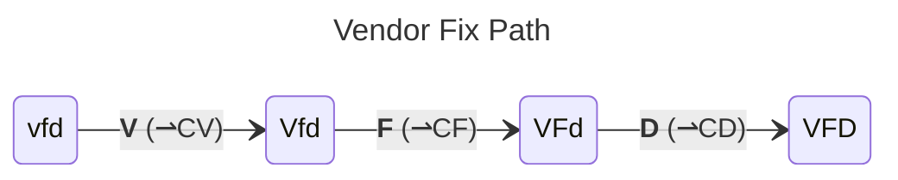
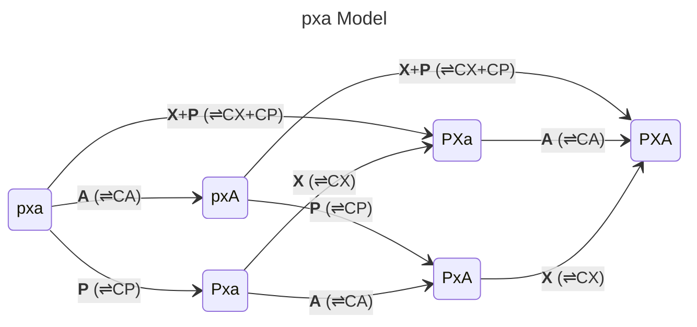

# Formal Vultron Protocol Redux



We have [formally defined](../../reference/formal_protocol/index.md) an [MPCVD protocol](../../index.md).
Here we provide a summary of the result.
See the linked sections for more details.

 
 

Recapping the definitions given in the [introduction](index.md), we have:

!!! note "Formal Protocol Definition"

    $${protocol}_{MPCVD} = 
        \Big \langle 
            { \langle S_i \rangle }^N_{i=1}, 
            { \langle o_i \rangle }^N_{i=1},
            { \langle M_{i,j} \rangle}^N_{i,j=1},
            { succ }
        \Big \rangle$$

where

| Symbol                                                                                                                                                                                                                                                   | Description                                                                                                                                                                                                                                  | Defined In               |
|:---------------------------------------------------------------------------------------------------------------------------------------------------------------------------------------------------------------------------------------------------------|:---------------------------------------------------------------------------------------------------------------------------------------------------------------------------------------------------------------------------------------------|:-------------------------|
| $N$                                                                                                                                                                                                                                                      | Number of MPCVD Participants                                                                                                                                                                                                                 | [Introduction](index.md) |
| $\langle S_i \rangle_{i=1}^N$                                                                                                                                                                                                                            | $N$ disjoint finite sets in which each $S_i$ represents the set of states of a given Participant $i$                                                                                                                                         | [States](states.md) |
| ${ \langle o_i \rangle }^N_{i=1}$                                                                                                                                                                                                                        | the set of starting states across all Participants in which each $o_i$ is an element of $S_i$ representing the initial state of each Participant $i$                                                                                         | [States](states.md) |
| $\langle M_{ij} \rangle_{i,j=1}^N$                                                                                                                                                                                                                       | $N^2$ disjoint finite sets with $M_{ii}$ empty for all $i$. $M_{ij}$ represents the messages that can be sent from process $i$ to process $j$.                                                                                               | [Messages](messages.md) |
| $succ$ | a partial function mapping for each $i$ and $j$, $S_i \times M_{ij} \rightarrow S_i \textrm{ and } S_i \times M_{ji} \rightarrow S_i$ indicating the state changes arising from the sending and receiving of messages between Participants. | [Transitions](transitions.md) |

!!! note inline end "Legend"

    | Symbol  | Description              |
    |:-------:|:-------------------------|
    | &#8636; | Message Received         |
    | &#8640; | Message Sent             |
    | &#8652; | Message Sent or Received |

## Summary Diagrams

A summary of the MPCVD state model $S_i$ for an individual Participant is shown in the diagrams below.

### Report Management

The Report Management (RM) state model is shown below.
Note that with the exception of receiving reports, the RM process primarily focuses on Participants communicating
their status to other Participants, as it is primarily emitting messages as opposed to receiving them.

### Embargo Management

The Embargo Management (EM) state model is shown below.
The EM process is more interactive than the RM process, as it involves Participants negotiating with each other
to determine the appropriate embargo period for a given vulnerability report.

### Case State

The Case State (CS) model is shown below.
We have divided the CS model into two diagrams: one that is specific to a given Participant, and one that is agnostic
to the Participant, reflecting changes experienced by all Participants.
The CS model is the most complex of the three, as it involves all Participants communicating with each other
about both their own state changes in the fix development and deployment process, as well as the state changes
driven by outside events (e.g., public awareness, exploits in the wild, attacks observed, etc.).

#### Participant-Specific

The _Vendor fix path_ is shown below, and is specific to individual Vendor Participants.
It reflects each Participant's state changes in the fix development and deployment process.

#### Participant-Agnostic

The CS pxa model is shown below, and is agnostic to individual Participants.
It reflects the state changes driven by external events that affect all Participants.
Note that the diagram shown below simplifies the $X \implies P$ transitions based on the discussion
in the detailed [CS model](../../topics/process_models/cs/cs_model.md#exploit-publication-causes-public-awareness).

### Ordering Preferences

!!! tip inline end "Notation"

    The symbol $\prec$ is read as *precedes*.

In [Defining CVD Success](../../topics/background/cvd_success.md), we defined a set of 12 ordering preferences over the
6 events in the Case State model. The symbols for these preferences refer to the transition events in the Case State
diagrams above.

| Ordering Preference | Notation |
| :--- | :--- |
| Fix Deployed Before Public Awareness | **D** $\prec$ **P** |
| Fix Ready Before Public Awareness | **F** $\prec$ **P** |
| Fix Deployed Before Exploit Public | **D** $\prec$ **X** |
| Fix Deployed Before Attacks Observed | **D** $\prec$ **A** |
| Fix Ready Before Exploit Public | **F** $\prec$ **X** |
| Vendor Awareness Before Public Awareness | **V** $\prec$ **P** |
| Fix Ready Before Attacks Observed | **F** $\prec$ **A** |
| Public Awareness Before Exploit Public | **P** $\prec$ **X** |
| Exploit Public Before Attacks Observed | **X** $\prec$ **A** |
| Public Awareness Before Attacks Observed | **P** $\prec$ **A** |
| Vendor Awareness Before Exploit Public | **V** $\prec$ **X** |
| Vendor Awareness Before Attacks Observed | **V** $\prec$ **A** |

!!! tip "Worked Example"

    A [worked example](../../topics/formal_protocol/worked_example.md) of the protocol in action is available.
