# Worked Example

!!! note "TODO"
    - clean up acronyms
    - clean up cross-reference links
    - clean up section titles
    - redo diagrams in mermaid

We conclude the chapter with a brief worked example showing a few usage
scenarios of the protocol. We use UML Sequence Diagrams to show the interaction
between Participant roles.

### A Finder Becomes a Reporter

As mentioned in
§[\[sec:finder_hidden\]](#sec:finder_hidden){reference-type="ref"
reference="sec:finder_hidden"}, Finders have a few hidden state
transitions before the CVD process really begins. An example of this
is shown in the figure below. The Finder must discover, validate, and
prioritize their finding before initiating the CVD process.

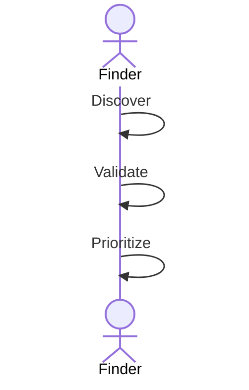

Finders become Reporters when they report a vulnerability to someone
else. The next figure shows a Finder sending a
report (_RS_) in conjunction with an embargo proposal (_EP_) to a
Vendor. The Vendor receives the report and updates their state
accordingly. Then the Vendor replies to acknowledge receipt of the
report and the embargo proposal, and confirms that they (i.e., the
Vendor) are aware of the report (_RK_, _EK_, and _CV_, respectively).
Note that the _EK_ response is intended to convey receipt of the embargo
proposal (_EP_) but does not constitute acceptance of the proposal. We
will discuss that in the next subsection.

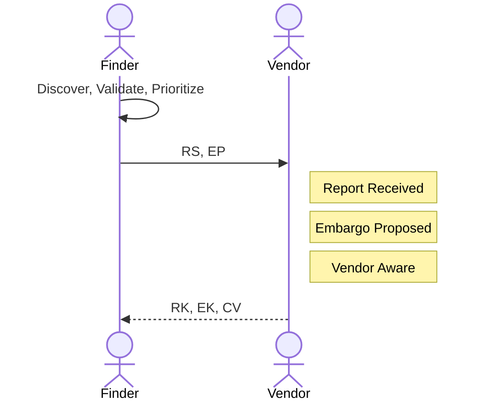

### Vendor Evaluates Embargo {#sec:vendor_eval_embargo_seq}
In this section, we show a variety of responses a Vendor might have to an embargo proposal.

#### Vendor Accepts Embargo 
First is a basic accept sequence in which the Vendor accepts the proposed embargo and tells the
Reporter this through an _EA_ message. The Reporter acknowledges this with an _EK_ in response.

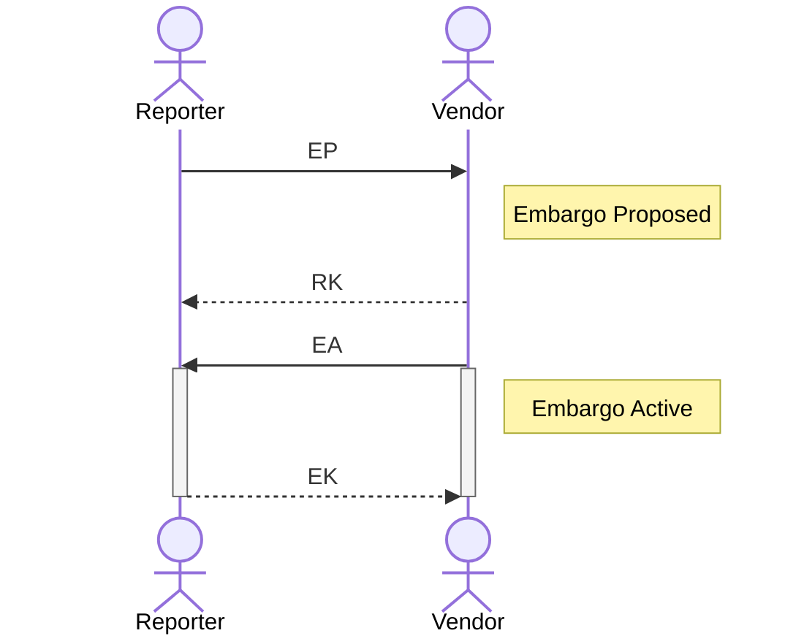

#### Vendor Rejects Embargo
Next we show a rejected proposal. As above, this is a simple sequence where the Vendor indicates their rejection of the
proposal with an _ER_ message, and the Reporter acknowledges this with an _EK_ message.

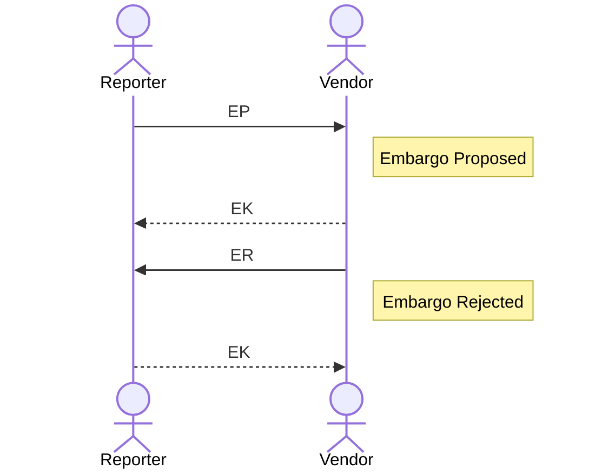

#### Vendor Counterproposal

Here we demonstrate a Vendor embargo counterproposal. The Vendor responds to the Reporter's prior
_EP_ message with an _EP_ message of their own. The Reporter initially
acknowledges the counterproposal with an _RK_ message and then evaluates
it and accepts with an _EA_ message. Finally, the Vendor acknowledges
the acceptance with an _EK_ message. Note, however, that there is no
active embargo until the Reporter accepts it. This method of
counterproposal might delay the establishment of an embargo.

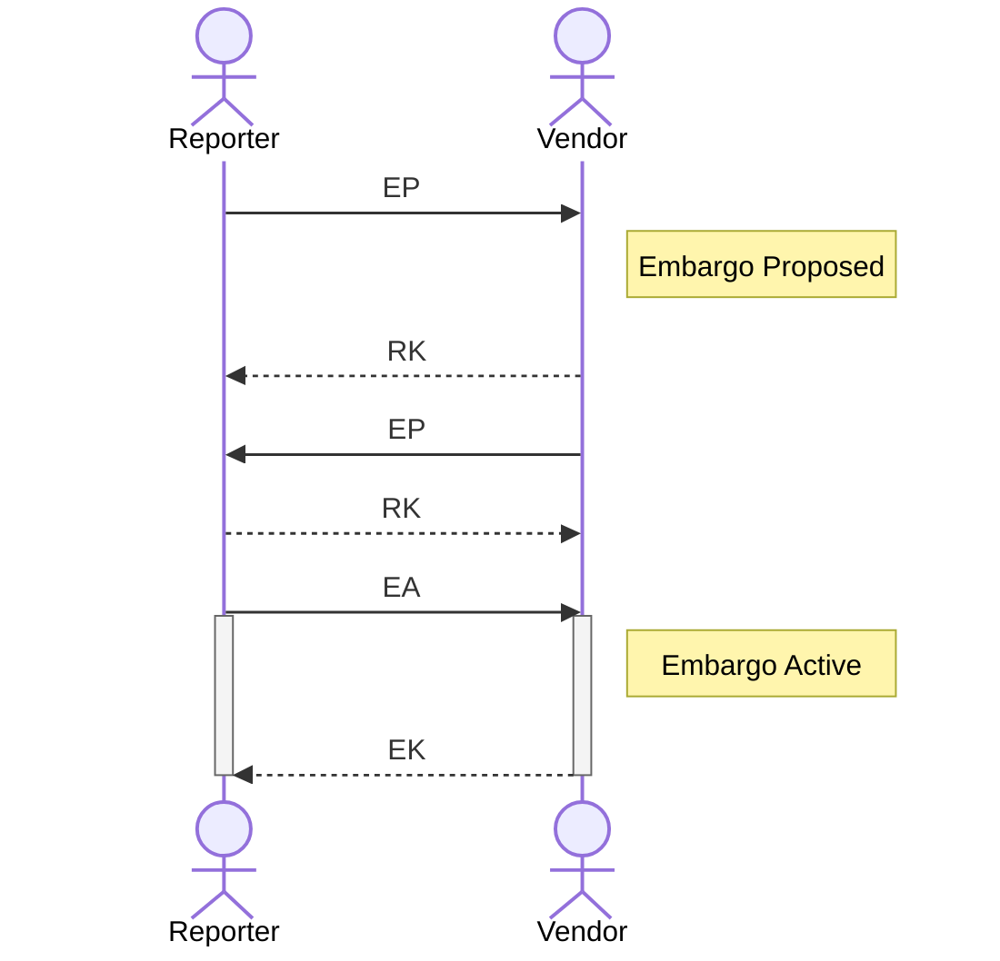

#### Vendor Accepts then Proposes Revision

!!! tip inline end "Yes, And..."

    "Yes-And" is a heuristic taken from improvisational theatre in which Participants are encouraged to agree with 
    whatever their counterpart suggests and add to it rather than reject it outright. 
    It serves as a good model for cooperation among parties who share an interest in a positive outcome.

Finally, the following diagram offers what we think is a better approach than a simple counterproposal.
In this "Accept-then-Counter" sequence, we see that the Vendor initially accepts the Reporter's proposed embargo and 
immediately follows up with a revision proposal of their own. 
The difference is that by initially accepting the proposal, the Vendor ensures that they are in an active embargo state
before attempting to renegotiate.
The sequence shown here is intended to be consistent with the previous discussion surrounding default embargo
strategies in §[\[sec:default_embargoes\]](#sec:default_embargoes){reference-type="ref"
reference="sec:default_embargoes"}.
One might think of this as the "Yes-And" rule for embargo negotiations.

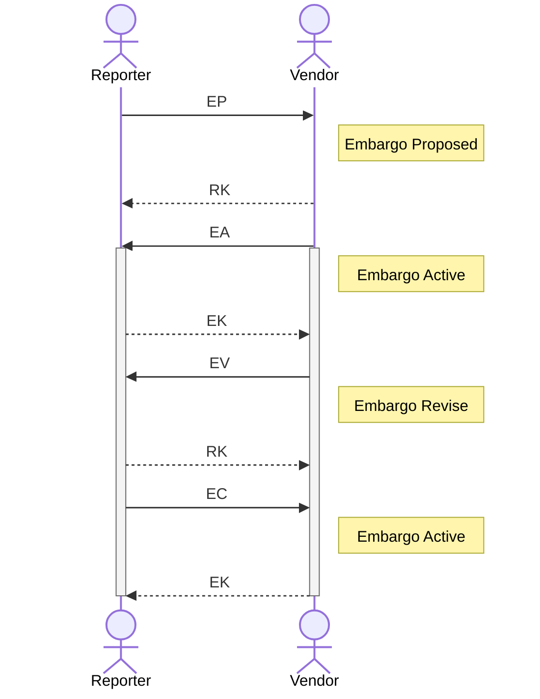

### Vendor Sets Priority
Here we show two responses from a Vendor in the course of prioritizing a report.

#### Vendor Accepts Report
This figure shows a Vendor accepting the report for further work (presumably to develop a patch) with an _RA_ message. 

#### Vendor Defers Report

On the contrary, this figure shows the Vendor deferring the report with an _RD_ message. 
In both cases, the Reporter acknowledges the Vendor's messages with an _RK_ message.

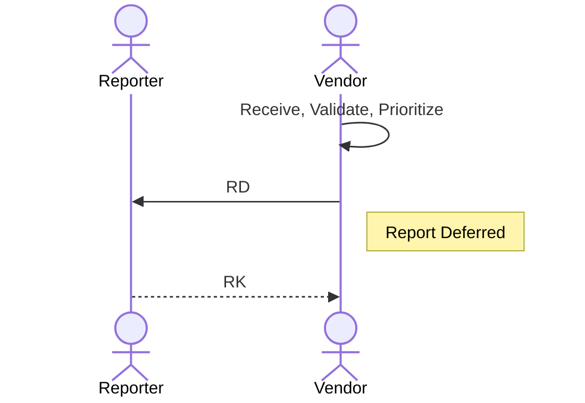

### Coordination With a Coordinator {#sec:coordinating_with_coordinator}

Figure
[\[fig:finder_coordinator_vendor_seq\]](#fig:finder_coordinator_vendor_seq){reference-type="ref"
reference="fig:finder_coordinator_vendor_seq"} shows the process of a
Reporter engaging a Coordinator, who, in turn, engages a Vendor. The
process begins in Figure
[\[fig:seq_reporter_engages_coordinator\]](#fig:seq_reporter_engages_coordinator){reference-type="ref"
reference="fig:seq_reporter_engages_coordinator"} with the Reporter
sending a report along with an embargo proposal to the Coordinator
($RS,EP$). The Coordinator acknowledges receipt with an $RK,EK$
response. After evaluating the proposed embargo, the Coordinator accepts
it with an _EA_ message. The Coordinator proceeds to validate and
prioritize the report, emitting an _RV_ and _RA_ along the way.

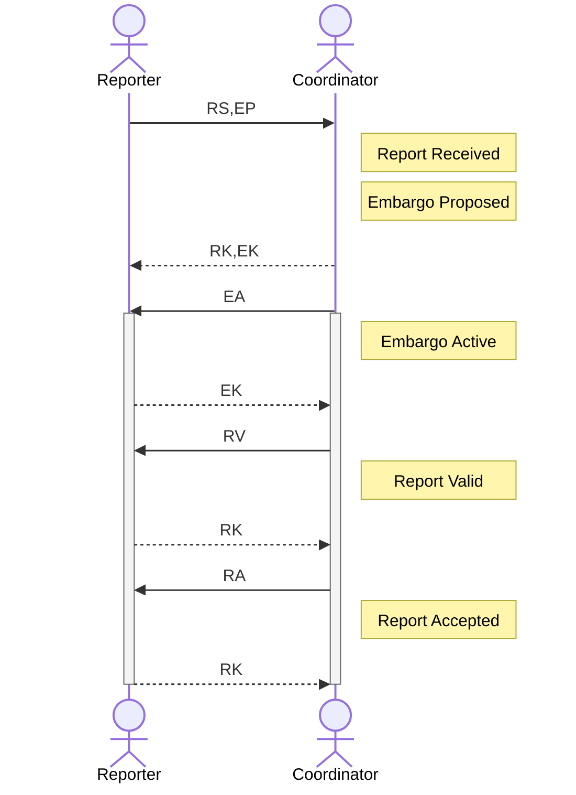

Proceeding to Figure
[\[fig:seq_coordinator_engages_vendor\]](#fig:seq_coordinator_engages_vendor){reference-type="ref"
reference="fig:seq_coordinator_engages_vendor"}, the Coordinator now
acts as a proxy for the Reporter, notifying the Vendor and passing along
the embargo information through an $RS,EP$ message of its own. The
Vendor accepts the existing embargo (_EA_) and proceeds to validate
(_RV_) and prioritize (_RA_) the report. Relevant responses from the
Vendor are passed through to the Reporter. Having accepted the report
for further work, the Vendor continues with creating a fix for the
reported vulnerability. When complete, the Vendor conveys their
readiness to the Coordinator, who in turn passes this information along
to the Reporter through the _CF_ message.

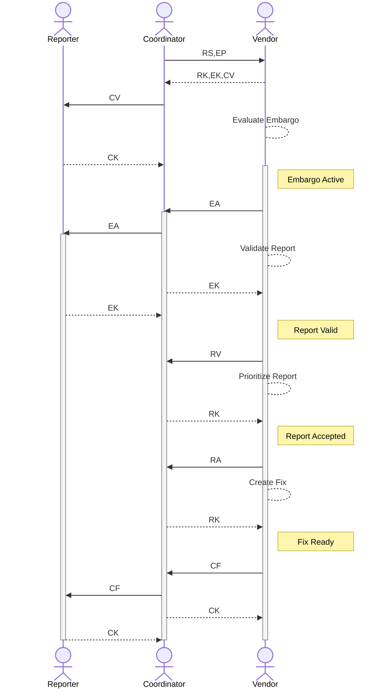

### Embargo Teardown, Publish, and Close

Any Participant can initiate an embargo teardown. We happened to show
the case where the Coordinator initiates it in Figure
[\[fig:seq_coordinator_embargo_teardown\]](#fig:seq_coordinator_embargo_teardown){reference-type="ref"
reference="fig:seq_coordinator_embargo_teardown"}, sending an embargo
termination message (_ET_) to all parties in the case (Reporter and
Vendor in this scenario). Recipients of the _ET_ message acknowledge
receipt and update their EM state accordingly.

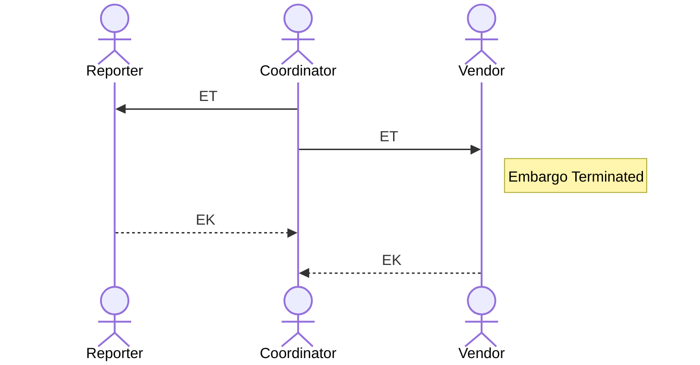

#### Publishing After Embargo Teardown

Once the embargo has been exited, any Participant may now publish. In
Figure
[\[fig:seq_vendor_publishes_first\]](#fig:seq_vendor_publishes_first){reference-type="ref"
reference="fig:seq_vendor_publishes_first"}, we show the Vendor
publishing first. They notify the Coordinator that they have published
using a _CP_ message to convey that information about the vulnerability
is now public. The Coordinator relays this information to the Reporter.
Both the Reporter and the Coordinator publish their own reports shortly
thereafter.

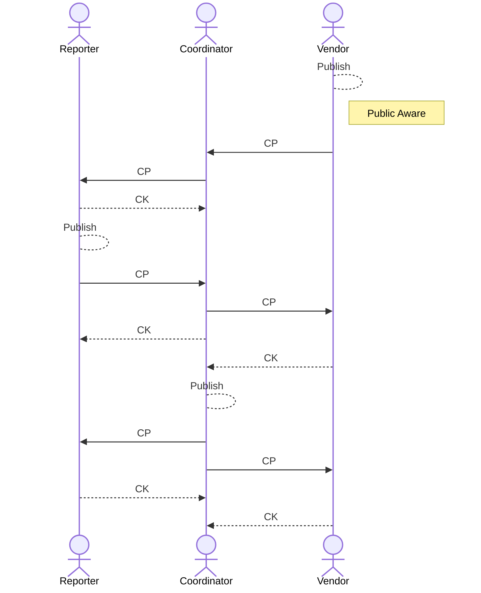

#### Closing the Case

Having no further work to be done on the case, the Reporter closes their
report and tells the Coordinator using an _RC_ message in Figure
[\[fig:seq_reporter_closes_case\]](#fig:seq_reporter_closes_case){reference-type="ref"
reference="fig:seq_reporter_closes_case"}. This prompts the Coordinator
to review their outstanding tasks and decide to initiate the closure of
their own report. In turn, the Coordinator relays this to the Vendor,
who also closes their report.

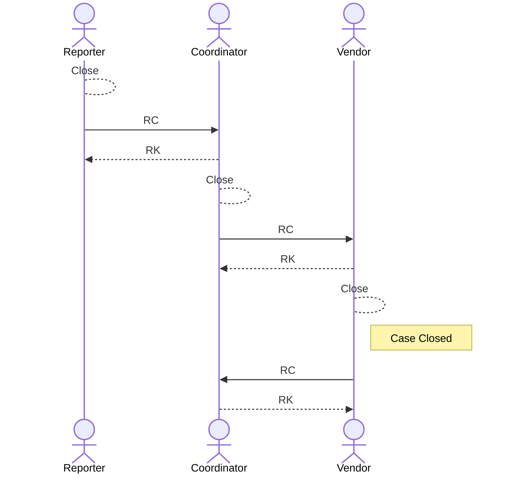

Note that for all three scenarios shown in Figure
[\[fig:embargo_teardown_and_publish\]](#fig:embargo_teardown_and_publish){reference-type="ref"
reference="fig:embargo_teardown_and_publish"}, there is no specific
order in which Participants must act. We could just as easily have shown
the Reporter initiating an embargo teardown because of a leaked media
report or the Vendor exiting an embargo early because they had their fix
ready sooner than expected.

#### Embargo Termination and Publication

Furthermore, our protocol only sets a discrete end to the embargo
period, it intentionally does *not* address a publication schedule. Once
the embargo has been exited, *any* Participant may publish at any time.
Participants might choose to coordinate publication schedules more
closely, but there is nothing in the protocol to require it. With the
recognition that more concise publication scheduling might be needed in
some situations, we revisit this concern as future work in
§[\[sec:pub_sync\]](#sec:pub_sync){reference-type="ref"
reference="sec:pub_sync"}.

#### Report Closure is a Per-Participant Choice

Finally, report closure is a per-Participant choice. We chose to show a
simple case where all Participants agreed at approximately the same time
that there was nothing further to be done. This will not always be the
case, nor is it necessary.

[^3]: "Yes-And" is a heuristic taken from improvisational theatre in
    which Participants are encouraged to agree with whatever their
    counterpart suggests and add to it rather than reject it outright.
    It serves as a good model for cooperation among parties who share an
    interest in a positive outcome.
