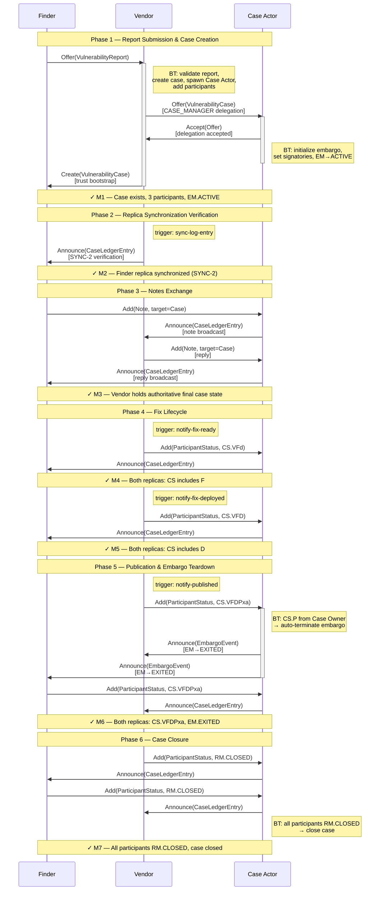

# FV Demo — Protocol Reference

This document is a **technical reference** for the fv
(Finder + Vendor) CVD demo. It is written for developers who want to
understand the message-level protocol interactions and build custom
actors that interoperate with the Vultron protocol.

For a hands-on tutorial on running the demo, see
[Running the Multi-Actor Container Demos](../tutorials/container_demos.md).

---

## Actors and Topology

The fv demo uses **two Docker containers** and **three logical
actors**:

| Actor | CVD Role(s) | Container | Actor ID pattern |
|:------|:------------|:----------|:-----------------|
| Finder | `REPORTER` | `finder` | `http://finder:7999/api/v2/actors/finder` |
| Vendor | `VENDOR`, `CASE_OWNER` | `vendor` | `http://vendor:7999/api/v2/actors/vendor` |
| Case Actor | `CASE_MANAGER` | `vendor` (co-located) | `http://vendor:7999/api/v2/actors/{uuid}` |

The **Case Actor** is a `Service`-type ActivityStreams actor that is
spawned automatically during case creation. It lives inside the Vendor
container as a separate actor record with its own inbox URL.
The Case Actor is the single-writer authority for the canonical case
log and coordinates state across all participants.

---

## Protocol Phases

The demo progresses through six phases, verified by numbered milestones (M1–M7). The sequence diagram below shows every
ActivityStreams activity exchanged between actors.

### Message-by-Message Sequence Diagram



---

## Phase 1 — Report Submission and Case Creation

### What the demo runner does

The demo runner calls trigger endpoints on both actors:

    POST /api/v2/actors/{finder_id}/trigger/submit-report
    POST /api/v2/actors/{vendor_id}/trigger/validate-report

### What happens internally

1. **Finder** constructs an `Offer(VulnerabilityReport)` activity and
   delivers it to the Vendor's inbox.
2. **Vendor's Behavior Tree** processes the received Offer:
    - Creates a stub `VulnerabilityCase` with the report attached.
    - Adds itself as a participant (roles: `VENDOR`, `CASE_OWNER`,
      `CASE_MANAGER`).
    - Adds the Finder as a participant (role: `REPORTER`).
    - **Spawns the Case Actor** — a new `Service`-type actor record
      in the Vendor container with its own inbox.
    - Adds the Case Actor as a participant (role: `CASE_MANAGER`);
      removes its own `CASE_MANAGER` role, retaining `VENDOR` and
      `CASE_OWNER`.
    - Sends `Offer(VulnerabilityCase)` to the Case Actor inbox — this
      is the **CASE_MANAGER role delegation**.
3. **Case Actor's BT** processes the delegation Offer:
    - Verifies the sender holds `CASE_OWNER`.
    - Verifies itself is listed as `CASE_MANAGER`.
    - Sends `Accept(Offer)` back to Vendor.
    - Initializes the embargo from the Vendor's default embargo policy.
    - Sets both Vendor and Finder to embargo `SIGNATORY` state
      immediately (no invite/accept round-trip needed — they were
      present at creation).
    - Sets EM state to `ACTIVE`.
4. **Vendor** sends `Create(VulnerabilityCase)` to the Finder. This
   is the **trust bootstrap** — the full case snapshot includes all
   three participants so the Finder can bind the Case Actor's identity
   to this case.

### Example: Offer(VulnerabilityReport)

```json
{
  "@context": "https://www.w3.org/ns/activitystreams",
  "type": "Offer",
  "actor": "http://finder:7999/api/v2/actors/finder",
  "to": ["http://vendor:7999/api/v2/actors/vendor"],
  "object": {
    "type": "VulnerabilityReport",
    "name": "Report: Buffer overflow in network stack",
    "content": "A heap-based buffer overflow..."
  }
}
```

### Example: Create(VulnerabilityCase) — Trust Bootstrap

```json
{
  "@context": "https://www.w3.org/ns/activitystreams",
  "type": "Create",
  "actor": "http://vendor:7999/api/v2/actors/vendor",
  "to": ["http://finder:7999/api/v2/actors/finder"],
  "object": {
    "type": "VulnerabilityCase",
    "id": "http://vendor:7999/api/v2/datalayer/{case-uuid}",
    "name": "Case for VulnerabilityReport",
    "case_participant": [
      {
        "type": "CaseParticipant",
        "attributed_to": "http://vendor:7999/api/v2/actors/vendor",
        "cvd_roles": ["VENDOR", "CASE_OWNER"]
      },
      {
        "type": "CaseParticipant",
        "attributed_to": "http://finder:7999/api/v2/actors/finder",
        "cvd_roles": ["REPORTER"]
      },
      {
        "type": "CaseParticipant",
        "attributed_to": "http://vendor:7999/api/v2/actors/{ca-uuid}",
        "cvd_roles": ["CASE_MANAGER"]
      }
    ]
  }
}
```

### Milestone M1 verification

| Check | Both replicas |
|:------|:-------------|
| Case exists | ✓ |
| Participant count ≥ 3 (Vendor, Finder, Case Actor) | ✓ |
| EM state = `ACTIVE` | ✓ |
| Default embargo present | ✓ |
| Finder has case replica | ✓ |

---

## Phase 2 — Replica Synchronization Verification

### What the demo runner does

    POST /api/v2/actors/{vendor_id}/demo/sync-log-entry

### What happens internally

1. **Vendor** commits a demo verification case ledger entry and queues `Announce(CaseLedgerEntry)` in its outbox.
2. Outbox delivery delivers the `Announce(CaseLedgerEntry)` to the Finder.
3. **Finder** processes the log entry and updates its local replica.
4. The demo runner verifies the Finder replica matches the authoritative Vendor state (SYNC-2).

### Example: Announce(CaseLedgerEntry)

```json
{
  "@context": "https://www.w3.org/ns/activitystreams",
  "type": "Announce",
  "actor": "http://vendor:7999/api/v2/actors/vendor",
  "to": ["http://finder:7999/api/v2/actors/finder"],
  "object": {
    "type": "CaseLedgerEntry",
    "id": "http://vendor:7999/api/v2/datalayer/{entry-uuid}",
    "content": "SYNC-2 replication verification",
    "hash": "sha256:..."
  },
  "target": {
    "type": "VulnerabilityCase",
    "id": "http://vendor:7999/api/v2/datalayer/{case-uuid}"
  }
}
```

### Milestone M2 verification

| Check | Both replicas |
|:------|:-------------|
| Finder DataLayer has case ID | ✓ |
| Matching `actor_participant_index` | ✓ |
| Matching `active_embargo` | ✓ |
| Matching log tail hash (SYNC-2) | ✓ |

---

## Phase 3 — Notes Exchange

### What the demo runner does

```text
POST /api/v2/actors/{finder_id}/demo/add-note-to-case
POST /api/v2/actors/{vendor_id}/demo/add-note-to-case
```

### What happens internally

1. **Finder** constructs `Add(Note, target=VulnerabilityCase)` and
   sends it to the Case Actor's inbox.
2. **Case Actor** receives the note, attaches it to the case, creates
   a log entry, and broadcasts `Announce(CaseLedgerEntry)` to all other
   participants.
3. **Vendor** receives the broadcast and updates its local case
   replica with the note.
4. **Vendor** sends a reply note via the same mechanism.
5. **Case Actor** broadcasts the reply to all other participants
   (including Finder).

### Example: Add(Note, target=Case)

```json
{
  "@context": "https://www.w3.org/ns/activitystreams",
  "type": "Add",
  "actor": "http://finder:7999/api/v2/actors/finder",
  "to": ["http://vendor:7999/api/v2/actors/{ca-uuid}"],
  "object": {
    "type": "Note",
    "name": "Question from Finder",
    "content": "Is there a workaround available while waiting for the patch?"
  },
  "target": {
    "type": "VulnerabilityCase",
    "id": "http://vendor:7999/api/v2/datalayer/{case-uuid}"
  }
}
```

### Milestone M3 verification

| Check | Both replicas |
|:------|:-------------|
| Vendor container holds authoritative final case state | ✓ |

---

## Phase 4 — Fix Lifecycle

### What the demo runner does

```text
POST /api/v2/actors/{vendor_id}/demo/notify-fix-ready
POST /api/v2/actors/{vendor_id}/demo/notify-fix-deployed
```

### What happens internally

1. **Vendor** sends `Add(ParticipantStatus(CS.VFd), target=Case)` to
   the Case Actor.
2. **Case Actor** verifies the sender is a known participant, updates
   the Vendor's participant status record, and broadcasts to all
   other participants.
3. **Finder** receives the broadcast and updates its replica — both
   replicas now show fix-ready (`F`).
4. Steps repeat for fix-deployed (`D`), advancing case state to
   `CS.VFD`.

### Example: Add(ParticipantStatus) — Fix Ready

```json
{
  "@context": "https://www.w3.org/ns/activitystreams",
  "type": "Add",
  "actor": "http://vendor:7999/api/v2/actors/vendor",
  "to": ["http://vendor:7999/api/v2/actors/{ca-uuid}"],
  "object": {
    "type": "ParticipantStatus",
    "vfd_state": "VFd",
    "attributed_to": "http://vendor:7999/api/v2/actors/vendor"
  },
  "target": {
    "type": "VulnerabilityCase",
    "id": "http://vendor:7999/api/v2/datalayer/{case-uuid}"
  }
}
```

### Milestone M4 and M5 verification

| Milestone | Check | Both replicas |
|:----------|:------|:-------------|
| M4 | Vendor participant CS includes `F` (fix ready) | ✓ |
| M5 | Vendor participant CS includes `D` (fix deployed) | ✓ |

---

## Phase 5 — Publication and Embargo Teardown

### What the demo runner does

```text
POST /api/v2/actors/{vendor_id}/demo/notify-published
POST /api/v2/actors/{finder_id}/demo/notify-published
```

### What happens internally

1. **Vendor** sends `Add(ParticipantStatus(CS.VFDPxa), target=Case)`
   to the Case Actor.
2. **Case Actor** detects that the Case Owner (Vendor) has set `CS.P`
   (public awareness). This automatically triggers **embargo
   teardown**.
3. Case Actor terminates the embargo and broadcasts
   `Announce(EmbargoEvent)` with EM state `EXITED` to all
   participants.
4. Both **Vendor** and **Finder** receive the termination notice and
   update their local EM states to `EXITED`.
5. **Finder** also sends `Add(ParticipantStatus(CS.VFDPxa))` to
   confirm its own public-awareness state.

### Example: Announce(EmbargoEvent) — Embargo Teardown

```json
{
  "@context": "https://www.w3.org/ns/activitystreams",
  "type": "Announce",
  "actor": "http://vendor:7999/api/v2/actors/{ca-uuid}",
  "to": [
    "http://vendor:7999/api/v2/actors/vendor",
    "http://finder:7999/api/v2/actors/finder"
  ],
  "object": {
    "type": "EmbargoEvent",
    "em_state": "EXITED"
  },
  "target": {
    "type": "VulnerabilityCase",
    "id": "http://vendor:7999/api/v2/datalayer/{case-uuid}"
  }
}
```

### Milestone M6 verification

| Check | Both replicas |
|:------|:-------------|
| CS state = `VFDPxa` | ✓ |
| EM state = `EXITED` | ✓ |
| Vendor participant is public-aware | ✓ |

---

## Phase 6 — Case Closure

### What the demo runner does

```text
POST /api/v2/actors/{vendor_id}/demo/close-case
POST /api/v2/actors/{finder_id}/demo/close-case
```

### What happens internally

1. **Vendor** sends
   `Add(ParticipantStatus(RM.CLOSED), target=Case)` to the Case
   Actor.
2. **Finder** sends the same.
3. **Case Actor** detects that all participants are now `RM.CLOSED`
   and closes the case.

### Example: Add(ParticipantStatus) — Case Closure

```json
{
  "@context": "https://www.w3.org/ns/activitystreams",
  "type": "Add",
  "actor": "http://vendor:7999/api/v2/actors/vendor",
  "to": ["http://vendor:7999/api/v2/actors/{ca-uuid}"],
  "object": {
    "type": "ParticipantStatus",
    "rm_state": "CLOSED",
    "attributed_to": "http://vendor:7999/api/v2/actors/vendor"
  },
  "target": {
    "type": "VulnerabilityCase",
    "id": "http://vendor:7999/api/v2/datalayer/{case-uuid}"
  }
}
```

### Milestone M7 verification

| Check | Both replicas |
|:------|:-------------|
| All participants `RM.CLOSED` | ✓ |
| Case status = closed | ✓ |
| Final CS state = `VFDPxa` | ✓ |

---

## State Machine Summary

The demo exercises all three Vultron state machines:

### Report Management (RM)

```text
RECEIVED → VALID → ACCEPTED → ... → CLOSED
```

### Embargo Management (EM)

```text
NONE → PROPOSED → ACTIVE → EXITED
```

(In the fv demo, `PROPOSED` is skipped — both participants
are set to `SIGNATORY` at case creation time, moving directly to
`ACTIVE`.)

### Case State (CS) — Six Dimensions

```text
vfdpxa → Vfdpxa → VFdpxa → VFDpxa → VFDPxa
```

| Step | Transition | Trigger |
|:-----|:-----------|:--------|
| Vendor aware | `v` → `V` | Report validated |
| Fix ready | `f` → `F` | `notify-fix-ready` |
| Fix deployed | `d` → `D` | `notify-fix-deployed` |
| Public aware | `p` → `P` | `notify-published` |
| No exploit | `x` stays `x` | (not demonstrated) |
| No attacks | `a` stays `a` | (not demonstrated) |

---

## Activity Types Used in the Demo

The following table maps each ActivityStreams activity type used in
the fv demo to its `MessageSemantics` value and the phase
where it appears:

| AS2 Activity | MessageSemantics | Phase | Direction |
|:-------------|:-----------------|:------|:----------|
| `Offer(VulnerabilityReport)` | `SUBMIT_REPORT` | 1 | Finder → Vendor |
| `Offer(VulnerabilityCase)` | `OFFER_CASE_MANAGER_ROLE` | 1 | Vendor → Case Actor |
| `Accept(Offer)` | `ACCEPT_CASE_MANAGER_ROLE` | 1 | Case Actor → Vendor |
| `Create(VulnerabilityCase)` | `CREATE_CASE` | 1 | Vendor → Finder |
| `Add(ParticipantStatus)` | `ADD_PARTICIPANT_STATUS_TO_PARTICIPANT` | 2–6 | Any → Case Actor |
| `Add(Note, target=Case)` | `ADD_NOTE_TO_CASE` | 3 | Any → Case Actor |
| `Announce(CaseLedgerEntry)` | `ANNOUNCE_CASE_LEDGER_ENTRY` | 2–6 | Case Actor → All |
| `Announce(EmbargoEvent)` | `ANNOUNCE_EMBARGO_EVENT_TO_CASE` | 5 | Case Actor → All |

---

## Puppeteering Constraint

The demo runner (the orchestration script) **never** constructs or
sends ActivityStreams JSON directly to any actor's inbox. It only:

- Calls **trigger endpoints** on each actor's own container
  (e.g., `POST /actors/{id}/demo/notify-fix-ready`).
- Reads **DataLayer endpoints** for milestone verification
  (e.g., `GET /datalayer/{case-id}`).

This ensures the full Behavior Tree, outbox delivery, and inbox
processing pipeline is exercised end-to-end. The demo is not a
simulation — it is a live protocol run.

---

## Key Implementation Files

| File | Role |
|:-----|:-----|
| `vultron/demo/scenario/fv_demo.py` | Demo orchestration script |
| `vultron/demo/helpers/` | Shared helper modules (actions, milestones, notes, polling, seeding, sync, verification, workflow) |
| `vultron/adapters/driving/fastapi/routers/demo_triggers.py` | Demo trigger endpoints |
| `vultron/adapters/driving/fastapi/routers/actors.py` | Inbox endpoint |
| `vultron/wire/as2/extractor.py` | Activity pattern matching (AS2 → MessageSemantics) |
| `vultron/core/dispatcher.py` | Message routing (MessageSemantics → use case) |
| `vultron/semantic_registry/` | Use-case registry (`USE_CASE_MAP`) |
| `docker/docker-compose-multi-actor.yml` | Multi-container topology |
| `docker/seed-configs/` | Per-container actor seed configurations |

---

## Related Resources

- [Running the Multi-Actor Container Demos](../tutorials/container_demos.md)
  — tutorial for running all three demo scenarios
- [Formal Protocol Reference](formal_protocol/index.md) — state
  machine definitions and message types
- [Ubiquitous Language](glossary.md) — domain terminology
