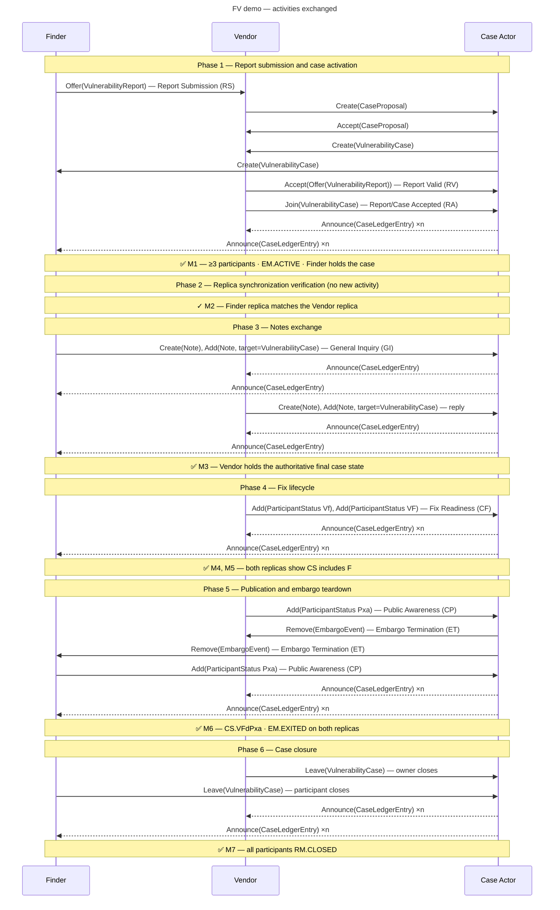

# FV Demo — Protocol Reference

This page is the message-level reference for the Finder + Vendor (FV) demo scenario.
It records, phase by phase, which trigger the demo runner calls, which ActivityStreams Vocabulary 2.0 (AS2) activities the actors then exchange, and which case ledger entries the exchange produces.
It is written for developers who are building actors that must interoperate with the Vultron Protocol, and it was verified against a run of the scenario.

The page does not explain how to run the demo or why the case moves as it does.
[Run the FV Demo](../tutorials/fv-demo.md) carries the run-it-yourself steps, and the [FV scenario narrative](../topics/scenarios/fv.md) carries the explanation in Coordinated Vulnerability Disclosure (CVD) terms.
Every activity named below is documented, with its canonical example, on the [Message Reference](messages/index.md) pages linked from the tables.

---

## Actors and topology

The compose stack starts every actor container the multi-actor scenarios share.
The FV scenario uses two of them and three logical actors:

| Actor | CVD role(s) | Container | Actor id |
|:------|:------------|:----------|:---------|
| Finder | `REPORTER` | `finder` | `http://finder:7999/api/v2/actors/{id}` |
| Vendor | `VENDOR`, `CASE_OWNER` | `vendor` | `http://vendor:7999/api/v2/actors/{id}` |
| Case Actor | `CASE_MANAGER` | `vendor` (co-hosted) | `http://vendor:7999/api/v2/actors/case-actor` |

The **Case Actor** is the actor that enacts the `CASE_MANAGER` role for the case.
It is the single writer of the canonical case ledger, and every case-scoped activity a participant sends is addressed to it ([The CASE_MANAGER and the Case Ledger](../topics/case_lifecycle/case_manager_and_ledger.md)).
The Vendor's container hosts it as a second actor record with its own inbox, because the Vendor's `case_actor_service_url` points at the Vendor's own container.
The dedicated `case-actor` container in the compose file takes no part in this scenario, and the demo runner asserts at the end of Phase 2 that it holds no case data.

The Finder is not a protocol role.
The actor labeled Finder holds `REPORTER`, the role of whoever submits the report ([ADR-0078](../adr/0078-retire-finder-role.md)).

---

## Message-by-message sequence

The demo runner drives the scenario through six phases and verifies seven milestones (M1–M7).
The sequence diagram below shows every activity exchanged between the three actors, in the order a run produces them.
Ledger fan-out, in which the Case Actor sends `Announce(CaseLedgerEntry)` for every entry it commits, is drawn once per phase rather than once per entry.


```mermaid
---
title: FV demo — activities exchanged
---
sequenceDiagram
    participant F as Finder
    participant V as Vendor
    participant CA as Case Actor

    note over F,CA: Phase 1 — Report submission and case activation
    F->>V: Offer(VulnerabilityReport) — Report Submission (RS)
    V->>CA: Create(CaseProposal)
    CA->>V: Accept(CaseProposal)
    CA->>V: Create(VulnerabilityCase)
    CA->>F: Create(VulnerabilityCase)
    V->>CA: Accept(Offer(VulnerabilityReport)) — Report Valid (RV)
    V->>CA: Join(VulnerabilityCase) — Report/Case Accepted (RA)
    CA-->>V: Announce(CaseLedgerEntry) ×n
    CA-->>F: Announce(CaseLedgerEntry) ×n
    note over F,CA: ✅ M1 — ≥3 participants · EM.ACTIVE · Finder holds the case

    note over F,CA: Phase 2 — Replica synchronization verification (no new activity)
    note over F,CA: ✓ M2 — Finder replica matches the Vendor replica

    note over F,CA: Phase 3 — Notes exchange
    F->>CA: Create(Note), Add(Note, target=VulnerabilityCase) — General Inquiry (GI)
    CA-->>V: Announce(CaseLedgerEntry)
    CA-->>F: Announce(CaseLedgerEntry)
    V->>CA: Create(Note), Add(Note, target=VulnerabilityCase) — reply
    CA-->>V: Announce(CaseLedgerEntry)
    CA-->>F: Announce(CaseLedgerEntry)
    note over F,CA: ✅ M3 — Vendor holds the authoritative final case state

    note over F,CA: Phase 4 — Fix lifecycle
    V->>CA: Add(ParticipantStatus Vf), Add(ParticipantStatus VF) — Fix Readiness (CF)
    CA-->>V: Announce(CaseLedgerEntry) ×n
    CA-->>F: Announce(CaseLedgerEntry) ×n
    note over F,CA: ✅ M4, M5 — both replicas show CS includes F

    note over F,CA: Phase 5 — Publication and embargo teardown
    V->>CA: Add(ParticipantStatus Pxa) — Public Awareness (CP)
    CA->>V: Remove(EmbargoEvent) — Embargo Termination (ET)
    CA->>F: Remove(EmbargoEvent) — Embargo Termination (ET)
    F->>CA: Add(ParticipantStatus Pxa) — Public Awareness (CP)
    CA-->>V: Announce(CaseLedgerEntry) ×n
    CA-->>F: Announce(CaseLedgerEntry) ×n
    note over F,CA: ✅ M6 — CS.VFdPxa · EM.EXITED on both replicas

    note over F,CA: Phase 6 — Case closure
    V->>CA: Leave(VulnerabilityCase) — owner closes
    F->>CA: Leave(VulnerabilityCase) — participant closes
    CA-->>V: Announce(CaseLedgerEntry) ×n
    CA-->>F: Announce(CaseLedgerEntry) ×n
    note over F,CA: ✅ M7 — all participants RM.CLOSED
```

A run also contains `Announce(VulnerabilityCase)` from the Case Actor to every participant, which seeds a replica, and `Reject(CaseLedgerEntry)` from a replica to the Case Actor, which reports that an entry arrived before its predecessor and asks for replay.
Both are part of ledger replication rather than of the CVD case, and [Ledger Replication Messages](messages/ledger_replication.md) documents them.

---

## Phase 1 — Report submission and case activation

### Triggers

```text
POST /api/v2/actors/{finder_id}/trigger/submit-report
POST /api/v2/actors/{vendor_id}/trigger/validate-report
POST /api/v2/actors/{vendor_id}/trigger/engage-case
```

### Activities

| Activity | Formal message | `MessageSemantics` | Direction | Documented on |
|:---------|:---------------|:-------------------|:----------|:--------------|
| `Offer(VulnerabilityReport)` | Report Submission (RS) | `SUBMIT_REPORT` | Finder → Vendor | [RM Messages](messages/rm.md) |
| `Create(CaseProposal)` | Create Case Proposal | `CREATE_CASE_PROPOSAL` | Vendor → Case Actor | [Case Proposal Messages](messages/case_proposal.md) |
| `Accept(CaseProposal)` | Accept Case Proposal | `ACCEPT_CASE_PROPOSAL` | Case Actor → Vendor | [Case Proposal Messages](messages/case_proposal.md) |
| `Create(VulnerabilityCase)` | Create Case | `CREATE_CASE` | Case Actor → Vendor, Finder | [Case Management Messages](messages/case_management.md) |
| `Accept(Offer(VulnerabilityReport))` | Report Valid (RV) | `VALIDATE_REPORT` | Vendor → Case Actor | [RM Messages](messages/rm.md) |
| `Join(VulnerabilityCase)` | Report/Case Accepted (RA) | `ENGAGE_CASE` | Vendor → Case Actor | [RM Messages](messages/rm.md) |

### What happens

1. The Finder's `submit-report` trigger builds `Offer(VulnerabilityReport)` and its outbox delivers it to the Vendor's inbox.
2. The Vendor's behavior tree stores the report and sends `Create(CaseProposal)` to the Case Actor.
   The Vendor does not create the case itself; case creation is delegated so that the `CASE_MANAGER` authority is established by the actor that will hold it ([ADR-0041](../adr/0041-caseactor-authoritative-case-initialization.md), CP-09-005).
3. The Case Actor creates the case, seats itself as `CASE_MANAGER`, the Vendor as `CASE_OWNER` at `RM.RECEIVED`, and the Finder as `REPORTER` at `RM.ACCEPTED`, initializes the Vendor's default embargo, and seeds both participants' [embargo consent](../topics/behavior_logic/use-cases/embargo-lifecycle.md) as signatories.
   The embargo is therefore `ACTIVE` from the first ledger entry without a proposal round-trip (EP-04-001).
   It then sends `Accept(CaseProposal)` to the Vendor, followed by `Create(VulnerabilityCase)` to both the Vendor and the Finder.
   That `Create` carries the case with its participants inline; it is the trust bootstrap that lets the Finder bind the Case Actor's identity to this case (CBT-01-001).
4. The Vendor's `validate-report` trigger sends Report Valid (RV) to the Case Actor, and the Vendor's participant record advances to `RM.VALID`.
5. The Vendor's `engage-case` trigger sends Report/Case Accepted (RA), and the record advances to `RM.ACCEPTED`.

The case is created before validation, at `RM.RECEIVED`.
[Propose a Case](../topics/behavior_logic/use-cases/propose-case.md) explains the cascade the Case Actor runs on acceptance, step by step.

### Example: Offer(VulnerabilityReport)

The example below is the activity a run produced, with identifiers shortened.
The report travels inline, because the Vendor has no way to read it out of the Finder's store.

```json
{
  "type": "Offer",
  "id": "urn:uuid:711dacfa-…",
  "actor": "http://finder:7999/api/v2/actors/{finder_id}",
  "to": ["http://vendor:7999/api/v2/actors/{vendor_id}"],
  "target": {"type": "Organization", "id": "http://vendor:7999/api/v2/actors/{vendor_id}"},
  "object": {
    "type": "VulnerabilityReport",
    "id": "urn:uuid:3fed4100-…",
    "name": "Remote Code Execution in Network Stack",
    "content": "A critical remote code execution vulnerability was discovered…",
    "attributedTo": "http://finder:7999/api/v2/actors/{finder_id}"
  }
}
```

### Example: Create(VulnerabilityCase)

The `context` names the new case and the `inReplyTo` names the `Accept(CaseProposal)` that authorized it (CP-05-003).
The case object is abbreviated here; on the wire it carries every participant inline (CBT-01-007).
The `actor` is the Case Actor, acting as `CASE_MANAGER`, while the case's `attributedTo` names the Vendor, the Case Owner (CP-09-001).

```json
{
  "type": "Create",
  "id": "urn:uuid:ac0e2f61-…",
  "actor": "http://vendor:7999/api/v2/actors/case-actor",
  "to": [
    "http://vendor:7999/api/v2/actors/{vendor_id}",
    "http://finder:7999/api/v2/actors/{finder_id}"
  ],
  "context": "urn:uuid:8eee4e72-…",
  "inReplyTo": "urn:uuid:15f958ea-…",
  "object": {
    "type": "VulnerabilityCase",
    "id": "urn:uuid:8eee4e72-…",
    "attributedTo": "http://vendor:7999/api/v2/actors/{vendor_id}"
  }
}
```

### Milestone M1

| Check | Where |
|:------|:------|
| Case exists | both replicas |
| Participant count ≥ 3 (Vendor, Finder, Case Actor) | both replicas |
| EM state = `ACTIVE`, default embargo present | both replicas |
| Finder holds the case | Finder replica |

---

## Phase 2 — Replica synchronization verification

### Triggers

None.
This phase reads the two replicas and sends nothing.

### What happens

1. The demo runner reads the highest ledger index the Vendor's replica holds.
2. It waits until the Finder's replica holds a contiguous ledger up to that index.
3. It compares the two replicas: the participant index, the active embargo id, and the ledger tail hash must match.
4. It reads the dedicated `case-actor` container and asserts that it holds no case.

Ledger entries reach a replica through `Announce(CaseLedgerEntry)`, one activity per entry per participant.
Entries can arrive out of order; a replica that receives an entry ahead of its predecessor answers with `Reject(CaseLedgerEntry)`, and the Case Actor replays the missing range ([Ledger Replication Messages](messages/ledger_replication.md)).

### Milestone M2

| Check | Where |
|:------|:------|
| Ledger coverage contiguous to the Vendor's tail | Finder replica |
| Matching `actorParticipantIndex` | both replicas |
| Matching `activeEmbargo` | both replicas |
| Matching ledger tail hash | both replicas |
| No case data | dedicated `case-actor` container |

---

## Phase 3 — Notes exchange

### Triggers

```text
POST /api/v2/actors/{finder_id}/demo/add-note-to-case
POST /api/v2/actors/{vendor_id}/demo/add-note-to-case
```

### Activities

| Activity | Formal message | `MessageSemantics` | Direction | Documented on |
|:---------|:---------------|:-------------------|:----------|:--------------|
| `Create(Note)` | General Inquiry (GI) | `CREATE_NOTE` | Participant → Case Actor | [General Messages](messages/general.md) |
| `Add(Note, target=VulnerabilityCase)` | General Inquiry (GI) | `ADD_NOTE_TO_CASE` | Participant → Case Actor | [General Messages](messages/general.md) |
| `Announce(CaseLedgerEntry)` | Announce Case Ledger Entry | `ANNOUNCE_CASE_LEDGER_ENTRY` | Case Actor → every other participant | [Ledger Replication Messages](messages/ledger_replication.md) |

### What happens

1. The Finder's trigger sends `Create(Note)` and then `Add(Note, target=VulnerabilityCase)` to the Case Actor.
2. The Case Actor attaches the note to the case, commits an `add_note_to_case` ledger entry, and fans it out.
3. The Vendor replies the same way, with the reply note's `inReplyTo` naming the question.
4. Both replicas end up holding both notes.

### Milestone M3

| Check | Where |
|:------|:------|
| Case holds the report, the participants, and both notes | Vendor replica |

---

## Phase 4 — Fix lifecycle

### Triggers

```text
POST /api/v2/actors/{vendor_id}/demo/notify-fix-ready
```

### Activities

| Activity | Formal message | `MessageSemantics` | Direction | Documented on |
|:---------|:---------------|:-------------------|:----------|:--------------|
| `Add(ParticipantStatus, target=CaseParticipant)` | Fix Readiness (CF) | `ADD_PARTICIPANT_STATUS_TO_PARTICIPANT` | Vendor → Case Actor | [CS Messages](messages/cs.md) |

### What happens

1. The `notify-fix-ready` trigger sends two `Add(ParticipantStatus)` activities in sequence, one per hop of the vendor-path state: `vfd` → `Vfd` (vendor aware) and `Vfd` → `VFd` (fix ready).
   The two hops are separate because the Case State machine admits one event per step.
2. The Case Actor validates the transition, appends the status to the Vendor's participant record, commits an `add_participant_status_to_participant` entry, and fans it out.
3. The demo does not call `notify-fix-deployed`.
   The `D` dimension belongs to a Deployer, and a vendor-only participant stops at `VFd`.

### Milestones M4 and M5

| Milestone | Check | Where |
|:----------|:------|:------|
| M4 | Vendor's case state includes `F` (fix ready) | both replicas |
| M5 | Vendor's case state is still `VFd` after the Finder's replica caught up | both replicas |

---

## Phase 5 — Publication and embargo teardown

### Triggers

```text
POST /api/v2/actors/{vendor_id}/demo/notify-published
POST /api/v2/actors/{finder_id}/demo/notify-published
```

### Activities

| Activity | Formal message | `MessageSemantics` | Direction | Documented on |
|:---------|:---------------|:-------------------|:----------|:--------------|
| `Add(ParticipantStatus, target=CaseParticipant)` | Public Awareness (CP) | `ADD_PARTICIPANT_STATUS_TO_PARTICIPANT` | Vendor → Case Actor; Finder → Case Actor | [CS Messages](messages/cs.md) |
| `Remove(EmbargoEvent, origin=VulnerabilityCase)` | Embargo Termination (ET) | `REMOVE_EMBARGO_EVENT_FROM_CASE` | Case Actor → Vendor, Finder | [EM Messages](messages/em.md) |

### What happens

1. The Vendor's trigger sends `Add(ParticipantStatus)` with the public-path state `Pxa`.
2. The Case Actor records the status and, because the report of public awareness comes from the Case Owner, terminates the embargo: it sends `Remove(EmbargoEvent)` to every participant and commits an `add_case_status_to_case` entry carrying `EM.EXITED`.
3. The Finder's trigger sends its own `Add(ParticipantStatus)` with `Pxa`.

### Milestone M6

| Check | Where |
|:------|:------|
| Case state `VFdPxa` | both replicas |
| EM state `EXITED` | both replicas |
| Vendor participant is public-aware | both replicas |

---

## Phase 6 — Case closure

### Triggers

```text
POST /api/v2/actors/{vendor_id}/demo/close-case
POST /api/v2/actors/{finder_id}/demo/close-case
```

### Activities

| Activity | Formal message | `MessageSemantics` | Direction | Documented on |
|:---------|:---------------|:-------------------|:----------|:--------------|
| `Leave(VulnerabilityCase)` | Close Case | `CLOSE_CASE` | Vendor → Case Actor; Finder → Case Actor | [Case Management Messages](messages/case_management.md) |

### What happens

Closure flows through `Leave(VulnerabilityCase)`, not through a participant asserting its own `RM.CLOSED` ([ADR-0050](../adr/0050-leave-vul-case-canonical-rm-closure.md), CM-23-001).

1. The Vendor sends `Leave(VulnerabilityCase)`.
   The Vendor is the `CASE_OWNER`, so this is an owner closure: the Case Actor commits `close_case` for the Vendor, advances its own participant record to `RM.CLOSED` and records that transition as an `add_participant_status_to_participant` entry (CM-23-005), then commits `case_fully_closed` (CM-23-002).
2. The Finder sends `Leave(VulnerabilityCase)`.
   As a non-owner, this advances only the Finder (CM-23-003); no other participant's RM state changes (CM-23-012).
3. Each entry is fanned out as `Announce(CaseLedgerEntry)`, and every replica applies it, which is how a participant learns that a peer has departed.

### Example: Leave(VulnerabilityCase)

```json
{
  "type": "Leave",
  "id": "urn:uuid:541b09bc-…",
  "actor": "http://vendor:7999/api/v2/actors/{vendor_id}",
  "to": ["http://vendor:7999/api/v2/actors/case-actor"],
  "object": {
    "type": "VulnerabilityCase",
    "id": "urn:uuid:8eee4e72-…",
    "attributedTo": "http://vendor:7999/api/v2/actors/{vendor_id}"
  }
}
```

### Milestone M7

| Check | Where |
|:------|:------|
| Every participant `RM.CLOSED`, including the `CASE_MANAGER` | both replicas |
| `close_case` entry present | Vendor replica |
| Ledger coverage contiguous to the Vendor's tail | Finder replica |

---

## The case ledger a run produces

The Case Actor commits the entries below, in this order.
Each entry's `eventType` names the protocol act; the actor column names the participant on whose behalf it was recorded.
The exact count of `add_participant_status_to_participant` and `add_case_status_to_case` entries in the initialization block depends on how many participant and case status records the acceptance cascade writes, so the table shows the shape of one run rather than an invariant.

| Index | `eventType` | Recorded for | Phase |
|------:|:------------|:-------------|:------|
| 0 | `create_case` | Case Actor | 1 |
| 1 | `add_report_to_case` | Case Actor | 1 |
| 2–6 | `add_participant_status_to_participant` | Case Actor (initial RM states of all three participants) | 1 |
| 7 | `add_case_status_to_case` | Vendor (initial case status, `EM.ACTIVE`) | 1 |
| 8 | `validate_report` | Vendor | 1 |
| 9 | `engage_case` | Vendor | 1 |
| 10 | `add_note_to_case` | Finder | 3 |
| 11 | `add_note_to_case` | Vendor | 3 |
| 12–16 | `add_participant_status_to_participant`, `add_case_status_to_case` | Vendor's `Vf` and `VF` statuses and the case status that follows each | 4 |
| 17–20 | `add_participant_status_to_participant`, `add_case_status_to_case` | Vendor's and Finder's `Pxa` statuses; the case status carrying `EM.EXITED` | 5 |
| 21 | `close_case` | Vendor | 6 |
| 22 | `add_participant_status_to_participant` | Case Actor (its own `RM.CLOSED`) | 6 |
| 23 | `case_fully_closed` | Vendor (owner closure) | 6 |
| 24 | `close_case` | Finder | 6 |

The Finder's replica and the Vendor's replica hold the same sequence, entry for entry, once fan-out completes.
The demo runner exports all three ledgers as JSONL under `devlogs/fv/` at the end of a run, and the invariant harness in `test/ci/invariants/` checks them against the causal edges the [FV scenario narrative](../topics/scenarios/fv.md) declares.

---

## State machine summary

The protocol defines five state machines: Report Management (RM), Embargo Management (EM), Participant Embargo Consent (PEC), and the two Case State (CS) sub-machines, the vendor path (VFD) and the public path (PXA).
The table shows the states the FV run traverses in each.

| Machine | Path the run traverses | Notes |
|:--------|:-----------------------|:------|
| RM (Vendor) | `RECEIVED → VALID → ACCEPTED → CLOSED` | driven by `validate-report`, `engage-case`, `close-case` |
| RM (Finder) | `ACCEPTED → CLOSED` | seated at `ACCEPTED` on creation (CBT-01-008) |
| RM (Case Actor) | `RECEIVED → VALID → ACCEPTED → CLOSED` | its own record tracks the proposal and the owner closure (CM-23-005) |
| EM | `ACTIVE → EXITED` | the default embargo is active from creation; `PROPOSED` is never entered |
| PEC | `SIGNATORY` for both participants | seeded on creation; no invitation round-trip |
| CS vendor path (VFD) | `vfd → Vfd → VFd` | `D` is not demonstrated; the Vendor stops at fix ready |
| CS public path (PXA) | `pxa → Pxa` | `X` and `A` are not demonstrated |

[Process Models](../topics/process_models/index.md) explains the RM, EM, and CS machines, and [The Embargo Lifecycle](../topics/behavior_logic/use-cases/embargo-lifecycle.md) covers PEC.

---

## Puppeteering constraint

The demo runner never constructs or sends an AS2 activity to any actor's inbox.
It only:

- calls **trigger endpoints** on each actor's own container (for example `POST /api/v2/actors/{id}/demo/notify-fix-ready`), and
- reads **DataLayer endpoints** for milestone verification (for example `GET /api/v2/actors/{id}/datalayer/{case_id}`).

Every activity in the trace above is therefore produced by an actor's own behavior tree and delivered by its outbox.
The demo is a live protocol run, not a simulation.

---

## Key implementation files

| File | Role |
|:-----|:-----|
| `vultron/demo/scenario/fv_demo.py` | Demo orchestration script |
| `vultron/demo/helpers/` | Shared helper modules for scenario scripts: actor roles, seeding, causal polling and gating, verification, and workflow emission |
| `vultron/adapters/driving/fastapi/routers/trigger_report.py`, `trigger_case.py` | Protocol trigger endpoints (`submit-report`, `validate-report`, `engage-case`) |
| `vultron/adapters/driving/fastapi/routers/demo_triggers.py` | Demo-only trigger endpoints (`add-note-to-case`, `notify-*`, `close-case`) |
| `vultron/adapters/driving/fastapi/routers/actors/` | Inbox endpoint |
| `vultron/wire/as2/extractor/` | Activity pattern matching (AS2 → `MessageSemantics`) |
| `vultron/core/dispatcher.py` | Message routing (`MessageSemantics` → use case) |
| `docker/docker-compose-multi-actor.yml` | Multi-container topology |
| `docker/seed-configs/` | Per-container actor seed configurations |

---

## Related resources

- [Run the FV Demo](../tutorials/fv-demo.md) — the tutorial for this scenario
- [Running the Multi-Actor Container Demos](../tutorials/container_demos.md) — selecting and running any scenario
- [FV scenario narrative](../topics/scenarios/fv.md) — the same case in CVD terms, with its declared causal edges
- [Message Reference](messages/index.md) — every activity's canonical form and example
- [Formal Protocol Reference](formal_protocol/index.md) — state machine definitions and message types
- [Glossary](glossary.md) — domain terminology
