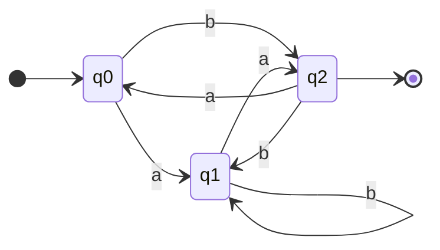
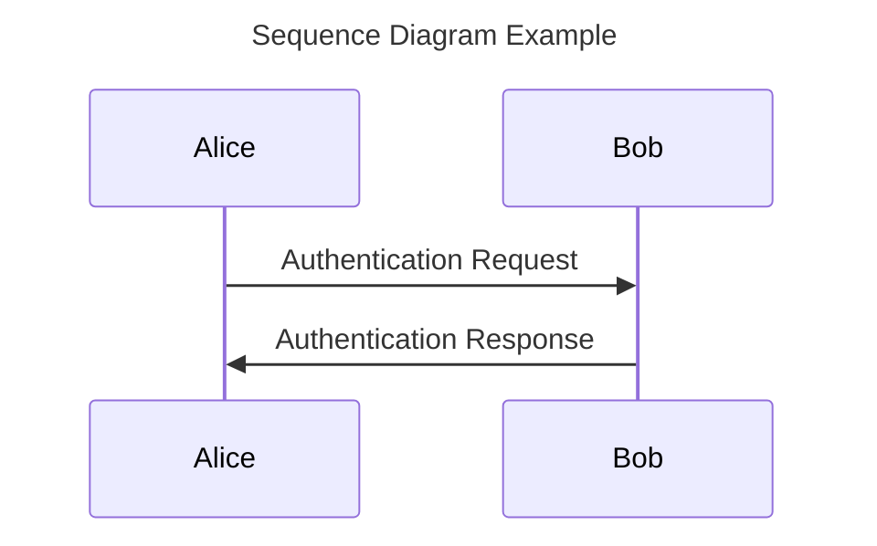
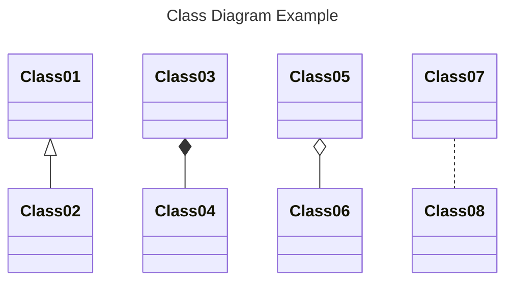

# Notation



Defining the Vultron Protocol involves a lot of notation.
This page provides a reference for the conventions and notation used throughout the documentation.

## Documentation Conventions

This documentation uses the [*Admonitions*](https://squidfunk.github.io/mkdocs-material/reference/admonitions/){:target="_blank"} (call-outs) provided by
[Material for MkDocs](https://squidfunk.github.io/mkdocs-material/){:target="_blank"} to highlight specific types of information.

!!! note ""

    Statements in boxes like this are normative requirements. 
    Use of SHOULD, MUST, MAY, etc. follow the [RFC 2119](https://tools.ietf.org/html/rfc2119){:target="_blank"} conventions.

!!! note "Formalisms"

    Formalisms are used to define the behavior of the Vultron Protocol.

    $$A = A$$

    Readers should generally be able to understand the protocol description in the text without understanding the formalisms,
    but the formalisms are included for completeness.

!!! info

    Statements in boxes like this are informative notes. 
    They provide additional information that may be helpful in understanding the normative requirements.

!!! tip

    Statements in boxes like this are tips. 
    They provide additional information that might point to other resources, or provide additional context that may be 
    helpful in understanding the protocol.

!!! quote

    This is a quote.

!!! example

    This is an example.
    It is also an example example.

!!! question

    What is a question? This is.

!!! success

    This admonition indicates that a page contains
    normative content (as shown below).

!!! warning

    This is a warning.

Material for MkDocs supports a number of other [admonitions](https://squidfunk.github.io/mkdocs-material/reference/admonitions/){:target="_blank"}.
This documentation generally keeps its usage consistent with the admonition names used in the Material for MkDocs
[documentation](https://squidfunk.github.io/mkdocs-material/reference/admonitions/){:target="_blank"}; the
ones used here are listed for completeness and clarity.
Any admonition used here but not listed, or any inconsistency with the above, can be reported by [opening an issue](https://github.com/CERTCC/Vultron/issues){:target="_blank"}.

### Normative and Non-Normative Pages

Not everything in this documentation about the Vultron Protocol is a normative requirement.
The following conventions indicate whether a page contains normative requirements or not.

!!! info "Recognizing Normative Pages"

    

    Pages that contain normative requirements are marked with a banner at or near the top of the page:

!!! info "Recognizing Non-Normative Pages"

    

    Pages that do not contain normative requirements are marked with a banner at or near the top of the page (Like this one).
    This banner may be omitted if the page is clearly non-normative.
    This banner appears on pages where that may not be clear, for example on pages describing a specific implementation
    in terms of SHOULD, MUST, MAY, etc. statements that are not intended to be normative requirements.

<!-- notation-math-start -->
## Mathematical Notation

All of these definitions assume the standard [Zermelo-Fraenkel set theory](https://en.wikipedia.org/wiki/Zermelo%E2%80%93Fraenkel_set_theory){:target="_blank"}.
The following notation is used:

!!! info "Set Theory Symbols"

    | Symbol | Meaning |
    | :--- | :--- |
    | $\{ \dots \}$ | depending on the context: (1) an ordered set in which the items occur in that sequence, or (2) a tuple of values |
    | \|$x$\| | the count of the number of elements in a list, set, tuple, or vector $x$ |
    | $\subset,=,\subseteq$ | the normal proper subset, equality, and subset relations between sets |
    | $\in$ | the membership (is-in) relation between an element and the set it belongs to |
    | $\prec$ | the precedes relation on members of an ordered set: $\sigma_i \prec \sigma_j \textrm{ if and only if } \sigma_i,\sigma_j \in s \textrm{ and } i < j$  where $s$ is an ordered set |
    | \|$X$\| | the size of (the number of elements in) a set $X$ |
    | $\langle X_i \rangle^N_{i=1}$ | a set of $N$ sets $X_i$, indexed by $i$; used in the [Formal Protocol](formal_protocol/index.md) in the context of Communicating Finite State Machines, taken from the article [On Communicating Finite State Machines](https://doi.org/10.1145/322374.322380){:target="_blank"} by Brand and Zafiropulo |

!!! info "Logic Symbols"

    | Symbol | Meaning |
    | :--- | :--- |
    | $\implies$ | implies |
    | $\iff$ | if-and-only-if (bi-directional implication) |
    | $\wedge$ | the logical AND operator |
    | $\lnot$ | the logical NOT operator |

!!! info "Directional Messaging Symbols"

    | Symbol | Meaning |
    | :--- | :--- |
    | $\rightharpoonup{}$ | a message emitted (sent) by a process |
    | $\leftharpoondown{}$ | a message received by a process |

!!! info "DFA Symbols"

    | Symbol | Meaning |
    | :--- | :--- |
    | $\xrightarrow{}$ | a transition between states, usually labeled with the transition type (e.g., $\xrightarrow{a}$) |
    | $(\mathcal{Q},q_0,\mathcal{F},\Sigma,\delta)$ | specific symbols for individual DFA components that are introduced when needed in Chapters |
    | $\Big \langle { \langle S_i \rangle }^N_{i=1}, { \langle o_i \rangle }^N_{i=1}, { \langle M_{i,j} \rangle}^N_{i,j=1}, { succ } \Big \rangle$ | formal protocol symbols that are introduced at the beginning of the [Formal Protocol](formal_protocol/index.md) |

## Diagram Notation

A variety of diagramming techniques are used throughout the documentation.

### State Diagrams

Depictions of DFA as figures use common state diagram symbols, as shown in the example below.

### Sequence and Class Diagrams

Sequence and class diagrams follow UML conventions

### Behavior Tree Diagrams

A few additional notation details specific to [Behavior Trees](../topics/behavior_logic/index.md) are introduced when needed.

<!-- notation-math-end -->
