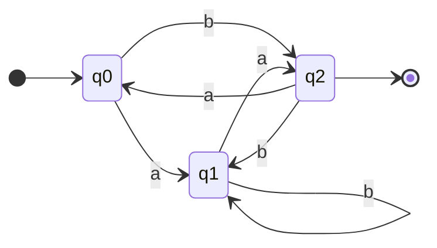
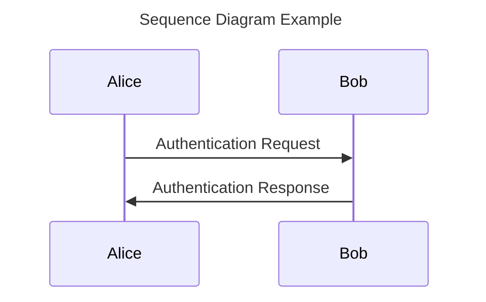
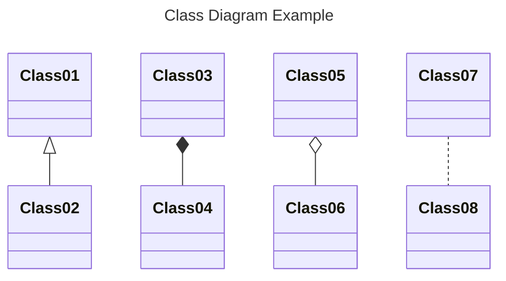

# Notation



Defining the Vultron Protocol involves a lot of notation.
This page is the reference for the set-theory, logic, and deterministic finite automaton (DFA) symbols used in the [formal protocol](formal_protocol/index.md) and the process-model formal pages, and for the diagram forms used throughout the documentation.
The call-out boxes and the normative-page banners the documentation uses are described on [Documentation Conventions](conventions.md).

<!-- notation-math-start -->
## Mathematical Notation

All of these definitions assume the standard [Zermelo-Fraenkel set theory](https://en.wikipedia.org/wiki/Zermelo%E2%80%93Fraenkel_set_theory){:target="_blank"}.
The following notation is used:

!!! info "Set Theory Symbols"

    | Symbol | Meaning |
    | :--- | :--- |
    | $\{ \dots \}$ | depending on the context: (1) an ordered set in which the items occur in that sequence, or (2) a tuple of values |
    | \|$x$\| | the count of the number of elements in a list, set, tuple, or vector $x$ |
    | $\subset,=,\subseteq$ | the normal proper subset, equality, and subset relations between sets |
    | $\in$ | the membership (is-in) relation between an element and the set it belongs to |
    | $\prec$ | the precedes relation on members of an ordered set: $\sigma_i \prec \sigma_j \textrm{ if and only if } \sigma_i,\sigma_j \in s \textrm{ and } i < j$  where $s$ is an ordered set |
    | \|$X$\| | the size of (the number of elements in) a set $X$ |
    | $\langle X_i \rangle^N_{i=1}$ | a set of $N$ sets $X_i$, indexed by $i$; used in the [Formal Protocol](formal_protocol/index.md) in the context of Communicating Finite State Machines, taken from the article [On Communicating Finite State Machines](https://doi.org/10.1145/322374.322380){:target="_blank"} by Brand and Zafiropulo |

!!! info "Logic Symbols"

    | Symbol | Meaning |
    | :--- | :--- |
    | $\implies$ | implies |
    | $\iff$ | if-and-only-if (bi-directional implication) |
    | $\wedge$ | the logical AND operator |
    | $\lnot$ | the logical NOT operator |

!!! info "Directional Messaging Symbols"

    | Symbol | Meaning |
    | :--- | :--- |
    | $\rightharpoonup{}$ | a message emitted (sent) by a process |
    | $\leftharpoondown{}$ | a message received by a process |

!!! info "DFA Symbols"

    | Symbol | Meaning |
    | :--- | :--- |
    | $\xrightarrow{}$ | a transition between states, usually labeled with the transition type (e.g., $\xrightarrow{a}$) |
    | $(\mathcal{Q},q_0,\mathcal{F},\Sigma,\delta)$ | specific symbols for individual DFA components that are introduced when needed in Chapters |
    | $\Big \langle { \langle S_i \rangle }^N_{i=1}, { \langle o_i \rangle }^N_{i=1}, { \langle M_{i,j} \rangle}^N_{i,j=1}, { succ } \Big \rangle$ | formal protocol symbols that are introduced at the beginning of the [Formal Protocol](formal_protocol/index.md) |

## Diagram Notation

A variety of diagramming techniques are used throughout the documentation.

### State Diagrams

Depictions of DFA as figures use common state diagram symbols, as shown in the example below.

```mermaid
stateDiagram-v2
    direction LR
    [*] --> q0
    q0 --> q1 : a
    q0 --> q2 : b
    q1 --> q2 : a
    q1 --> q1 : b
    q2 --> q0 : a
    q2 --> q1 : b
    q2 --> [*]
```

### Sequence and Class Diagrams

Sequence and class diagrams follow Unified Modeling Language (UML) conventions

```mermaid
---
title: Sequence Diagram Example
---
sequenceDiagram
    participant A as Alice
    participant B as Bob
    A ->> B: Authentication Request
    B->>A: Authentication Response
```

```mermaid
---
title: Class Diagram Example
---
classDiagram
    Class01 <|-- Class02
    Class03 *-- Class04
    Class05 o-- Class06
    Class07 .. Class08
```

### Behavior Tree Diagrams

A few additional notation details specific to [Behavior Trees](../topics/behavior_logic/index.md) are introduced when needed.

<!-- notation-math-end -->
