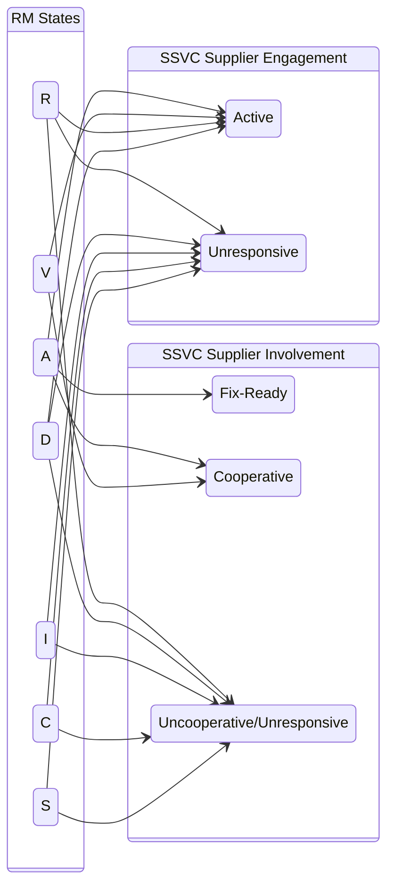

# Interactions Between the Vultron Protocol and SSVC

Once a report has been validated (i.e., it is in the RM _Valid_ state, $q^{rm} \in V$), it must be prioritized to 
determine what further effort, if any, is necessary. 
While any prioritization scheme might be used, here we demonstrate an application of the [SSVC](https://github.com/CERTCC/SSVC) model.

## SSVC Supplier and Deployer Trees

The default outcomes for both the SSVC Supplier and Deployer Trees are _Defer_, _Scheduled_, _Out of Cycle_, and _Immediate_.
The mapping from SSVC outcomes to RM states is straightforward, as shown below for the Supplier Tree and
the Deployer Tree.

!!! note "SSVC Supplier Tree Mapping to RM States"

    $$\label{eq:ssvc_supplier_tree_output}
    q^{rm} \in
    \begin{cases}
        \xrightarrow{d} D & \text{when } SSVC(Supplier~Tree) = Defer \\
        \\
        \xrightarrow{a} A & \text{when } SSVC(Supplier~Tree) \in  
        \begin{Bmatrix}
            Scheduled \\
            Out~of~Cycle \\
            Immediate \\
        \end{Bmatrix} \\
    \end{cases}$$

!!! note "SSVC Deployer Tree Mapping to RM States"
    
    $$\label{eq:ssvc_deployer_tree_output}
    q^{rm} \in
    \begin{cases}
        \xrightarrow{d} D & \text{when } SSVC(Deployer~Tree) = Defer \\
        \\
        \xrightarrow{a} A & \text{when } SSVC(Deployer~Tree) \in  
        \begin{Bmatrix}
            Scheduled \\
            Out~of~Cycle \\
            Immediate \\
        \end{Bmatrix} \\
    \end{cases}$$

The
SSVC _Defer_
output maps directly onto the RM _Deferred_ state. Otherwise, the three
outputs that imply further action is necessary---_Scheduled_,
_Out-of-Cycle_, and _Immediate_---all proceed to the
RM _Accepted_ state.
The different categories imply different processes within the _Accepted_
state. But because the RM model does not dictate internal
organizational processes, further description of what those processes
might look like is out of scope for this report.

We remind readers of a key takeaway from the protocol requirements in
the main part of this report:

!!! note ""
 
    Vendors SHOULD communicate their prioritization choices when making
    either a _defer_ ($\{V,A\} \xrightarrow{d} D$) or _accept_
    ($\{V,D\} \xrightarrow{a} A$) transition out of the _Valid_,
    _Deferred_, or _Accepted_ states.

## SSVC Coordinator Trees

SSVC version 2 offers two decision trees for Coordinators: A Coordinator Triage Tree
and a Coordinator Publish Tree.
The outputs for the Coordinator Triage Decision Tree are _Decline_, _Track_, and _Coordinate_.
Similar to the Supplier Tree mapping above, the mapping here is simple, as shown below.

!!! note "SSVC Coordinator Triage Tree Mapped to RM States"

    $$\label{eq:ssvc_coordinator_triage_tree_output}
    q^{rm} \in
    \begin{cases}
        \xrightarrow{d} D & \text{when } SSVC(Coord.~Triage~Tree) = Decline \\
        \\
        \xrightarrow{a} A & \text{when } SSVC(Coord.~Triage~Tree) \in  
        \begin{Bmatrix}
            Track \\
            Coordinate \\
        \end{Bmatrix} \\
    \end{cases}$$

Again, whereas the _Decline_ output maps directly to the RM _Deferred_ state, the remaining two
states (_Track_ and _Coordinate_) imply the necessity for distinct processes within the Coordinator's RM _Accepted_ state.

On the other hand, the SSVC Coordinator Publish tree falls entirely within the Coordinator's _Accepted_ state, so its 
output does not directly induce any Coordinator RM state transitions.
However, a number of its decision points *do* touch on the protocol models, which we cover next.

## SSVC Decision Points and the Vultron Protocol

Additional connections between the protocol and the SSVC decision trees are possible.
We now examine how individual SSVC tree decision points can inform or be informed by Participant states in the
Vultron protocol.

### Exploitation

The SSVC Exploitation decision point permits three possible values:
- _None_
- _PoC_
- _Active_

These values map directly onto state subsets in the CS model, as shown below.

!!! note "SSVC Exploitation Decision Point Mapped to CS States"

    $$ SSVC(exploitation) =
    \begin{cases}
        None & \iff q^{cs} \in \cdot\cdot\cdot\cdot xa \\
        PoC & \iff  q^{cs} \in \cdot\cdot\cdot\cdot Xa \\
        Active & \iff q^{cs} \in \cdot\cdot\cdot\cdot\cdot A \\
    \end{cases}$$

A value of _None_ implies that no exploits have been made public, and no attacks have been observed
(i.e., $q^{cs} \in \cdot\cdot\cdot\cdot xa$).
The _PoC_ value means that an exploit is public, but no attacks have been observed 
(i.e., $q^{cs} \in \cdot\cdot\cdot\cdot Xa$). 
Finally, the _Active_ value indicates attacks are occurring
(i.e., $q^{cs} \in \cdot\cdot\cdot\cdot\cdot A$).
These case states and SSVC values are equivalent in both directions, hence our use of the "if-and-only-if" ($\iff$) symbol.

### Report Public

The SSVC Report Public decision point also maps directly onto the CS model.
A value of _Yes_ means that the report is public, equivalent to $q^{cs} \in \cdot\cdot\cdot P \cdot\cdot$.
On the other hand, a _No_ value is the same as $q^{cs} \in \cdot\cdot\cdot p \cdot\cdot$.
As above, "$\iff$" indicates the bidirectional equivalence.

!!! note "SSVC Report Public Decision Point Mapped to CS States"

    $$SSVC(report~public) = 
    \begin{cases}
        Yes & \iff q^{cs} \in \cdot\cdot\cdot P \cdot\cdot \\
        No & \iff q^{cs} \in \cdot\cdot\cdot p \cdot\cdot \\
    \end{cases}$$

### Supplier Contacted

If the Supplier (Vendor) has been notified (i.e., there is reason to believe they are at least in the RM _Received_ 
state, equivalent to the $V\cdot\cdot\cdot\cdot\cdot$ CS state subset) the Supplier Contacted value should be _Yes_,
otherwise it should be _No_.

!!! note "SSVC Supplier Contacted Decision Point Mapped to RM States"

    $$SSVC(supp.~contacted) = 
    \begin{cases}
        Yes & \iff q^{rm}_{Vendor} \not \in S \text{ or } q^{cs}_{Vendor} \in V\cdot\cdot\cdot\cdot\cdot \\
        \\
        No & \iff q^{rm}_{Vendor} \in S \text{ or } q^{cs}_{Vendor} \in vfd \cdot\cdot\cdot \\
    \end{cases}$$

### Report Credibility

Unlike most of the other SSVC decision points covered here that form a part of a Participant's report prioritization 
process *after* report validation, the Report Credibility decision point forms an important step in the Coordinator's
validation process.
In fact, it is often the only validation step possible when the Coordinator lacks the ability to reproduce a
vulnerability whether due to constraints of resources, time, or skill.
Thus, a value of _Credible_ can be expected to lead to an RM transition to _Valid_ ($q^{rm} \in R \xrightarrow{v} V$),
assuming any additional validation checks also pass. On the contrary, _Not-Credible_ always implies the RM transition
to _Invalid_ ($q^{rm} \in R \xrightarrow{i} I$) because "Valid-but-not-Credible" is a contradiction.

!!! note "SSVC Report Credibility Decision Point Mapped to RM States"

    $$SSVC(report~cred.) = 
    \begin{cases}
        Credible & \text{implies }q^{rm} \xrightarrow{v} V \textrm{ (if validation also passes)}\\
        Not~Credible & \text{implies } q^{rm} \xrightarrow{i} I \\
    \end{cases}$$

### Supplier Engagement

The possible values for the Supplier (Vendor) Engagement decision point are _Active_ or _Unresponsive_.
From the Coordinator's perspective, if enough Suppliers in a CVD case have communicated their engagement in a case
(i.e., enough Vendors are in the RM _Accepted_ state already or are expected to make it there soon from either the
_Received_ or _Valid_ states), then the SSVC value would be _Active_.

Vendors in _Invalid_ or _Closed_ can be taken as disengaged, and it might be appropriate to select _Unresponsive_ for 
the SSVC Engagement decision point.

Vendors in either _Received_ or _Deferred_ might be either _Active_ or _Unresponsive_, depending on the specific report
history.

This mapping is shown below and on the left side of {== Figure
[\[fig:rm_ssvc_coord_map\]](#fig:rm_ssvc_coord_map){reference-type="ref"
reference="fig:rm_ssvc_coord_map"} ==}.

!!! note "SSVC Supplier Engagement Decision Point Mapped to RM States"

    $$ SSVC(supp.~eng.) = 
    \begin{cases}
        Active & \text{if } q^{rm} \in \{A,V\} \\
        \\
        \begin{cases}
            Active \\
            Unresponsive
        \end{cases} & \text{if } q^{rm} \in \{R,D\} \\
        \\
        Unresponsive & \text{if } q^{rm} \in \{I,C,S\} \\
    \end{cases}$$

### Supplier Involvement

The Supplier Involvement decision point can take on the values _Fix-Ready_, _Cooperative_, or _Uncooperative/Unresponsive_.
We begin by noting the equivalence of the _Fix-Ready_ value with the similarly named substate of the CS model.

!!! note "SSVC Supplier Involvement Decision Point Mapped to CS States"

    $$\begin{aligned}
    \label{eq:ssvc_supplier_involvement_fr}
        SSVC(supp.~inv.) = Fix~Ready \iff q^{cs} \in VF \cdot\cdot\cdot\cdot
    \end{aligned}$$

The Vendor RM states map onto these values as shown below and on the right side of
{== Figure
[\[fig:rm_ssvc_coord_map\]](#fig:rm_ssvc_coord_map){reference-type="ref"
reference="fig:rm_ssvc_coord_map"} ==}.

!!! note "SSVC Supplier Involvement Decision Point Mapped to Vendor RM States"

    $$\begin{aligned}
    \label{eq:ssvc_supplier_involvement}
    SSVC(supp.~inv.) = 
    \begin{cases}
        \begin{cases}
            Fix~Ready \\
            Cooperative
        \end{cases} & \text{if } q^{rm} \in A \\
        \\
        Cooperative & \text{if } q^{rm} \in V \\
        \\
        Uncoop./Unresp. & \text{if } q^{rm} \in \{R,I,D,C,S\} \\
    \end{cases}
    \end{aligned}$$

### Engagement vs. Involvement: What's the Difference?

Note the discrepancy between the mappings given for SSVC Supplier Engagement versus those for Supplier Involvement.
This distinction is most prominent in the connections from the _R_ and _D_ RM states on the left and right sides of {== Figure
[\[fig:rm_ssvc_coord_map\]](#fig:rm_ssvc_coord_map){reference-type="ref"
reference="fig:rm_ssvc_coord_map"} ==}.
These differences are the result of the relative timing of the two different decisions they support within a CVD case.

The decision to Coordinate (i.e., whether the Coordinator should move from RM _Valid_ to RM _Accept_ 
($q^{rm} \in V \xrightarrow{a} A$)) occurs early in the Coordinator's RM process.
The SSVC Supplier Engagement decision point is an attempt to capture this information.
This early in the process, allowances must be made for Vendors who may not have completed their own validation or 
prioritization processes. 
Hence, the mapping allows Vendors in any valid yet unclosed state ($q^{rm} \in \{R,V,A,D\}$) to be categorized as 
_Active_ for this decision point.

On the other hand, the decision to Publish&mdash;a choice that falls entirely within the Coordinator's RM _Accepted_ 
state&mdash;occurs later, at which time, more is known about each Vendor's level of involvement in the case
to that point. 
By the time the publication decision is made, the Vendor(s) have had ample opportunity to engage in the CVD process.
They might already have a _Fix-Ready_ ($q^{cs} \in VF \cdot\cdot\cdot\cdot$), or they might be working toward it
(i.e., SSVC _Cooperative_). However, if the Coordinator has reached the point where they are making a publication 
decision, and the Vendor has yet to actively engage in the case for whatever reason&mdash;as indicated by their failure to reach the
RM _Accepted_ state or demonstrate progress toward it by at least getting to RM _Valid_ 
($q^{rm} \in \{A,V\}$)&mdash;then they can be categorized as _Uncooperative/Unresponsive_.

{== TODO clean up diagram ==}

