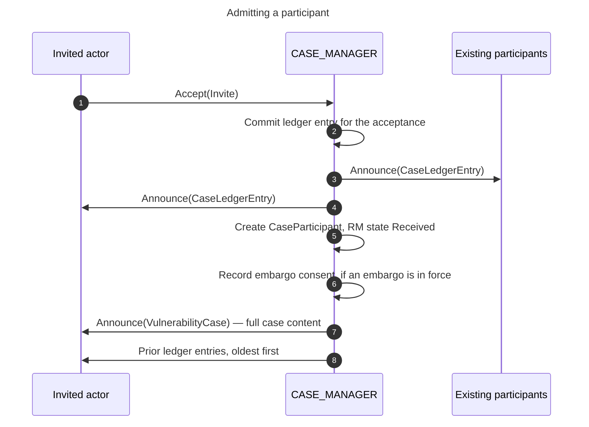

## 10. Model Interactions and Cascade Rules [N]

The five state machines are not independent. A transition in one produces
obligations in others, and this section specifies those couplings.

Each coupling is a **cascade**: a state change raises a domain event, and the
CASE_MANAGER handles that event by applying further changes. Every cascade step
is authorized separately, and where the order of steps matters this section says
so. The cascades below are the complete set that this specification requires.

!!! note "Recall: which machine owns which state"
    

### 10.1 Admitting a Participant

When an actor accepts an invitation, the CASE_MANAGER admits it to the case and
delivers the case content. The steps are ordered because each one supplies a
precondition for the next.

On receiving `Accept(Invite)`, the CASE_MANAGER MUST perform these five steps in
this order:

1. Commit a ledger entry recording the acceptance, and send that entry to every
   participant.
2. Create the participant's `CaseParticipant` record with RM state `Received`.
3. Record the participant's embargo consent, if an embargo is in force.
4. Send `Announce(VulnerabilityCase)` carrying the full case snapshot.
5. Send the ledger entries committed before this participant joined, oldest
   first.

!!! note "Recall: report management states"
    

    Full definitions are in [§6.1](index.md#61-states).

Steps 2, 3 and 4 MUST occur in that order. Step 4 delivers the content that
step 3 authorizes, and step 2 establishes the RM state that step 4's delivery
gate tests ([§9.7](index.md#97-gating-full-case-delivery)).

### 10.2 Embargo Revision and Termination Cascades

A change to the shared embargo state propagates to every participant's consent
state, because consent is given to specific terms.

!!! note "Recall: embargo management states"
    

    Full definitions are in [§7.1](index.md#71-states).

- **EM enters `Revised`.** The CASE_MANAGER MUST transition every participant
  currently at PEC `SIGNATORY` to `LAPSED`. Consent to the previous terms does
  not carry over to revised terms.
- **EM enters `Exited`.** The CASE_MANAGER MUST reset every participant's PEC
  machine to `UNBOUND`. No embargo is in scope, so no consent is either.
- **After a teardown.** The CASE_MANAGER SHOULD commit and send a fresh
  `Announce(CaseLedgerEntry)` so every participant learns that the embargo
  ended.

!!! note "Recall: participant embargo consent states"
    

    Full definitions are in [§9.1](index.md#91-states).

### 10.3 Status Adoption: The Two-Seam Model

A participant's report does not become canonical case state on arrival. It
passes two authorization points, which this specification calls **seams**. A
seam is a place where the CASE_MANAGER makes an authorization decision that can
be re-policied without affecting the other.

Two seams exist because "record what a participant claimed" and "act on that
claim as truth" are separate decisions with separate authority.

#### Seam 1 — Adoption

A participant reports an observation by sending `Add(ParticipantStatus)` to the
CASE_MANAGER. A participant does not send `Add(CaseStatus)`: writing canonical
case status is reserved to the CASE_MANAGER
([§5.4.1](index.md#541-single-writer-authority)).

The CASE_MANAGER records the claim in the case ledger first, and then decides
whether to adopt it as canonical:

- The CASE_MANAGER MUST adopt a Case Owner's report without seeking approval.
  Asking the Case Owner to approve its own report would be circular
  ([§12.4.4](index.md#1244-case-owner-authority)).
- For every other sender, the CASE_MANAGER MUST obtain Case Owner authorization
  before adopting the report as canonical case state. This is the default
  posture, and it is deliberate: without it, any admitted participant could
  force a change to canonical case state.
- An implementation MAY configure a permissive policy instead, where all
  admitted participants are trusted and the cost of Case Owner approval is
  unacceptable. Such a configuration MUST be explicit and documented. An
  implementation MUST NOT relax the default in order to unblock a path that the
  gate is correctly blocking.
- The CASE_MANAGER adjudicates each state-machine dimension of a reported
  status separately. A valid `vfd` update proceeds even when the `rm` value in
  the same report is refused.
- On adoption, the CASE_MANAGER performs the canonical write by emitting
  `Add(CaseStatus)` addressed to itself.
- The component that records the claim MUST NOT execute side-effects.

!!! warning "The default is Case Owner authorization, not automatic adoption"
    A permissive default would mean that any admitted participant — including a
    hostile or malfunctioning one admitted as an external monitor — could force
    a canonical PXA change and, through it, an embargo teardown, with no Case
    Owner confirmation. A conservative default makes that a protocol guarantee
    rather than a deployment posture.

#### Seam 2 — Side-effects

After the canonical write, the CASE_MANAGER evaluates what the new canonical
state requires:

- The CASE_MANAGER MUST check whether the adopted status set Public Aware,
  Exploit Public, or Attacks Observed
  ([§8.2](index.md#82-pxa-public-aware-exploit-public-attacks-observed)).
- If any of those is now set, the CASE_MANAGER MUST evaluate embargo teardown.
- **This check MUST run after the canonical write, never before.** What is
  written is the `CaseStatus` record holding the case's shared EM and PXA
  values; the check reads that written record, so that the side-effect always
  follows from canonical state rather than from an unadopted claim.
- Executing the teardown MUST also require Case Owner authorization by default,
  on the same terms as adoption above.

The two seams are independent. Seam 1 does not examine embargo teardown, and
seam 2 cannot tell whether the canonical write came from an inbound message or
from the CASE_MANAGER's own emission. Either seam can therefore change policy
without a change to the other.

!!! note "When teardown is required but not authorized"
    Evaluating teardown is mandatory; executing it is authorized. If the
    authorization is withheld, the case is left in a state where public
    awareness coexists with an active embargo. That combination is a
    contradiction, and the CASE_MANAGER records it as a diagnostic note on the
    case rather than resolving it silently.

!!! note "Where the gate model applies"
    Seam 1 governs any reported status. Its authorization question matters most
    for the participant-agnostic PXA values, which any participant may report
    ([§12.4.2](index.md#1242-participant-agnostic-cs-transitions-pxa)) —
    including reports about other participants.

!!! info "See also"
    - [ADR-0046: Received Status Authorization](../../adr/0046-received-status-authorization.md)
    - [ADR-0076: Security-Significant Gates Default to Require Case Owner Approval](../../adr/0076-security-significant-gates-default-require-case-owner-approval.md)
    - [ADR-0080: Protocol Asks, Not Suspended Behaviors](../../adr/0080-protocol-asks-not-suspended-behaviors.md)

---
