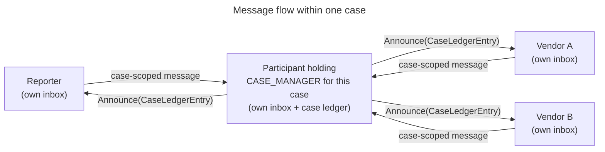

## 3. Protocol Overview [I]

This section describes the shape of the protocol before the normative sections
specify it. It covers how the protocol is modeled, what state it tracks, how that
state is divided between individual participants and the case as a whole, and
what roles participants hold. Nothing here is normative; each subsection points
to the section that carries the requirements.

### 3.1 Coordination Model

Vultron models a case as a set of communicating state machines — one set per
participant — that coordinate only by exchanging messages. No participant reads
another's state directly. Each learns about the others from the messages it
receives.

A participant's own view is therefore always a **replica**: its local copy of
what it believes the case state to be, assembled from the messages that have
reached it. Two participants can hold different views at the same moment,
because a message is still in transit or because a participant has not yet
reported something.

State divides into two kinds, and the distinction runs through the whole
specification. **Participant-specific state** belongs to one participant, which
is the authority on its own value. **Shared case state** has one value for the
entire case, and only the participant holding the `CASE_MANAGER` role writes it
([§5.4.1](index.md#541-single-writer-authority)); it replicates each accepted
change to every participant as `Announce(CaseLedgerEntry)`.



A participant reports its own state and reports observations about the world. It
does not write shared case state, and reporting an observation is not the same as
that observation becoming canonical
([§10.3](index.md#103-status-adoption-the-two-seam-model)).

### 3.2 What a Deployment Looks Like

The protocol is abstract, but a deployment is concrete, and the shape is worth
stating plainly before the state machines begin.

Each participating organization runs one Vultron service, which exposes an inbox at
a URI. For each case, one participant additionally holds the `CASE_MANAGER` role
for that case, and every case-scoped message passes through it: a participant
addresses the message to the CASE_MANAGER, which records it in the case ledger and
then sends the resulting entry to every participant, including the sender.

Two things this is **not**:

- It is not a central clearinghouse. The role is held per case. A different case
  may route through a different organization entirely, and there is no service that
  sees every case.
- It is not a registry. Nothing looks up authority in a directory; authority
  follows the role recorded on the case
  ([§5.4.1](index.md#541-single-writer-authority)).

Participants also talk to each other outside the protocol — by mail, by phone, in a
shared channel. That is normal and out of scope. What routes through the
CASE_MANAGER is the case's *protocol* traffic, because that is what changes case
state ([§5.4.2](index.md#542-routing-topology)).

!!! note "Messages describe what has happened"
    A Vultron message states that something has already occurred. It is not an
    instruction to the recipient. An `RV` message means "I received this report
    and determined it was valid" — it does not ask the recipient to treat the
    report as valid. This holds throughout
    [§4](index.md#4-semantic-layer-message-meanings-n)–[§10](index.md#10-model-interactions-and-cascade-rules-n)
    and governs how every message description in those sections should be read.

    One construct is deliberately request-shaped: a proposal such as an embargo
    invitation asks for a decision. Even there, the reply reports a decision that
    has been made; it does not command a transition.

!!! info "See also"
    - [Formal Protocol Definition](../formal_protocol/index.md) — the formal
      treatment, including the process count and message-set notation

### 3.3 Tracking Dimensions

The protocol tracks coordination state across four dimensions. Each is a state
machine, or a pair of them, with its own states and transitions. The lists below
name the states so the rest of this overview can refer to them; the defining
sections carry the full definitions.

- **Report Management (RM)** — the lifecycle of a report inside one participant,
  from receipt to closure. Participant-specific. Seven states: Start, Received,
  Invalid, Valid, Deferred, Accepted, Closed
  ([§6](index.md#6-report-management-rm-state-machine-n)).
- **Embargo Management (EM)** — the negotiated disclosure timing agreed for the
  case. Shared case state. Five states: None, Proposed, Active, Revised, Exited
  ([§7](index.md#7-embargo-management-em-state-machine-n)).
- **Case State (CS)** — what is known about the vulnerability. CS is the pair
  `(VFD, PXA)` ([§8](index.md#8-case-state-cs-dimensions-n)).
- **Participant Embargo Consent (PEC)** — whether each participant is bound by
  the case's current embargo terms. Per-participant, written by the
  CASE_MANAGER. Five states: Unbound, Invited, Signatory, Lapsed, Declined
  ([§9](index.md#9-participant-embargo-consent-pec-state-machine-n)).



RM, EM and CS were present in the original protocol design. PEC emerged during
implementation and is fully normative; its provenance is recorded at
[§9](index.md#9-participant-embargo-consent-pec-state-machine-n).

### 3.4 How the Dimensions Interact

The four dimensions are coupled. A transition in one creates obligations in
others. This subsection summarizes the couplings;
[§10](index.md#10-model-interactions-and-cascade-rules-n) specifies them.

**RM governs what a participant receives.** A participant's RM state determines
what it is obliged to do and what the CASE_MANAGER may send it. Full case
content is withheld until the participant has been **admitted** — recorded in
the case's participant roster with RM state Received — and its embargo consent
has been resolved ([§9.7](index.md#97-gating-full-case-delivery)).

**EM gates disclosure.** While an embargo is in force, participants defer
publication. An embargo ends by **teardown**: the CASE_MANAGER terminates it and
records the termination. A participant may report that it intends to exit, or
propose a shorter embargo or an earlier end date, but a participant does not end
the case's embargo by itself — EM is shared case state
([§7.2](index.md#72-transitions-and-guards),
[§10.2](index.md#102-embargo-revision-and-termination-cascades)).

**CS records observation, not decision.** A VFD transition is a fact about what
one participant has done. A PXA transition is a fact about the world. Any
participant may report a PXA observation; whether that report becomes canonical
case state is decided separately
([§10.3](index.md#103-status-adoption-the-two-seam-model)).

**EM and PEC answer different questions.** EM says whether the case has an
embargo. PEC says whether a given participant is bound by it. The two can
disagree: a case at EM Active may hold a participant at PEC Unbound, if that
participant joined after the embargo was agreed or declined the terms. Cascade
rules keep them consistent
([§10.2](index.md#102-embargo-revision-and-termination-cascades)).

### 3.5 Participants and Roles

An **actor** is an identity in the protocol — an organization, a person, or a
service, named by a URI. An actor that joins a case becomes a **participant** in
that case, and the case's record of that participant associates it with a set of
roles. Roles determine what a participant is obliged to do and which transitions
it is authorized to cause.

**Roles are not exclusive.** A participant may hold Reporter, Vendor and
Coordinator at once. A vendor that discovers a vulnerability in its own product
is both Reporter and Vendor.

**Participant count is not role count.** Every participant runs all five state
machines regardless of which roles it holds. Roles govern which transitions it
may cause, not which machines it maintains.

Two categories of role apply. [§12.3](index.md#123-role-taxonomy) gives the full
taxonomy.

- **Process roles** — what an actor *does* in a case: Reporter, Vendor,
  Coordinator, Deployer, CVE Numbering Authority (CNA), Observer.
- **Protocol authority roles** — what an actor *controls* in the protocol
  itself: Case Owner and Case Manager. These confer specific rights within a
  case, independent of what other actors do.

The distinction between the two authority roles matters throughout:

- The **Case Owner** is the party whose disclosure decision the case exists to
  serve. It decides who is admitted, which roles they hold, and whether embargo
  terms are accepted or torn down. Case ownership is never delegated, though it
  may be transferred ([§11.3](index.md#113-case-ownership-transfer-n)).
- The **Case Manager** is the participant holding the `CASE_MANAGER` role. It
  writes the canonical case ledger, relays case-scoped messages, and acts on the
  Case Owner's behalf. The Case Owner may delegate this role
  ([§11.1](index.md#111-role-assignment-n)).

Roles are assigned through the case's authority chain, not claimed. An actor does
not acquire a case role by asserting that it holds one
([§11.1](index.md#111-role-assignment-n)).

!!! info "See also"
    - [Formal Protocol Definition](../formal_protocol/index.md)
    - [CVD as a Coordination Problem](../../topics/background/cvd-coordination-problem.md)

---
