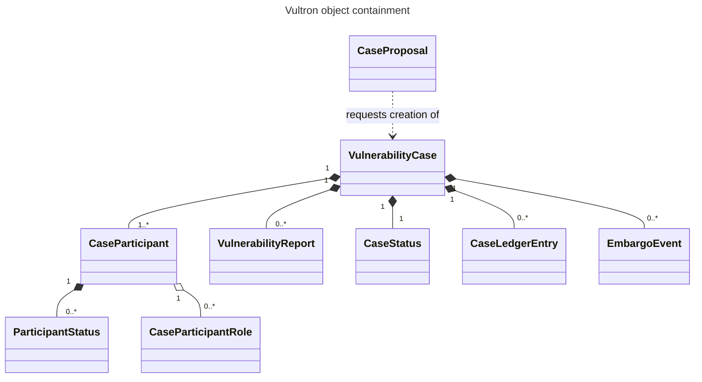

## 5. Syntactic Layer — Wire Format [N]

This section specifies how a Vultron message is encoded and delivered. Where
[§4](index.md#4-semantic-layer-message-meanings-n) says what a message *means*,
this section says what it *looks like*.

Vultron does not define its own message syntax. It uses ActivityStreams 2.0, a
published W3C vocabulary for describing things that actors do, and extends it with
the object types a vulnerability case needs. Reusing an existing vocabulary means
the outer envelope is already specified, already tooled, and already understood by
readers who have met it elsewhere.

The consequence for a reader is that Vultron messages look generic. There is no
`ProposeEmbargo` verb; there is an `Invite` whose object happens to be an embargo
event. Meaning comes from the combination of verb and object, not from the verb
alone, which is why [§5.7](index.md#57-shorthand-to-wire-form-mapping) is needed to
connect the two layers.

### 5.1 Base Vocabulary

Every Vultron message is an ActivityStreams 2.0 **Activity**: an object describing
an action, with the actor who performed it and the thing it was performed on.

Four fields are required on every Activity:

| Field | Contains |
|---|---|
| `type` | The Activity type — the verb, such as `Offer` or `Announce` |
| `actor` | The URI of the actor that performed the action |
| `object` | The thing acted on, included inline ([§5.5](index.md#55-serialization)) |
| `id` | A URI uniquely identifying this Activity, used for deduplication ([§14.3](index.md#143-replay-and-idempotency)) |

Vultron's own types are declared in the vocabulary namespace
`https://certcc.github.io/Vultron/ns`.

An implementation MUST use the Vultron ActivityStreams vocabulary for message
structure.

This version does not require full ActivityPub server behavior. Inbox and outbox
HTTP delivery, WebFinger discovery and HTTP Signatures are not conformance
requirements here.

!!! note "Informative: ActivityPub conformance is not required by this version"
    A future version is expected to raise the floor to ActivityPub;
    [§1.3](index.md#13-relationship-to-existing-standards) states the roadmap.

### 5.2 Object Types

An Activity's meaning depends on what it acts on, so the object types matter as much
as the verbs. Vultron defines eight, and they are not a flat set: a case contains
participants, a report, status records, and an ordered ledger. That containment is
the mental model the rest of this specification assumes.



| Object | What it is |
|---|---|
| `VulnerabilityCase` | The case itself: the container for everything below |
| `VulnerabilityReport` | The report artifact that started the case |
| `CaseParticipant` | An actor's membership in a case, carrying the roles it holds and the state it owns |
| `CaseParticipantRole` | A role being offered to an actor in the context of a case. A distinct type so that offering a role is structurally different from offering ownership of the case |
| `EmbargoEvent` | An embargo's terms — proposed, accepted, revised or terminated. A subtype of the ActivityStreams `Event` type, which is why embargo messages appear on the wire as invitations to an event rather than under an embargo-specific verb |
| `CaseLedgerEntry` | One entry in the canonical case ledger ([§2.3](index.md#23-protocol-objects-and-messages)) |
| `CaseProposal` | A request that some actor create and manage a case. Used when the requesting actor does not intend to manage the case itself; the actor that accepts becomes the case's creator |
| `CaseStatus` / `ParticipantStatus` | Status records — see below |

**Status records: claim versus canonical.** These two are the most easily confused
types in the protocol, and the difference is one of authority rather than content.

- A `ParticipantStatus` is a **claim**. It carries what one participant reports
  about its own state, or observes about the world. Any participant may write one,
  and writing one does not change what the case asserts.
- A `CaseStatus` is **canonical**. It carries what the case asserts: its embargo
  state and what is publicly known. Only the CASE_MANAGER writes it
  ([§5.4.1](index.md#541-single-writer-authority)).

A claim becomes canonical only when the CASE_MANAGER adopts it, and adoption is an
authorization decision with a named default rather than an automatic consequence of
receipt ([§10.3](index.md#103-status-adoption-the-two-seam-model)). An
implementation MUST NOT substitute one type for the other: a participant that
emits `CaseStatus` is asserting authority it does not hold, and a CASE_MANAGER that
treats an inbound `ParticipantStatus` as canonical has skipped the decision.

!!! note "Informative: which types have core models"
    `CaseProposal` and the fault object of
    [§5.3](index.md#53-activity-types-and-canonical-message-forms) exist in the
    reference implementation only as wire types, with no separate internal model.
    Every other type above has both.

### 5.3 Activity Types and Canonical Message Forms

Vultron uses ActivityStreams verbs rather than defining its own. Thirteen are in
use:

`Create`, `Offer`, `Accept`, `Reject`, `TentativeReject`, `Announce`, `Update`,
`Add`, `Remove`, `Invite`, `Read`, `Join`, `Ignore`.

Because the verbs are generic, meaning often comes from **nesting**: an Activity
whose object is itself an Activity. Accepting an embargo, for instance, is an
`Accept` whose object is the `Invite` being accepted, which in turn carries the
embargo event. The nesting is what distinguishes accepting an embargo from
accepting a report.

```json
{
  "@context": "https://certcc.github.io/Vultron/ns/context.jsonld",
  "id": "https://vendor.example/activities/8f2c",
  "type": "Accept",
  "actor": "https://vendor.example/actors/vendor",
  "object": {
    "id": "https://coord.example/activities/4a19",
    "type": "Invite",
    "actor": "https://coord.example/actors/case-manager",
    "context": { "type": "VulnerabilityCase", "id": "https://coord.example/cases/2026-0042" },
    "object": {
      "type": "EmbargoEvent",
      "endTime": "2026-11-01T00:00:00Z"
    }
  }
}
```

**The two ways an actor joins a case are different messages.** Conflating them
loses a round-trip in which the Case Owner decides:

- `Invite`, with the case stub as its target, is the CASE_MANAGER inviting an actor
  to join on the Case Owner's behalf. It is answered with `Accept` or `Reject`.
- `Offer`, with a `CaseParticipant` as its object, is a participant *recommending*
  an actor. It is answered by the Case Owner, which may then cause an `Invite` to
  be sent. An implementation MUST NOT treat it as an invitation to the recommended
  actor.

Both paths end in an `Accept` of an `Invite`
([§11.2](index.md#112-invitation-and-acceptance-n)).

**Fault reporting.** The three failure modes of
[§4.6](index.md#46-error-and-acknowledgement-messages) have these wire forms:

| Failure mode | Wire form |
|---|---|
| Not understood | `Create` of a `ProcessingFault` object |
| Understood but declined | `Reject` of the message being declined |
| Needs explanation | `Create` of a `Note`, or `Add` of a `Note` to the case |

### 5.4 Addressing and Channels

An actor is identified by a URI, and that URI is also where it receives messages.
Each actor exposes an **inbox** to receive Activities and an **outbox** from which
it sends them. An actor's URI is its identity for every purpose in the protocol:
there is no separate registry, and no name or hosting location carries authority
([§2.2](index.md#22-roles)).

Delivery is therefore inbox to inbox. Which inbox a message may go to, however, is
constrained — and that constraint is the subject of the next two subsections.

#### 5.4.1 Single-Writer Authority

The participant holding the `CASE_MANAGER` role is the **only** entity authorized to
write the case's shared state: the PXA axis, the embargo state, the embargo record,
and the case ledger. No participant and no handler may write shared case state
directly; every such change MUST be made by the CASE_MANAGER.

The participant-specific axes — report management and VFD — are owned by each
participant's own `CaseParticipant` record and are explicitly **not** subject to
this restriction. A participant is the authority on its own report management and
VFD state.

This rule exists to make concurrent claims resolvable. Two participants may report
contradictory observations about the world at the same moment; with one writer,
the case has one answer, and the decision about which claim becomes that answer is
explicit ([§10.3](index.md#103-status-adoption-the-two-seam-model)) rather than a
race. The routing rule below follows from it.

#### 5.4.2 Routing Topology

Once a case exists, every case-scoped message follows this path:

```text
Participant → CASE_MANAGER → CaseLedgerEntry → Announce(CaseLedgerEntry) → all Participants
```

- A participant MUST address case-scoped Activities to the CASE_MANAGER.
- The CASE_MANAGER MUST record a case-scoped message in the case ledger before
  sending it on to the other participants.
- `Announce` of a `CaseLedgerEntry` is the **only** mechanism by which a
  participant learns of an accepted change to shared case state.

There are exactly **two** exceptions, both confined to case bootstrap, both
occurring before a CASE_MANAGER exists to route through
([§4.5](index.md#45-trust-and-bootstrap-semantics)):

1. **Pre-case report submission** — the reporter sends the report directly to the
   vendor. No case exists, and therefore no case actor service has provisioned an
   actor to hold the `CASE_MANAGER` role.
2. **Case creation handshake** — the receiving party sends the case-creation
   message back to the reporter, introducing the actor that holds the role.

!!! warning "This is a routing rule, not a prohibition on talking"
    The rule above scopes **Vultron protocol messages about a case**. It does not
    say that participants may not communicate with each other, and the protocol has
    no way to enforce such a thing. Participants routinely talk directly — by mail,
    by phone, in a shared channel — and that is outside the protocol's scope.

    What the rule means is narrower: a case-scoped Vultron Activity delivered
    directly from one participant to another is not part of the protocol, and a
    receiving implementation has no obligation to apply it. Case state changes
    through the ledger or not at all.

!!! note "Informative: why route through one writer"
    Routing through a single writer avoids the coordination cost of agreeing an
    order among peers, while still leaving each participant its own replica and its
    own view. The cost is that the CASE_MANAGER is a single point of coordination
    authority for the case, and its availability bounds how fast that case can
    progress.

    This is scoped per case. The role is held for one case at a time, different
    cases may be managed by different actors, and the role is transferable
    ([§11.3](index.md#113-case-ownership-transfer-n)). The current reference
    implementation goes further than the protocol requires and provisions a
    dedicated service actor per case.

    The protocol deliberately leaves more decentralized realizations open — a
    ledger shared among peers, for instance, which would remove the single point of
    authority at the cost of needing agreement on ordering. This version does not
    specify one, and no implementation of one exists.

### 5.5 Serialization

Vultron messages are serialized as JSON-LD. JSON-LD is JSON with a context that
maps short names to full URIs, so a message is readable as ordinary JSON while
remaining unambiguous about which vocabulary each term comes from.

An outbound message MUST set `@context` to the Vultron JSON-LD context document
URI:

```json
{
  "@context": "https://certcc.github.io/Vultron/ns/context.jsonld",
  "id": "https://coord.example/activities/1b7e",
  "type": "Announce",
  "actor": "https://coord.example/actors/case-manager",
  "object": {
    "type": "CaseLedgerEntry",
    "logIndex": 12,
    "contentHash": "sha256:9f2a...",
    "predecessorHash": "sha256:41c8..."
  }
}
```

That context document imports the ActivityStreams 2.0 namespace and declares every
Vultron type name, so an implementation cites only the Vultron URI and does not
need to declare the ActivityStreams namespace separately.

**Objects travel inline.** An actor MUST include the full object in every Activity
it emits. An Activity MUST NOT reference an object belonging to another actor by ID
alone.

This is what makes actor isolation work
([§4.7](index.md#47-knowledge-model-and-actor-isolation)). A message carrying only
an identifier would require its recipient to fetch the referenced object from
whoever holds it, which makes the recipient's knowledge depend on another actor
being reachable, and makes a message unprocessable if it is not.

!!! note "Provisional namespace URI"
    The namespace is currently hosted on GitHub Pages. A permanent URI may be
    registered in a future version
    ([§13](index.md#13-iana-and-namespace-considerations-i)).

### 5.6 Transport Layer [N/I]

The transport layer moves a serialized message from one actor to another. The
message schema of [§5.1](index.md#51-base-vocabulary)–[§5.5](index.md#55-serialization)
is transport-agnostic: the same JSON payload is deliverable over any conformant
transport.

This version recognizes one required transport profile and describes a second that
is anticipated.

#### REST (HTTP) profile [N]

This is the transport an implementation MUST provide.

- Each actor exposes an inbox endpoint that accepts inbound Activities.
- An outbound Activity is delivered by HTTP POST to the recipient's inbox.
- Authentication and authorization requirements are at
  [§14](index.md#14-security-considerations-ni).

#### ActivityPub federation profile [I]

Full ActivityPub conformance is not required by this version. The roadmap is at
[§1.3](index.md#13-relationship-to-existing-standards);
[Annex E](index.md#annex-e-relationship-to-activitypub-i) describes where Vultron
follows ActivityPub conventions and where it diverges.

#### Participant discovery [I]

Before two actors can exchange messages they must locate each other. WebFinger is
the anticipated mechanism, consistent with its use alongside ActivityPub in
federated systems. This version does not specify participant discovery.

!!! note "Transport is not routing"
    The routing rule of [§5.4.2](index.md#542-routing-topology) is a protocol rule
    and applies regardless of which transport carries the messages. The transport
    is responsible for getting a message to an inbox. The protocol is responsible
    for which inbox it may go to.

### 5.7 Shorthand to Wire Form Mapping

This is the normative mapping from the protocol shorthands of
[§4](index.md#4-semantic-layer-message-meanings-n) to their wire forms. It appears
here rather than in §4 because it depends on both the shorthands and the object
types of [§5.2](index.md#52-object-types).

| Shorthand | Wire form |
|---|---|
| `RS` | `Offer` of a `VulnerabilityReport` |
| `RI` | `TentativeReject` of the report offer |
| `RV` | `Accept` of the report offer |
| `RD` | `Ignore` of the `VulnerabilityCase` |
| `RA` | `Join` of the `VulnerabilityCase` |
| `RC` | `Reject` of the report offer |
| `RK` | `Read` of the report offer |
| `EP`, `EV` | `Invite` to an `EmbargoEvent`, in the context of the case |
| `EA`, `EC` | `Accept` of that `Invite` |
| `ER`, `EJ` | `Reject` of that `Invite` |
| `ET` | `Remove` of the `EmbargoEvent` |
| `CV`–`CA` | `Add` of a status record to the case — see below |
| `RE`, `EE`, `CE`, `EK`, `CK` | *none* ([§4.6](index.md#46-error-and-acknowledgement-messages)) |

**The status messages depend on who is sending.** The six case state shorthands do
not have one wire form; they have two, and which applies is determined by the
sender's authority:

- A **participant** reporting its own VFD progress, or an observation about the
  world, sends `Add` of a **`ParticipantStatus`**. This is a claim.
- The **CASE_MANAGER**, having adopted a claim, sends `Add` of a **`CaseStatus`**
  targeting the case. This is the canonical write.

A participant MUST NOT send `Add` of a `CaseStatus`
([§5.4.1](index.md#541-single-writer-authority)). An implementation that maps all
six shorthands to `CaseStatus` regardless of sender will have participants
asserting authority they do not hold.

**Two collision classes exist.** In both, the wire form alone is insufficient and an
implementation MUST use additional information to disambiguate:

| Collision | Disambiguate by |
|---|---|
| The revision shorthands share wire forms with their initial-proposal counterparts | The local embargo state ([§4.2](index.md#42-embargo-management-messages)) |
| All six case state shorthands share one verb | The status record's payload ([§4.3](index.md#43-case-state-messages)) |

---
