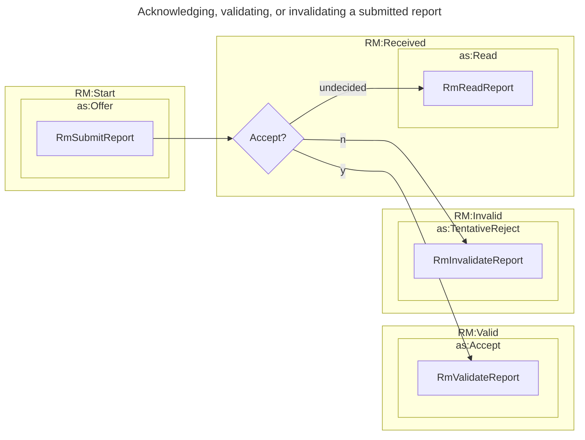
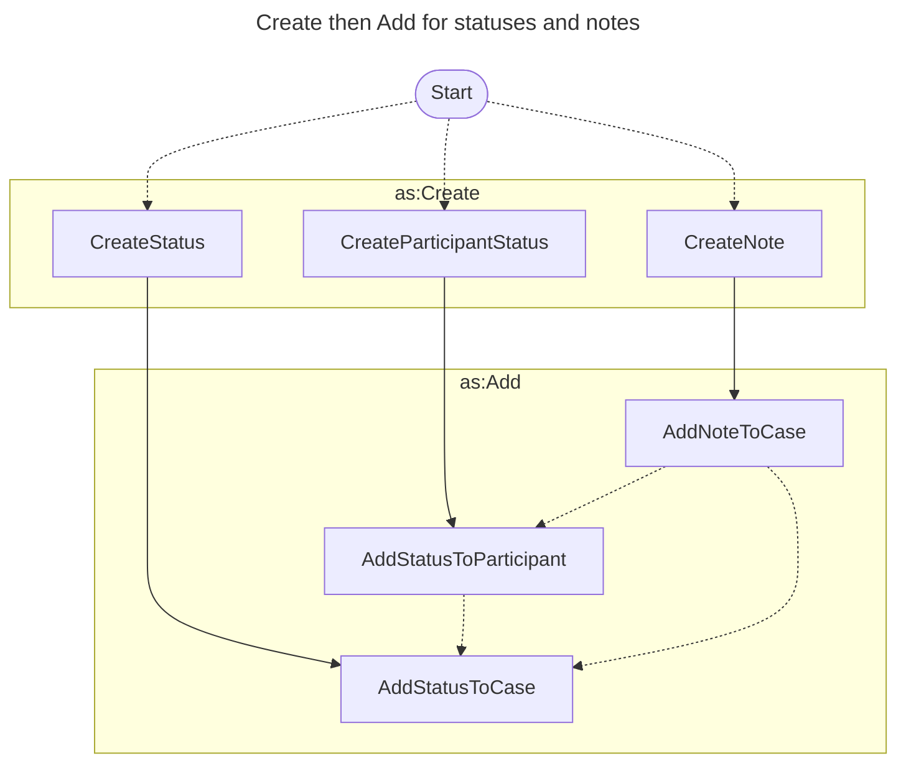
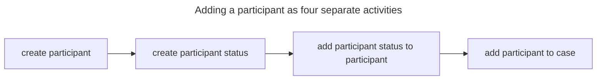
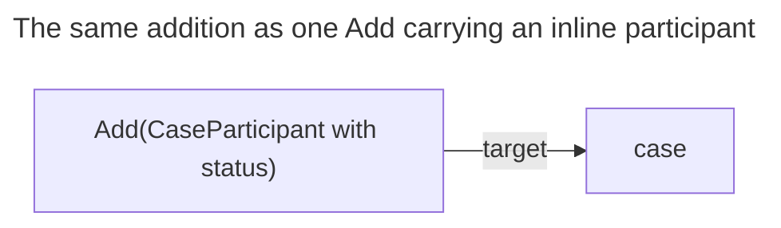

# Activity Vocabulary Design

Vultron carries its protocol messages as ActivityStreams Vocabulary 2.0 (AS2)
activities rather than as a bespoke message format.
That choice constrains every later one.
The verb set is fixed by a published standard.
Every Vultron message is therefore expressed with a verb that already exists, or
with a new type that earns its place.
This page explains the rules we applied, the verb choices those rules produced,
and the places where a wire-level distinction has no counterpart in the formal
protocol.

For the activities themselves, see the
[Vultron AS Activities](../howto/activitypub/activities/index.md) guides.
For the mapping between formal protocol shorthands and wire activities, see
[Message Types](../reference/messages/index.md).

---

## Reuse existing verbs; mint as few types as possible

Two rules govern every activity definition in the Vultron AS2 vocabulary.

- Do not create a new activity type when an existing ActivityStreams type
  expresses the act.
- Do not create two activity types that share the same object and target, so
  that each activity/object/target combination carries one meaning in the
  protocol.

The first rule keeps Vultron interoperable with general ActivityPub tooling.
An implementation that already understands `as:Add` needs no Vultron-specific
extension to route a status update.
The second rule keeps the vocabulary unambiguous: if two activities had the same
verb, object, and target, a receiver could not tell them apart.

These rules have a visible cost.
Where the formal protocol distinguishes several messages, the wire vocabulary
often carries one activity and distinguishes them by payload.
The `CP`, `CX`, and `CA` messages all ride a single
`Add(CaseStatus)[target=VulnerabilityCase]`, discriminated by the `pxa_state`
field rather than by the verb (MSM-03-004 through MSM-03-006).
Minting three Vultron-specific activities for those three messages would have
added vocabulary where ActivityStreams already supplies an adequate verb.

We accepted that cost deliberately.
The formal message set partitions by *which state machine* a message concerns;
the wire vocabulary partitions by *which ActivityStreams verb and object
faithfully express the act*.
Neither partition is derivable from the other, so the mapping between them is
irreducible and is published as its own artifact
([ADR-0083](../adr/0083-formal-message-set-and-as2-vocabulary-are-different-shapes.md)).
The consequence for a reader is that the verb alone does not identify the
message; the
[message-type reference pages](../reference/messages/index.md) name the
discriminating field for every collapsed row.

---

## Choosing between near-synonymous verbs

ActivityStreams offers three verbs for consuming a piece of content: `as:Read`,
`as:View`, and `as:Listen`.
Most Coordinated Vulnerability Disclosure (CVD) cases are text-centric, so
`as:Read` is the verb Vultron uses.
`as:View` and `as:Listen` remain available to an implementation whose
participants consume a video recording or an audio recording as part of a case,
and neither is forbidden.

`RmReadReport` is a subclass of `as:Read`.
Subclassing rather than reusing the bare verb lets a recipient acknowledge that
a report arrived without committing to anything further.
That separation is the point: it leaves `RmValidateReport` (`as:Accept`) and
`RmInvalidateReport` (`as:TentativeReject`) free to carry the judgment, so
acknowledgement and validity are distinct claims on the wire.

The diagram shows the three ways a recipient can answer a submitted report.
`RmReadReport` is the answer available while the recipient is still undecided;
the other two arms carry a verdict.

An acknowledgement is therefore optional whenever a verdict follows.
A `RmValidateReport` sent as a reply to `RmSubmitReport` already implies the
report was read, because validating it required reading it.
Sending a separate `RmReadReport` in that case adds a message without adding
information.
The [Vultron AS ontology](../reference/ontology/vultron_as.md) defines the
acknowledgement activities that can serve this role.

---

## Verbs Vultron does not use

Some ActivityStreams verbs are a plausible fit for a CVD protocol and are still
absent from the Vultron vocabulary.
Recording why keeps them from being read as oversights.

| Verb | Why it is unused |
|---|---|
| `as:Like`, `as:Dislike`, `as:Flag` | These express an opinion about an object. They may be relevant to a particular implementation, but Vultron defines no protocol meaning for an opinion, so no use case is specified. |
| `as:Undo` | `Undo` implies retracting the *effects* of a prior activity. Re-engaging a deferred case is not a retraction. |

The `as:Undo` case is worth expanding, because re-engagement looks like an undo
and is not one.
The Report Management (RM) model permits reversible movement between
`ACCEPTED` and `DEFERRED`, so re-engaging a deferred case is a forward
transition emitted from `DEFERRED`.
It reuses the same `RmEngageCase` (`as:Join`) activity that the first engagement
used, and there is no separate `RmReEngageCase`.
Modeling it as `as:Undo` would claim that the earlier `RmDeferCase` is being
retracted, when the deferral genuinely happened and remains part of the case
history.

---

## Creating an object and attaching it to another

Vultron documents object creation and object attachment as two activities.
`as:Create` mints a new object; `as:Add` attaches an existing object to another
object.
A new note therefore appears as `Create(Note)` followed by
`Add(Note)[target=VulnerabilityCase]`, and a new status as `Create(CaseStatus)`
followed by `Add(CaseStatus)[target=VulnerabilityCase]`.

The diagram shows each object being created and then attached.
The dotted arrows show attachments that can follow from one another: a
participant status update can lead to a case status update, and a note can lead
to either.

### ActivityStreams does not force the split

Both verbs accept both fields.
`as:Create` carries a `target`, so a single `Create` could mint an object and
name what it belongs to.
`as:Add` carries an `object`, so a single `Add` could name an object the sender
created moments earlier.
Nothing in ActivityStreams requires two activities where one would carry the
same information.

We separated them to make the difference between minting and attaching legible.
The rule we settled on is `as:Create` when an object is being brought into
existence, and `as:Add` when an object that already exists is being attached to
another.

### The split has no formal counterpart, and is still load-bearing on the wire

The `Create(X)` plus `Add(X → Y)` pair is a wire-layer expansion, and the formal
protocol models neither activity
([ADR-0083](../adr/0083-formal-message-set-and-as2-vocabulary-are-different-shapes.md)).
Every object gains two activities on the wire: one to mint it, one to attach it.
No shorthand in the 28-symbol formal message set names either step, because
object lifecycle is a serialization concern rather than a protocol state change.

This is the asymmetry ADR-0083 predicts, and it cuts both ways.
Read against the formal message set, the split carries no information: a reader
comparing the two vocabularies should expect to find it unmatched, and should
not read the absence as a gap in either set.
Read against the wire vocabulary, the split is a real distinction that the
protocol's dispatch depends on.

The two forms are separate messages with separate handlers.
`Create(CaseStatus)` is recognized by its `context` naming the case;
`Add(CaseStatus)` is recognized by its `target` naming the case.
The state change itself — applying the new `pxa_state` to the case — hangs off
the `Add`, because that is the activity that asserts the attachment
(MSM-03-004 through MSM-03-006).
An activity that tries to be both, such as a `Create(CaseStatus)` carrying a
`target`, matches neither pattern.
It does not collapse two messages into one; it dispatches as unrecognized, and
the state change never happens.

So the conclusion is narrower than "either verb will do".
An implementation is free to decide that a given object needs no separate
minting step, and to send only the `Add` that attaches it, with the object
inline.
What it cannot do is merge the two verbs into one activity and expect a Vultron
peer to understand it.

### Where fewer activities are worth having

Adding a participant to a case is the clearest case.
Expressed as separate activities, one participant addition is four messages.

The diagram shows the fully expanded form: two `Create` activities and two
`Add` activities to seat one participant.
Three of the four are avoidable, because an object can be sent inline inside the
activity that attaches it.
A single `Add(CaseParticipant)[target=Case]` carrying a participant that already
holds its status object expresses the same outcome.

What shrank is the number of activities, not the verb. The attachment is still
an `Add` with the case as its `target`, which is what a Vultron peer's dispatch
recognizes.

The same reasoning applies at case creation.
A case can be created with its report, its known participants, and its notes
already inline in the initial case object, so no `Add` is needed for any of them.
The activity guides break the steps out individually because the individual
steps are easier to follow, not because a conformant implementation must emit
them one at a time.

A separate `Create(CaseParticipant)` is still necessary when the participants
are not all known when the case is created.
A Reporter may report a vulnerability to a Coordinator, who creates a case
before the affected Vendors have been identified.
The Coordinator seats itself and the Reporter at case creation, then adds each
Vendor as it is identified.

### `Create(Report)` and `Offer(Report)`

Report delivery shows the same shape with a different pair of verbs.
Reports reach a recipient as an `Offer`, and an `Offer` can carry a `Report`
object the sender created immediately beforehand.
A `Create(Report)` technically precedes every `Offer(Report)`, but the recipient
usually observes only the `Offer`, because the report was created entirely on
the sender's side.

The two activities separate when the report was created earlier, or by a
different actor.

!!! example "When `Create(Report)` is separate from `Offer(Report)`"

    A Reporter files a report with a bug-bounty platform that implements
    Vultron.
    The `Create(Report)` happens between the Reporter and the platform.
    Later the platform submits the report to a Vendor as an `Offer(Report)`.
    The Vendor receives the `Offer`, which contains the `Report` object, and may
    never learn of the earlier `Create(Report)`.

The activity guides show both patterns because both occur.

---

## Inviting an actor rather than adding one

A case created today does not know every actor that will eventually work it.
The Case Owner and any already-known participants, such as the Reporter, can be
seated when the case is created, carried inline on the `Create` activity for the
case.
Later arrivals cannot be, because consent has not been established: an actor
that was not present at case creation has agreed to nothing.

`as:Invite` is the verb for that situation.
It asks rather than asserts, and the invited actor answers with `as:Accept` or
`as:Reject`.
`as:Add` would assert a participation the actor had not agreed to, which is why
the two verbs are not alternatives for the same job.
A participant that accepts is then represented by a
[`CaseParticipant`](../reference/glossary.md), a per-case binding around an
`as:Actor`.
The binding is per-case so that one long-lived actor identity can hold different
roles and statuses in each case it works.

### Why a suggestion step exists

Invitations are the Case Owner's decision, and the participant who knows an
invitation is needed is often not the Case Owner.
The suggestion flow lets any participant recommend an actor to the
[CASE_MANAGER](../reference/glossary.md), which presents the recommendation to
the Case Owner for a decision (ADR-0026, ADR-0029).

A Case Owner could invite an actor directly and skip the flow, and any
participant — Case Owner included — may use it. Two situations make the
indirection worth its cost:

- A case may have more than one Case Owner, and they may disagree about who
  should be invited.
- A participant who is not a Case Owner may still be the participant who knows
  the invitation is needed.

The second situation is the common one.
A Reporter who discovers mid-case that the flaw is in a third-party library
knows the library's Vendor belongs in the case.
That Reporter has no authority to invite it.
A Vendor participating in a case may want a sector-specific Coordinator brought
in to address critical-infrastructure exposure.
A Reporter may want a protocol working-group member included as a technical
expert.
A Coordinator may want a large Deployer included because deploying the fix has
operational consequences worth coordinating.

Routing all of these through the Case Owner keeps one actor accountable for who
joins a case, while letting any participant raise the question.

---

## Closing a report and closing a case

Closure has two wire forms, and they use different verbs.
`RmCloseCase` is `Leave(VulnerabilityCase)`; `RmCloseReport` is
`Reject(Offer(VulnerabilityReport))`.

The asymmetry follows from what exists at the moment of closure.
`as:Leave` needs something to leave, and a participant can only leave a case it
joined, so `Leave` is the right verb once a case exists
([ADR-0050](../adr/0050-leave-vul-case-canonical-rm-closure.md)).
Before a case exists there is no membership to end — there is only an outstanding
`Offer(VulnerabilityReport)`.
Closing at that point means refusing the offer, which `as:Reject` already says.
`RmCloseReport` is therefore reachable only from `RM.INVALID`, because a report
that reached `RM.VALID` has a case, and closing that case is `RmCloseCase`'s job.

This is the second design rule at work. Reusing `as:Leave` for a report the
sender never joined would have claimed a membership that never existed, and
minting a third verb for report closure was unnecessary when `as:Reject`
expresses refusal.
The cost is that `as:Reject` now carries report closure alongside genuine
refusals, so a receiver cannot read failure from the verb alone (MSM-05-003).

---

## A dedicated object type where a verb was ambiguous

Offering a role and offering case ownership both serialized as
`Offer(VulnerabilityCase)`.
Verb, object, and target were identical.
The two could be told apart only by the order in which the registry happened to
try its patterns, which violates the second design rule above.

The fix was a new object type rather than a new verb.
A role offer carries an `as_CaseParticipantRole` object, so the object type alone
identifies the activity
([ADR-0039](../adr/0039-offer-case-participant-role-wire-type.md)).
The wire form became self-describing, and pattern order stopped being
load-bearing for this pair.

This is the shape of exception the first design rule anticipates.
Adding a verb was unnecessary, because `as:Offer` already expressed the act.
Adding an object type was necessary, because nothing in the existing vocabulary
distinguished the two offers.

---

## Faults and acknowledgements took different axes

The formal protocol partitions faults by which state machine the bad message
belonged to, giving one error shorthand per machine: `RE`, `EE`, `CE`, and `GE`.
The wire vocabulary partitions faults by *why* the message failed instead.
The three modes are received but not understood, received and understood but
declined, and a condition that needs narrative explanation (MSM-05-001).

We consider failure mode the better axis for a receiver.
Knowing that a message was not understood tells a sender to check its
serialization; knowing that a message was declined tells a sender to check the
protocol state it assumed.
Knowing which state machine the message belonged to tells a sender something it
already knew.
The same reasoning moved acknowledgement.
For ledger-replicated state, a matching hash chain acknowledges the entire log
prefix at once, so a per-message `EK` or `CK` would repeat what the chain already
proves (MSM-05-002).

Neither mechanism is missing from the implementation.
Both are shaped differently from the formal set, which is why the mapping
specification records them as *evolved* rather than as absent.
The mechanisms themselves — which activity conveys which failure mode, and how
the hash chain carries an acknowledgement — are described in
[Faults and Acknowledgements](../reference/messages/faults_and_acknowledgements.md).

---

## Summary

| Design rule | Statement |
|---|---|
| Verb reuse | Use an existing ActivityStreams type where one expresses the act. |
| Unambiguous combinations | No two activity types share a verb, object, and target. |
| Verb selection | `as:Read` for text-centric acknowledgement; `as:View` and `as:Listen` stay available. |
| Unused verbs | `as:Like`, `as:Dislike`, `as:Flag` carry no protocol meaning; `as:Undo` misdescribes a forward transition. |
| Create and Add | A wire expansion with no formal counterpart, and still two distinct messages on the wire. Inline the object to send fewer activities; do not merge the two verbs. |
| Invite and Add | `as:Invite` asks; `as:Add` asserts. Late arrivals are invited. |
| Closure verbs | `Leave(VulnerabilityCase)` once a case exists; `Reject(Offer(Report))` before one does. |
| New object types | Minted only where no existing combination distinguishes two acts (ADR-0039). |
| Fault partitioning | By failure mode, not by state machine (MSM-05-001). |

## Further reading

- [Message Semantics](message_semantics.md) — why messages announce completed
  transitions instead of commanding action
- [Protocol Event Flow](protocol_flow.md) — how one activity causes a chain of
  automated consequences
- [Message Types](../reference/messages/index.md) — the shorthand-to-wire-form
  mapping, with the discriminating field for every collapsed row
- [Vultron AS Objects](../reference/activitypub/objects.md) — the object types
  these activities carry
- [Vultron AS Activities](../howto/activitypub/activities/index.md) — the
  activity guides, organized by user flow
- [ADR-0083](../adr/0083-formal-message-set-and-as2-vocabulary-are-different-shapes.md)
  — the decision to keep the formal message set and the wire vocabulary as
  different shapes
