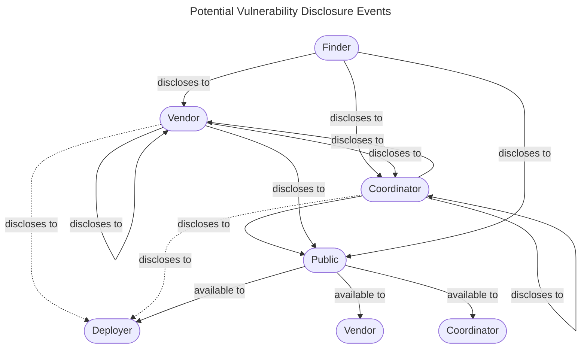
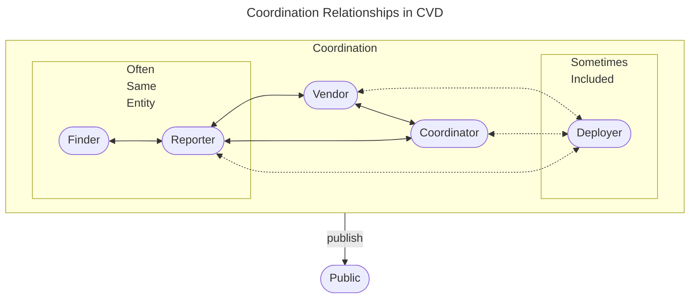

# CVD as a Coordination Problem

Coordinated Vulnerability Disclosure (CVD) is a problem of coordinating people and organizations, not a problem of moving data.
This page explains why Vultron treats every CVD case as a Multi-Party Coordinated Vulnerability Disclosure (MPCVD) case, and where the protocol sits among the CERT Coordination Center (CERT/CC) documents it builds on.
It is written for readers who know the CVD process in general.
For a shorter overview of what Vultron is, read [What Is Vultron?](what-is-vultron.md) first.

---

## Who else needs to know what, and when

The *CERT Guide to Coordinated Vulnerability Disclosure* (the *CVD Guide*) describes the process in two questions.
The excerpt below is from its page [CVD is a Process](https://certcc.github.io/CERT-Guide-to-CVD/tutorials/cvd_is_a_process/){:target="_blank"}.

!!! quote "Excerpt from *The CERT Guide to Coordinated Vulnerability Disclosure*"

    Perhaps the simplest description of the CVD process is that it starts with at least one individual becoming aware of a vulnerability in a product.
    This discovery event immediately divides the world into two sets of people: those who know about the vulnerability, and those who don't.
    From that point on, those belonging to the set that knows about the vulnerability iterate on two questions:

    1.  What actions should I take in response to this knowledge?
    2.  Who else needs to know what, and when?

    The CVD process continues until the answers to these questions are "nothing," and "nobody."

The second question is a coordination question.
Every answer to it adds a party to the case, and every added party brings its own answers to the first question.
The rest of this page follows from taking that second question seriously.

---

## CVD *is* MPCVD, and MPCVD *is* CVD

Any given CVD case is made up of many individual disclosure events.
For example, a case can include disclosures

- from a Finder to one or more Vendors and Coordinators
- from Vendors and Coordinators to other Vendors and Coordinators
- from Finders, Vendors, and Coordinators to Deployers and the Public

The [glossary](../../reference/glossary.md#cvd-roles-and-participants) defines the Finder, Vendor, Coordinator, and Deployer roles.
The following diagram shows the disclosure events that can occur between them.
A looping arrow means that an entity in one role can also disclose to another entity in the same role.

The *C* in *CVD* stands for *Coordinated*, and that simplifies the picture.
The Participants coordinate with each other as one group, and the group publishes to the public.
The following diagram shows those coordination relationships.
The Finder and the Reporter are often the same entity, and Deployers are sometimes included in the coordinating group.

Software supply chains have made library and component vulnerabilities as much a part of everyday CVD as vulnerabilities in a Vendor's own code.
As a result, many CVD cases need coordination across several Vendors.
We find it less and less useful to separate "traditional" two-party CVD from MPCVD.
In this documentation, we use the two terms interchangeably.

$$CVD \iff MPCVD$$

When we write *CVD*, we do not mean to exclude the multi-party case.
When we write *MPCVD*, we do not mean to exclude the single-Vendor case.
The protocol is built for the MPCVD case where $N_{vendors} \geq 1$.
The "traditional" CVD case is a special, and often simpler, case where $N_{vendors} = 1$.

---

## Where this work comes from

Vultron builds on a set of four foundational CERT/CC documents that aim to make the CVD process more professional.
Each one looks at the process from a different side.

- *The CERT Guide to Coordinated Vulnerability Disclosure*, in both its [original](https://resources.sei.cmu.edu/library/asset-view.cfm?assetid=503330){:target="_blank"} and [updated](https://certcc.github.io/CERT-Guide-to-CVD){:target="_blank"} forms, is a field guide to the CVD process and its extension into MPCVD.
- The [*Stakeholder-Specific Vulnerability Categorization*](https://github.com/CERTCC/SSVC){:target="_blank"} (SSVC) gives decision support for prioritizing the vulnerability response work that surrounds CVD.
- [*A State-Based Model for Multi-Party Coordinated Vulnerability Disclosure*](https://resources.sei.cmu.edu/library/asset-view.cfm?assetid=735513){:target="_blank"} describes every possible CVD case history, and derives measures and metrics for how well a CVD process performs.
  It expands [*Are We Skillful or Just Lucky? Interpreting the Possible Histories of Vulnerability Disclosures*](https://dl.acm.org/doi/10.1145/3477431){:target="_blank"}, an article in the Association for Computing Machinery (ACM) journal [*Digital Threats: Research and Practice*](https://dl.acm.org/journal/dtrap){:target="_blank"}.
- [*Designing Vultron*](https://resources.sei.cmu.edu/library/asset-view.cfm?assetid=887198){:target="_blank"}, the report this documentation grew out of, proposes an abstract formal protocol for MPCVD that ties the other three together.

The *CVD Guide* describes the process and the scenarios a Participant can expect to meet in it.
Vultron adds a layer of formality to that description, in the form of a *protocol* for MPCVD.

---

## Narrative, prescriptive, and normative protocols

[What Is Vultron?](what-is-vultron.md#what-we-mean-by-protocol) sets out what we mean by *protocol*.
The second dictionary sense it gives is the accepted code of behavior in a group.
MPCVD is first a coordination process among human Participants, whose goal is to remediate vulnerabilities in deployed systems.
So a protocol for it must cover how those Participants are expected to behave, not only what their systems exchange.

The *CVD Guide*, the Case State model, and Vultron each address that behavior, in three different ways.

| Source | Kind of protocol | What it offers |
|---|---|---|
| The [*CVD Guide*](https://certcc.github.io/CERT-Guide-to-CVD){:target="_blank"} | Narrative | Practice to follow, based on decades of experience and observation of CVD at the CERT/CC |
| The [Case State model](../process_models/cs/index.md), from *A State-Based Model for Multi-Party Coordinated Vulnerability Disclosure* | Prescriptive | The high-level goals of the CVD process, derived from first principles over every possible case history |
| Vultron: this documentation and the [*Designing Vultron*](https://resources.sei.cmu.edu/library/asset-view.cfm?assetid=887198){:target="_blank"} report | Normative | Rules that structure and guide Participants toward those goals |

The normative protocol exists to reach the goals the prescriptive model sets.
Those goals are stated as outcomes a case should reach, and [What Does *Success* Mean in CVD?](cvd_success.md) lists them.

---

## Further reading

- [What Does *Success* Mean in CVD?](cvd_success.md) — the outcomes the protocol is designed to make more likely.
- [The Need for Interoperability in Coordinated Vulnerability Disclosure](interoperability.md) — why the Participants in a case need shared meaning, not only a shared message format.
- [Vultron Process Models](../process_models/index.md) — the report, embargo, and case state processes that carry out the protocol.
