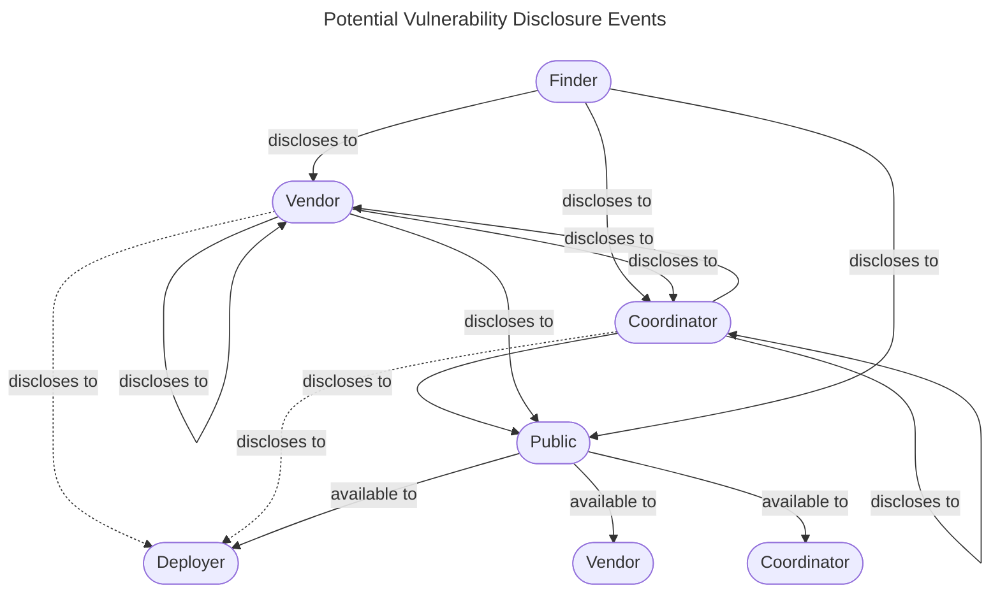
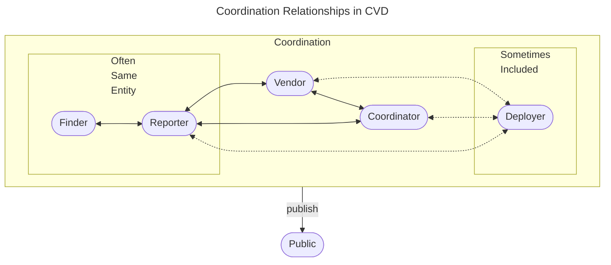

# Vultron Contextualized

!!! tip inline end "Prerequisites"

    The [Understanding Vultron](index.md) section assumes that you have:
    
    - an interest in learning about the Vultron Protocol
    - familiarity with the CVD process in general

    If you are already familiar with the Vultron Protocol, and are looking for implementation advice, 
    see [Implementing Vultron](../../howto/index.md).
    For technical reference, see [Reference](../../reference/index.md).
    If you're just trying to understand the CVD process, we recommend that you start with the [CERT Guide to Coordinated Vulnerability Disclosure](https://vuls.cert.org/confluence/display/CVD/).

The CVD process
addresses a human coordination problem that spans individuals and
organizations. As we wrote in [*The CERT* *Guide to Coordinated
Vulnerability Disclosure*](https://vuls.cert.org/confluence/display/CVD):

!!! quote "Excerpt from *The CERT Guide to Coordinated Vulnerability Disclosure*"

    Perhaps the simplest description of the CVD process is that it starts with at least one individual becoming aware of a vulnerability in a product.
    This discovery event immediately divides the world into two sets of people: those who know about the vulnerability, and those who don't.
    From that point on, those belonging to the set that knows about the vulnerability iterate on two questions:

    1.  What actions should I take in response to this knowledge?
    2.  Who else needs to know what, and when?
    
    The CVD process continues until the answers to these questions are "nothing," and "nobody."

## CVD *Is* MPCVD, and MPCVD *Is* CVD

Any given CVD case is made up of many individual disclosure events, for example,

- from a Finder to one or more Vendors and/or Coordinators
- from Vendors and Coordinators to other Vendors and Coordinators
- from Finders, Vendors, and Coordinators to Deployers and the Public

The following diagram illustrates the disclosure events between the various roles in the CVD process.
Looping arrows indicate that an entity in one role might also disclose to another entity in the same role.

However, we can simplify the diagram with the recognition that the _C_ in _CVD_ stands for _Coordinated_.
The following diagram illustrates the coordination relationships between the various roles in the CVD process.

In recent years, software supply chains have evolved such that software library and component vulnerabilities have
become just as much a part of the everyday CVD process as vulnerabilities in Vendors' proprietary code.
This means that many CVD cases we encounter require coordination across multiple vendors.
As a result, we find it decreasingly useful to differentiate between "traditional" (i.e., two-party) CVD and MPCVD.
In this documentation, we use both terms interchangeably.

$$CVD \iff MPCVD$$

Practically speaking, this means that readers should not infer from our use of *CVD* in one place that we meant to
exclude the multi-party scenario, nor that our use of *MPCVD* implies the exclusion of the single-vendor CVD scenario.
Instead, our intent is to construct a protocol that adequately addresses the MPCVD scenario where
$N_{vendors} \geq 1$
and for which the "traditional" CVD case is merely a special (and often simpler) case where
$N_{vendors} = 1$.

## Context of Our Recent Work

This documentation, in the context of recent CVD work at the
[CERT/CC](https://www.sei.cmu.edu/about/divisions/cert/index.cfm),
is one of four foundational documents aimed at increasing the
professionalization of the CVD process. The following is the full set of
foundational documents (thus far):

- *The CERT Guide to Coordinated Vulnerability Disclosure* (the
    *CVD Guide*) in both its [original](https://resources.sei.cmu.edu/library/asset-view.cfm?assetid=503330)
    and [updated](https://vuls.cert.org/confluence/display/CVD) forms, provides a "field guide" perspective to the
    CVD process and its natural extension into MPCVD.

- The [*Stakeholder-Specific Vulnerability Categorization*](https://github.com/CERTCC/SSVC)
    provides decision support for prioritizing vulnerability response activities
    closely associated with the CVD process.

- [*A State-Based Model for Multi-Party Coordinated Vulnerability Disclosure*](https://resources.sei.cmu.edu/library/asset-view.cfm?assetid=735513)
    describes a model that encompasses all possible CVD case histories into a set of measures and metrics for the
    efficacy of CVD processes. That report is an expanded version of [*Are We Skillful or Just Lucky? Interpreting the Possible
    Histories of Vulnerability Disclosures*](https://dl.acm.org/doi/10.1145/3477431), an article published in the ACM Journal [Digital Threats: Research and Practice](https://dl.acm.org/journal/dtrap).

- *Designing Vultron*, the report on which this documentation was based, proposes an abstract formal protocol for
    MPCVD, ties together various concepts from all three of the above.

Whereas the [*CVD Guide*](https://vuls.cert.org/confluence/display/CVD) offers a narrative description of both the CVD
process and the many scenarios one can expect to encounter as a Participant therein, in this documentation we provide an
additional layer of formality in the form of a *protocol* for MPCVD.

## What We Mean by *Protocol*

We first define what we mean by our use of the term *protocol* by
providing a few common usages from the [Oxford English Dictionary](https://www.oed.com/).

!!! quote "Oxford English Dictionary on [*protocol*](https://www.oed.com/dictionary/protocol_n?tab=meaning_and_use)"
  
    (Computing and Telecommunications) A (usually standardized) set of
    rules governing the exchange of data between given devices, or the
    transmission of data via a given communications channel.

    (In extended use) the accepted or established code of behavior in
    any group, organization, or situation; an instance of this.

!!! question inline end "Why *Vultron*?"

    The working name for our protocol is *Vultron*, an homage to the
    fictional robot Voltron. In the Voltron animated series, a team of
    protectors joins forces to defend the universe from their adversaries.
    Their defensive mission requires a combination of independent defenders
    coordinating their efforts to achieve their goals. Like Voltron, our
    Vultron Protocol
    comprises a combination of humans and the technical processes and
    mechanisms that empower them. Together, those humans, processes, and
    mechanisms must function both individually and in coordination and
    cooperation with others to protect information systems and the people
    who depend on them from exploitation by adversaries.

Both usages are relevant to this effort.
First, insofar as we seek to scale the MPCVD process through the use of automation and software-augmented human
processes, we wish to propose a formal technical protocol that can serve as the basis of such technical tools.
The [Formal Protocol](../../reference/formal_protocol/index.md) section of this documentation addresses this first definition in
specific detail after explicating its component parts and their interactions in
[Report Management](../process_models/rm/index.md), [Embargo Management](../process_models/em/index.md), [Case State](../process_models/cs/index.md),
and [Model Interactions](../process_models/model_interactions/index.md).

Second, recognizing that MPCVD is primarily a coordination process among
human Participants with the goal of remediating extant vulnerabilities
in deployed information systems, a protocol must not only address the
technical formalities of communicating code but also extend to the
expected behaviors of the human Participants that rely on it. In this
second sense, we address the term *protocol* in these ways:

- The [*CVD Guide*](https://vuls.cert.org/confluence/display/CVD)
    offers a *narrative* protocol for practitioners to follow based on
    decades of accumulated experience and observation of the
    CVD process at the CERT/CC.

- The [Case State model](../process_models/cs/index.md) from [A State-Based Model for Multi-Party Coordinated Vulnerability Disclosure](https://resources.sei.cmu.edu/library/asset-view.cfm?assetid=735513)
    offers a *prescriptive* protocol outlining the high-level goals of the CVD process, as derived from a first-principles approach to possible
    CVD case histories.

- This documentation and the [report](https://resources.sei.cmu.edu/library/asset-view.cfm?assetid=887198) it is based
    on describes a *normative* protocol designed to structure and guide practitioners toward those goals.

To that end, we offer this documentation as a proposal for such an MPCVD protocol.
