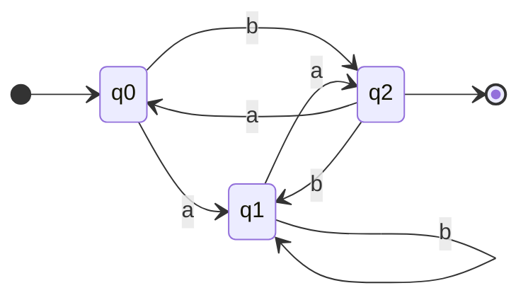
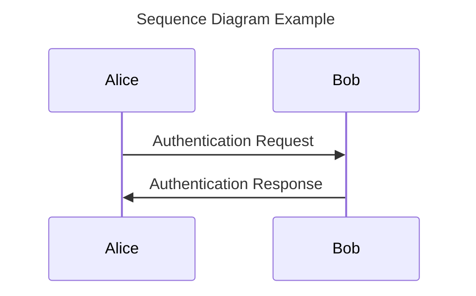
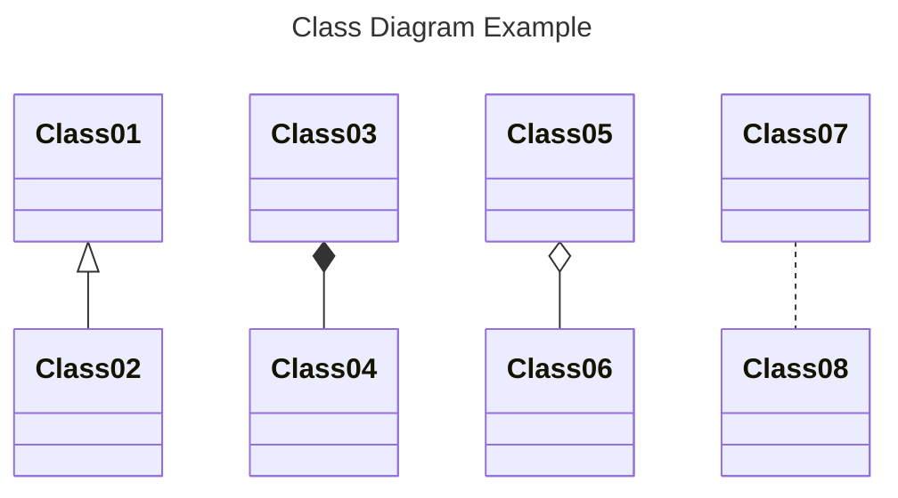

# Notation

Defining the Vultron protocol involves a lot of notation.
This page provides a reference for the notation used throughout the documentation.

## Mathematical Notation

In all of these definitions, we take the standard Zermelo-Fraenkel set theory.
We adopt the following notation:

!!! info "Set Theory Symbols"

    | Symbol | Meaning |
    | :--- | :--- |
    | $\{ \dots \}$ | depending on the context: (1) an ordered set in which the items occur in that sequence, or (2) a tuple of values |
    | \|$x$\| | the count of the number of elements in a list, set, tuple, or vector $x$ |
    | $\subset,=,\subseteq$ | the normal proper subset, equality, and subset relations between sets |
    | $\in$ | the membership (is-in) relation between an element and the set it belongs to |
    | $\prec$ | the precedes relation on members of an ordered set: $\sigma_i \prec \sigma_j \textrm{ if and only if } \sigma_i,\sigma_j \in s \textrm{ and } i < j$  where $s$ is an ordered set |
    | \|$X$\| | the size of (the number of elements in) a set $X$ |
    | $\langle X_i \rangle^N_{i=1}$ | a set of $N$ sets $X_i$, indexed by $i$; used in Chapter [\[sec:formal_protocol\]](#sec:formal_protocol){reference-type="ref" reference="sec:formal_protocol"} in the context of Communicating FSM, taken from    the article on "On Communicating Finite State Machines"[@brand1983communicating] |

!!! info "Logic Symbols"

    | Symbol | Meaning |
    | :--- | :--- |
    | $\implies$ | implies |
    | $\iff$ | if-and-only-if (bi-directional implication) |
    | $\wedge$ | the logical AND operator |
    | $\lnot$ | the logical NOT operator |

!!! info "Directional Messaging Symbols"

    | Symbol | Meaning |
    | :--- | :--- |
    | $\rightharpoonup{}$ | a message emitted (sent) by a process |
    | $\leftharpoondown{}$ | a message received by a process |

!!! info "DFA Symbols"

    | Symbol | Meaning |
    | :--- | :--- |
    | $\xrightarrow{}$ | a transition between states, usually labeled with the transition type (e.g., $\xrightarrow{a}$) |
    | $(\mathcal{Q},q_0,\mathcal{F},\Sigma,\delta)$ | specific symbols for individual DFA components that are introduced when needed in Chapters |
    | $\Big \langle { \langle S_i \rangle }^N_{i=1}, { \langle o_i \rangle }^N_{i=1}, { \langle M_{i,j} \rangle}^N_{i,j=1}, { succ } \Big \rangle$ | formal protocol symbols that are introduced at the beginning of Chapter [\[sec:formal_protocol\]](#sec:formal_protocol){reference-type="ref" reference="sec:formal_protocol"} |

## Diagram Notation

We use a variety of diagramming techniques throughout the documentation.

### State Diagrams

Our depictions of DFA as figures use common state diagram symbols as shown in the example below.

### Sequence and Class Diagrams

We follow UML conventions for sequence and class diagrams

### Behavior Tree Diagrams

We introduce a few additional notation details specific to [Behavior Trees](../topics/behavior_logic) when needed.
