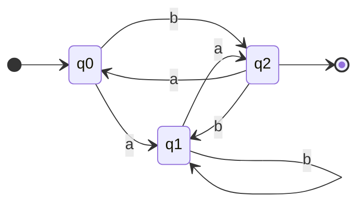
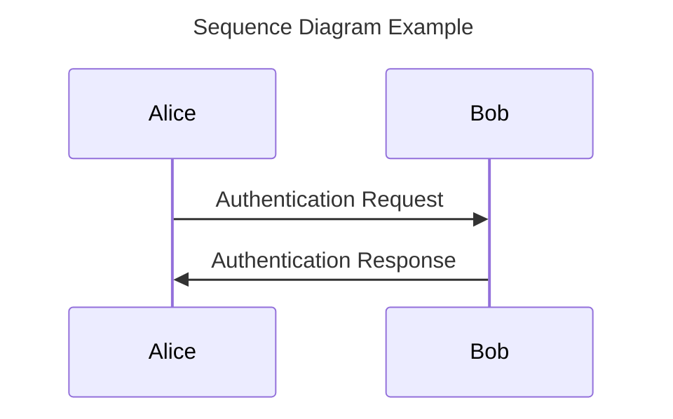
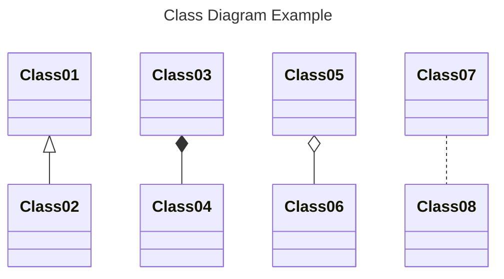

# Notation



Defining the Vultron Protocol involves a lot of notation.
This page provides a reference for the conventions and notation used throughout the documentation.

## Documentation Conventions

We are using the [*Admonitions*](https://squidfunk.github.io/mkdocs-material/reference/admonitions/){:target="_blank"} (call-outs) provided by
[Material for MkDocs](https://squidfunk.github.io/mkdocs-material/){:target="_blank"} to highlight specific types of information in this
documentation.

!!! note ""

    Statements in boxes like this are normative requirements. 
    Use of SHOULD, MUST, MAY, etc. follow the [RFC 2119](https://tools.ietf.org/html/rfc2119){:target="_blank"} conventions.

!!! note "Formalisms"

    Formalisms are used to define the behavior of the Vultron Protocol.

    $$A = A$$

    Readers should generally be able to understand the protocol description in the text without understanding the formalisms,
    but the formalisms are included for completeness.

!!! info

    Statements in boxes like this are informative notes. 
    They provide additional information that may be helpful in understanding the normative requirements.

!!! tip

    Statements in boxes like this are tips. 
    They provide additional information that might point to other resources, or provide additional context that may be 
    helpful in understanding the protocol.

!!! quote

    This is a quote.

!!! example

    This is an example.
    It is also an example example.

!!! question

    What is a question? This is.

!!! success

    We use this (as you'll see below) as an indicator that a page contains
    normative content.

!!! warning

    This is a warning.

Material for MkDocs supports a number of other [admonitions](https://squidfunk.github.io/mkdocs-material/reference/admonitions/){:target="_blank"}.
We're generally trying to keep our usage consistent with the admonition names used in the Material for MkDocs
[documentation](https://squidfunk.github.io/mkdocs-material/reference/admonitions/){:target="_blank"}, but we'd also like to list the
ones we use here for completeness and clarity.
If you spot us using one that is not listed here, or being inconsistent with the above in our usage, please let us
know by [opening an issue](https://github.com/CERTCC/Vultron/issues){:target="_blank"}.

### Normative and Non-Normative Pages

Not everything we say about the Vultron Protocol is a normative requirement.
We use the following conventions to indicate whether a page contains normative requirements or not.

!!! info "Recognizing Normative Pages"

    

    Pages that contain normative requirements are marked with a banner at or near the top of the page:

!!! info "Recognizing Non-Normative Pages"

    

    Pages that do not contain normative requirements are marked with a banner at or near the top of the page (Like this one).
    This banner may be omitted if the page is clearly non-normative.
    We include it on pages where that may not be clear, for example on pages where we are describing a specific implementation
    in terms of SHOULD, MUST, MAY, etc. statements, but those statements are not intended to be normative requirements.

## Mathematical Notation

In all of these definitions, we take the standard [Zermelo-Fraenkel set theory](https://en.wikipedia.org/wiki/Zermelo%E2%80%93Fraenkel_set_theory){:target="_blank"}.
We adopt the following notation:

!!! info "Set Theory Symbols"

    | Symbol | Meaning |
    | :--- | :--- |
    | $\{ \dots \}$ | depending on the context: (1) an ordered set in which the items occur in that sequence, or (2) a tuple of values |
    | \|$x$\| | the count of the number of elements in a list, set, tuple, or vector $x$ |
    | $\subset,=,\subseteq$ | the normal proper subset, equality, and subset relations between sets |
    | $\in$ | the membership (is-in) relation between an element and the set it belongs to |
    | $\prec$ | the precedes relation on members of an ordered set: $\sigma_i \prec \sigma_j \textrm{ if and only if } \sigma_i,\sigma_j \in s \textrm{ and } i < j$  where $s$ is an ordered set |
    | \|$X$\| | the size of (the number of elements in) a set $X$ |
    | $\langle X_i \rangle^N_{i=1}$ | a set of $N$ sets $X_i$, indexed by $i$; used in the [Formal Protocol](../../reference/formal_protocol/index.md) in the context of Communicating Finite State Machines, taken from the article [On Communicating Finite State Machines](https://doi.org/10.1145/322374.322380){:target="_blank"} by Brand and Zafiropulo |

!!! info "Logic Symbols"

    | Symbol | Meaning |
    | :--- | :--- |
    | $\implies$ | implies |
    | $\iff$ | if-and-only-if (bi-directional implication) |
    | $\wedge$ | the logical AND operator |
    | $\lnot$ | the logical NOT operator |

!!! info "Directional Messaging Symbols"

    | Symbol | Meaning |
    | :--- | :--- |
    | $\rightharpoonup{}$ | a message emitted (sent) by a process |
    | $\leftharpoondown{}$ | a message received by a process |

!!! info "DFA Symbols"

    | Symbol | Meaning |
    | :--- | :--- |
    | $\xrightarrow{}$ | a transition between states, usually labeled with the transition type (e.g., $\xrightarrow{a}$) |
    | $(\mathcal{Q},q_0,\mathcal{F},\Sigma,\delta)$ | specific symbols for individual DFA components that are introduced when needed in Chapters |
    | $\Big \langle { \langle S_i \rangle }^N_{i=1}, { \langle o_i \rangle }^N_{i=1}, { \langle M_{i,j} \rangle}^N_{i,j=1}, { succ } \Big \rangle$ | formal protocol symbols that are introduced at the beginning of the [Formal Protocol](../../reference/formal_protocol/index.md) |

## Diagram Notation

We use a variety of diagramming techniques throughout the documentation.

### State Diagrams

Our depictions of DFA as figures use common state diagram symbols as shown in the example below.

### Sequence and Class Diagrams

We follow UML conventions for sequence and class diagrams

### Behavior Tree Diagrams

We introduce a few additional notation details specific to [Behavior Trees](../behavior_logic/index.md) when needed.
