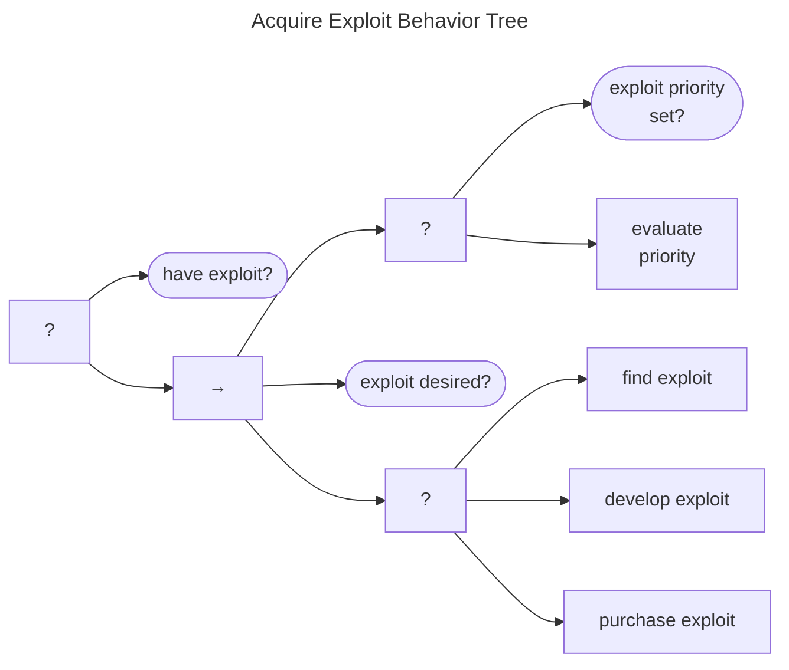

# Acquire Exploit Behavior

Some Vendors or other CVD Participants might require a proof-of-concept exploit to accompany an incoming report for it
to pass their validation checks.
To that end, an Acquire Exploit Behavior Tree is shown below.

The goal of this behavior is for the Participant to be in possession of an exploit.

If the Participant does not already have one, the main acquisition
sequence is triggered. The sequence begins by ensuring that the exploit
acquisition activity has sufficient priority to continue. If it does,
the Participant has one of three options to choose from: they can find
one somewhere else, develop it themselves, or pay someone for the
privilege.

The overall behavior returns *Success* when either an exploit is
acquired or when one is not desired and is therefore deferred. It can
fail in the scenario where an exploit is desired but not acquired.
