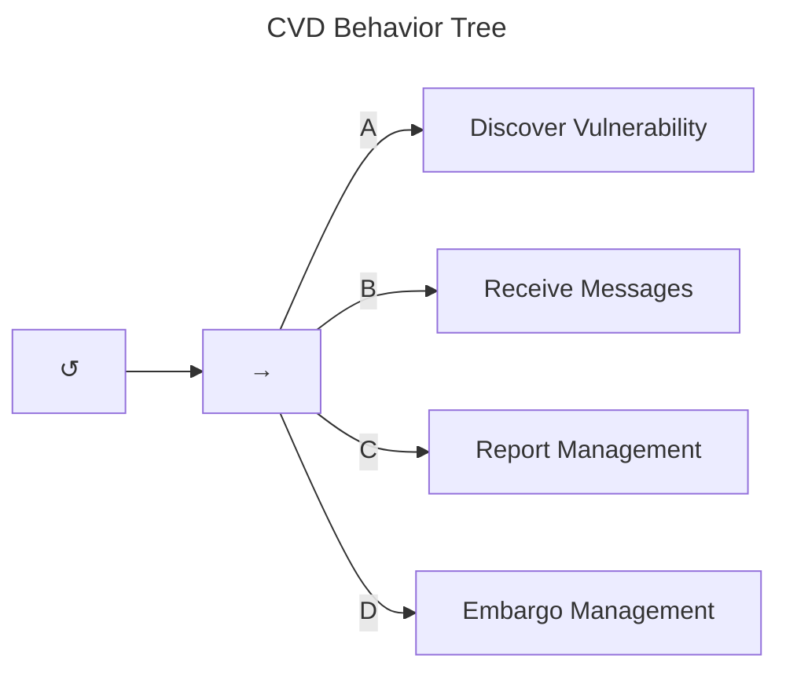
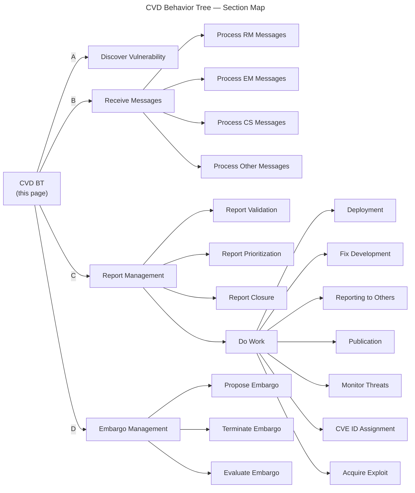

# CVD Behavior Tree

We begin at the root node of the CVD Behavior Tree shown in the figure below.
The root node is a simple loop that continues until an interrupt condition is met, representing the idea
that the CVD practice is meant to be continuous. In other words, we are intentionally not specifying the interrupt condition.

The main sequence is comprised of four main tasks:

- (A) [*Discover Vulnerability.*](vuldisco_bt.md) Although not all Participants have the
    ability or motive to discover vulnerabilities, we include it as a
    task here to call out its importance to the overall
    CVD process. This task returns *Success* regardless of whether a vulnerability is found to allow execution to
    pass to the next task.

- (B) [*Receive Messages*](msg_intro_bt.md). All coordination in CVD between Participants is done through
    the exchange of messages, regardless of how those messages are
    conveyed, stored, or presented. The receive messages task represents
    the Participant's response to receiving the various messages defined
    in the [formal protocol](../../reference/formal_protocol/index.md). Due to the degree of detail
    required to cover all the various message types, decomposition of
    this task node is deferred until [later](msg_intro_bt.md) so we can cover the next two items
    first. Before we proceed, it is sufficient to know that a new report arriving in the *receive messages* behavior
    sets $q^{rm} \in S \xrightarrow{r} R$ and returns *Success*.
    Each message is dispatched to one of four process-specific sub-trees:

  - [Process RM Messages](msg_rm_bt.md) — handles report-submission, error, and status messages
      (`RS`, `RE`, `RV`, `RI`, `RA`, `RD`, `RC`, `RK`)
  - [Process EM Messages](msg_em_bt.md) — handles all embargo coordination messages
      (`EP`, `EA`, `EV`, `EJ`, `EC`, `ET`, `ER`, `EE`, `EK`)
  - [Process CS Messages](msg_cs_bt.md) — handles case-state change notifications
      (`CP`, `CX`, `CA`, `CV`, `CF`, `CD`, `CE`, `CK`)
  - [Process Other Messages](msg_other_bt.md) — handles general inquiry and acknowledgment messages
      (`GI`, `GE`, `GK`)

- (C) [*Report Management*](rm_bt.md). This task embodies the [RM process](../process_models/rm/index.md)
    as integrated into the [formal protocol](../../reference/formal_protocol/index.md).
    It delegates to three sub-behaviors plus the main work loop:

  - [Report Validation](rm_validation_bt.md) — evaluates credibility and validity; transitions
      $q^{rm} \in R \xrightarrow{v} V$ or $q^{rm} \xrightarrow{i} I$
  - [Report Prioritization](rm_prioritization_bt.md) — applies triage (e.g., SSVC); transitions
      $q^{rm} \in V \xrightarrow{a} A$ or $q^{rm} \xrightarrow{d} D$
  - [Report Closure](rm_closure_bt.md) — checks closure criteria and transitions
      $q^{rm} \xrightarrow{c} C$
  - [Do Work](do_work_bt.md) — a parallel node covering the active work performed on
      *Accepted* reports ($q^{rm} \in A$), including:
    - [Deployment](deployment_bt.md) — prioritizes and executes fix or mitigation deployment;
          transitions $q^{cs} \xrightarrow{\mathbf{D}} D$
    - [Fix Development](fix_dev_bt.md) — Vendor-specific behavior to create a fix;
          transitions $q^{cs} \xrightarrow{\mathbf{F}} F$
    - [Reporting to Others](reporting_bt.md) — identifies relevant Participants and notifies them
          (emits `RS`)
    - [Publication](publication_bt.md) — manages preparation and release of advisories, fixes,
          and exploits; transitions $q^{cs} \xrightarrow{\mathbf{P}} P$
    - [Monitor Threats](monitor_threats_bt.md) — watches for attacks, public exploits, and
          public reports; may trigger embargo termination
    - [CVE ID Assignment](id_assignment_bt.md) — assigns or requests a CVE ID for the
          vulnerability
    - [Acquire Exploit](acquire_exploit_bt.md) — finds, develops, or purchases a PoC exploit
          when needed

- (D) [*Embargo Management*](em_bt.md). Similarly, this task represents the
    [EM process](../process_models/em/index.md) as integrated into the
    [formal protocol](../../reference/formal_protocol/index.md).
    It uses three reusable sub-trees:

  - [Propose Embargo](em_propose_bt.md) — selects terms and emits `EP` (new proposal) or
      `EV` (revision), respecting embargo viability conditions
  - [Evaluate Embargo](em_eval_bt.md) — accepts a proposal (emits `EA`) or issues a
      counterproposal via [Propose Embargo](em_propose_bt.md)
  - [Terminate Embargo](em_terminate_bt.md) — exits an active or proposed embargo when
      termination criteria are met; transitions $q^{em} \xrightarrow{t} X$ and emits `ET` or `ER`

Behaviors and state changes resulting from changes to the [CS model](../process_models/cs/index.md)
are scattered throughout the other Behavior Trees where relevant.

## Section Overview

The diagram below maps the full decomposition of Behavior Trees covered in this section.
Each box corresponds to a page in this section.

