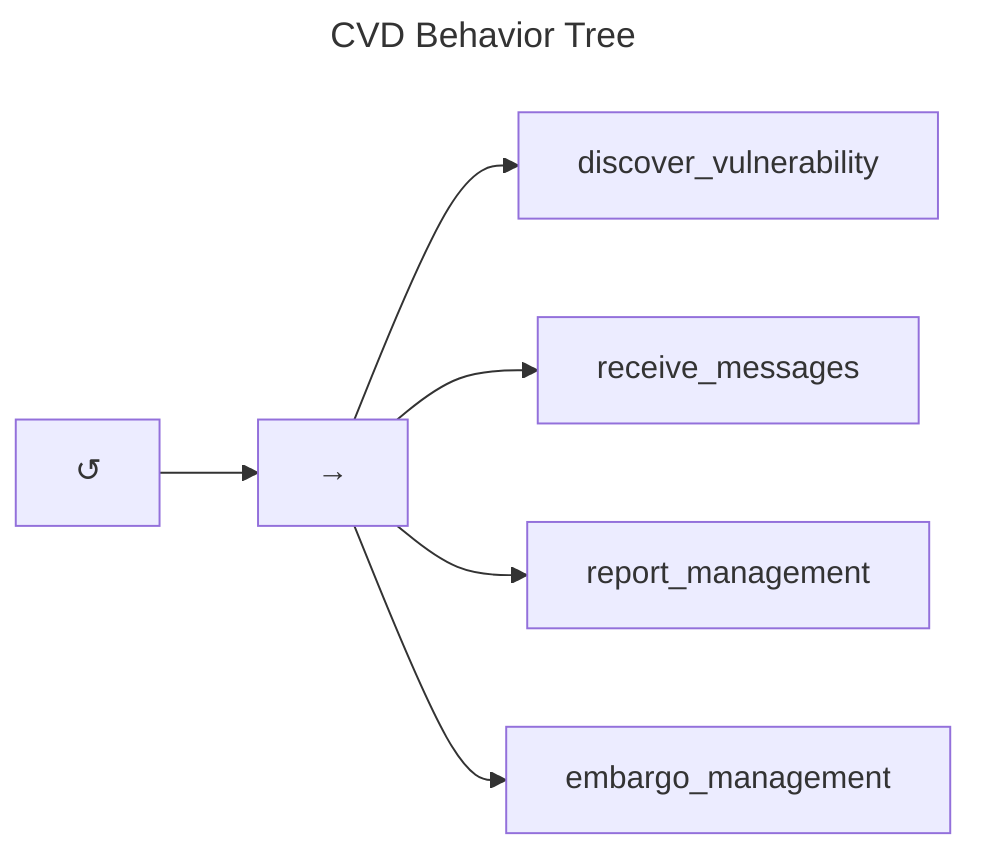

# CVD Behavior Tree

We begin at the root node of the CVD Behavior Tree shown in the figure below.
The root node is a simple loop that continues until an interrupt condition is met, representing the idea
that the CVD practice is meant to be continuous. In other words, we are intentionally not specifying the interrupt condition.

The main sequence is comprised of four main tasks:

-   [*Discover vulnerability.*](../topics/behavior_logic/vuldisco_bt) Although not all Participants have the
    ability or motive to discover vulnerabilities, we include it as a
    task here to call out its importance to the overall
    CVD process. This task returns *Success* regardless of whether a vulnerability is found to allow execution to
    pass to the next task.

-   [*Receive messages*](../topics/behavior_logic/receive_messages_bt). All coordination in CVD between Participants is done through
    the exchange of messages, regardless of how those messages are
    conveyed, stored, or presented. The receive messages task represents
    the Participant's response to receiving the various messages defined
    in the [formal protocol](../reference/formal_protocol). Due to the degree of detail
    required to cover all the various message types, decomposition of
    this task node is deferred until [later](../topics/behavior_logic/receive_messages_bt) so we can cover the next two items
    first.

-   [*Report Management*](../topics/behavior_logic/rm_bt). This task embodies the [RM process](../topics/process_models/rm)
    as integrated into the [formal protocol](../reference/formal_protocol).

-   [*Embargo Management*](../topics/behavior_logic/em_bt). Similarly, this task represents the
    [EM process](../topics/process_models/em) as integrated into the [formal protocol](../reference/formal_protocol).

A further breakdown of a number of CVD tasks that fall outside the scope of the
[formal protocol](../reference/formal_protocol) can be found in
[Do Work](../topics/behavior_logic/do_work_bt).
In that section, we examine a number of behaviors that Participants may include as part of the work they do for reports 
in the $Accepted$ RM state ($q^{rm}\in A$).

Behaviors and state changes resulting from changes to the [CS model](../topics/process_models/cs) are scattered throughout the other Behavior Trees
where relevant.

