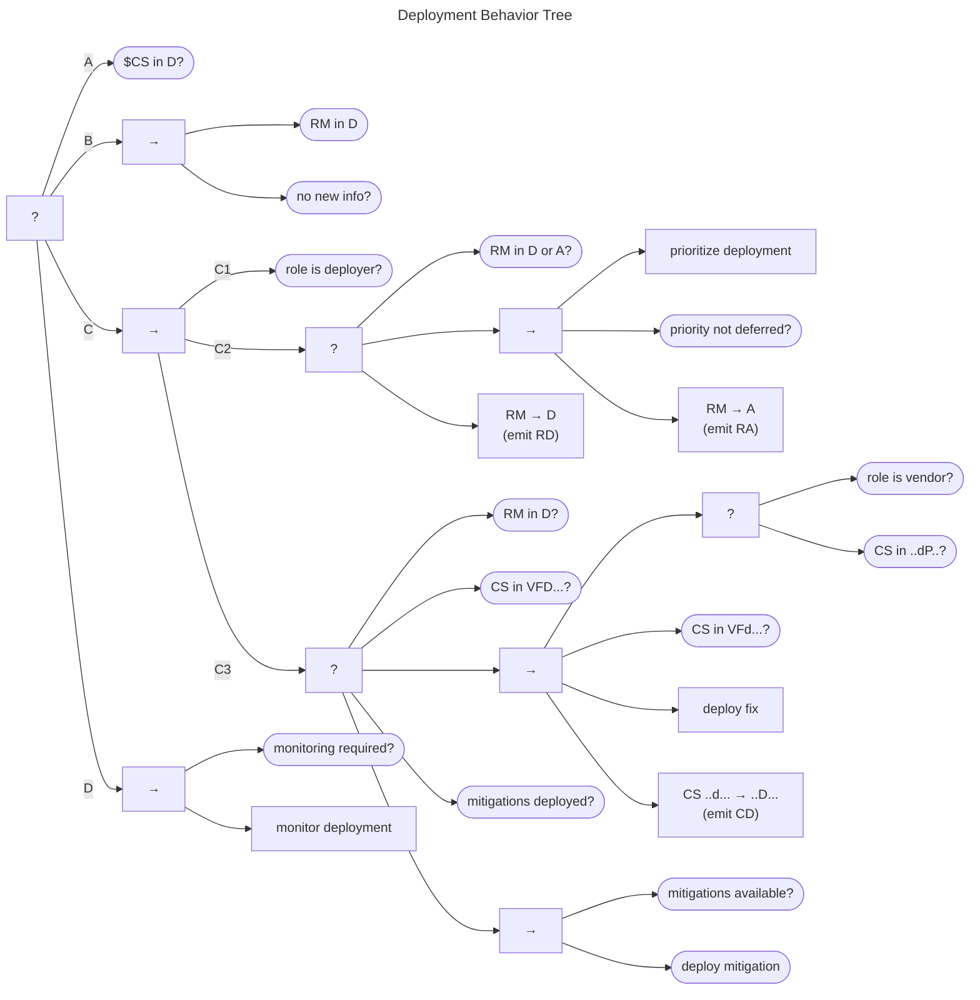

# Deployment Behavior {#sec:deployment_bt}

The Deployment Behavior Tree is shown in the figure below.
The goal of this behavior is either for (A) the case to reach the $q^{cs} \in D$ state or (B) for the Participant to be
comfortable with remaining in a *Deferred* deployment state.

Assuming neither of these conditions has been met, the main deployment sequence (C) falls to the Deployer role (C1).
It consists of two subprocesses: prioritize deployment and deploy.

The prioritize deployment behavior is shown in (C2) the fallback node in the center of the diagram.
The subgoal is for the deployment priority to be established, as indicated by the Deployer's RM state $q^{rm} \in \{D,A\}$.
For example, a Deployer might use the [SSVC Deployer Tree](https://github.com/CERTCC/SSVC) to decide whether (and when) 
to deploy a fix or mitigation.
If the deployment priority evaluation indicates further action is needed,

- the report management state is set to $q^{rm} \in A$
- an $RA$ message is emitted, and 
- the overall prioritization behavior succeeds

Otherwise, when the deployment is *Deferred*, it results in a transition to state $q^{rm} \in D$ and
emission of an $RD$ message.

(C3) The deploy behavior is shown in the second fallback node of the center sequence (C).
It short-circuits to *Success* if either the deployment is *Deferred* or has already occurred.
The main sequence can fire in two cases:

1.  when the Deployer is also the Vendor and a fix is ready
    ($q^{cs} \in F$)
2.  when the Deployer is not the Vendor but the fix is both ready and
    public ($q^{cs} \in P$ and $q^{cs} \in F$)

Assuming either of these conditions is met,

- the deploy fix task can run, 
- the case status is updated to $q^{cs} \in D$, and 
- $CD$ emits on *Success*

Should the deployment sequence fail for any reason, a fallback is possible if undeployed mitigations are available.

(D) Finally, returning to the top part of the tree, Participants might choose to monitor the deployment process should they 
have the need to.

