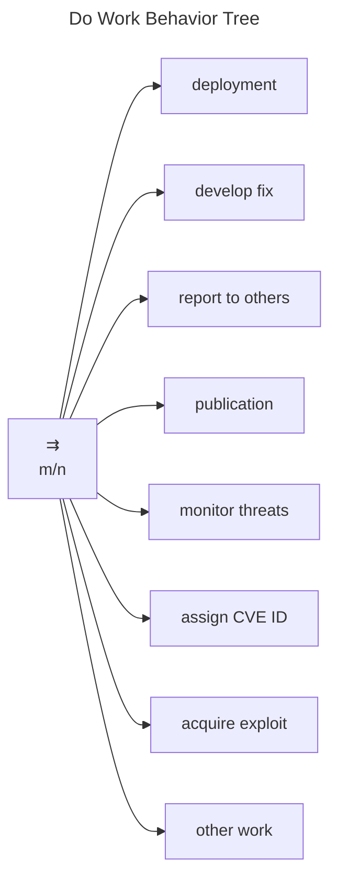

# Do Work Behavior Tree

Although it is not directly addressed by the [formal MPCVD protocol](/reference/formal_protocol), the *do work* node
of the [RM Behavior Tree](/topics/behavior_logic/rm_bt/) is where much of the CVD effort happens.
As a result, it is worth spending some time reviewing what some of the underlying work actually entails.

In this section, we will expand on the set of behaviors shown in Figure
[\[fig:bt_do_work\]](#fig:bt_do_work){reference-type="ref"
reference="fig:bt_do_work"}. Specifically, we will cover the following
tasks, each in its own subsection.

-   Deployment

-   Developing a fix

-   Reporting to others

-   Publication

-   Monitoring threats

-   Assigning CVE IDs

-   Acquiring exploits

The *other work* task is included as a placeholder for any
Participant-specific tasks not represented here.

Note that Figure
[\[fig:bt_do_work\]](#fig:bt_do_work){reference-type="ref"
reference="fig:bt_do_work"} models this behavior as a parallel Behavior
Tree node, although we intentionally do not specify any *Success*
criteria regarding what fraction of its children must succeed. Decisions
about which (and how many) of the following tasks are necessary for a
Participant to complete work on their $Accepted$
CVD cases are left
to the discretion of individual Participants.

