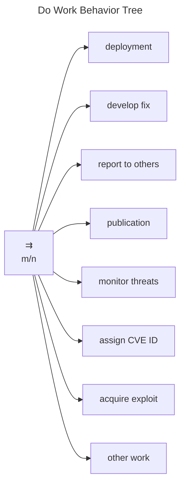

# Do Work Behavior Tree

Although it is not directly addressed by the [formal MPCVD protocol](../reference/formal_protocol), the *do work* node
of the [RM Behavior Tree]((./rm_bt/) is where much of the CVD effort happens.
As a result, it is worth spending some time reviewing what some of the underlying work actually entails.

In this section, we will expand on the set of behaviors shown in the diagram below.

!!! tip inline end "Why is this a parallel node?"
    The *do work* node is a parallel node because it is not necessary for a Participant to complete all of these tasks
    in order to complete their CVD work.
    We intentionally do not specify any *Success* criteria regarding what fraction of its children must succeed. 
    Decisions about which (and how many) of the following tasks are necessary for a Participant to complete work
    on their $Accepted$ CVD cases are left to the discretion of individual Participants.

 Specifically, we will cover the following
tasks, each in its own subsection.

-   [Deployment]((./deployment_bt/)
-   [Developing a fix]((./fix_dev_bt/)
-   [Reporting to others]((./reporting_bt/)
-   [Publication]((./publication_bt/)
-   [Monitoring threats]((./monitor_threats_bt/)
-   [Assigning CVE IDs]((./id_assignment_bt/)
-   [Acquiring exploits]((./acquire_exploit_bt/)

The *other work* task is included as a placeholder for any Participant-specific tasks not represented here.

