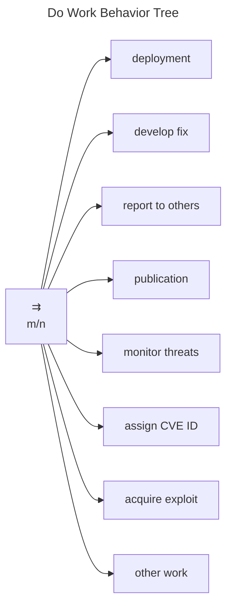
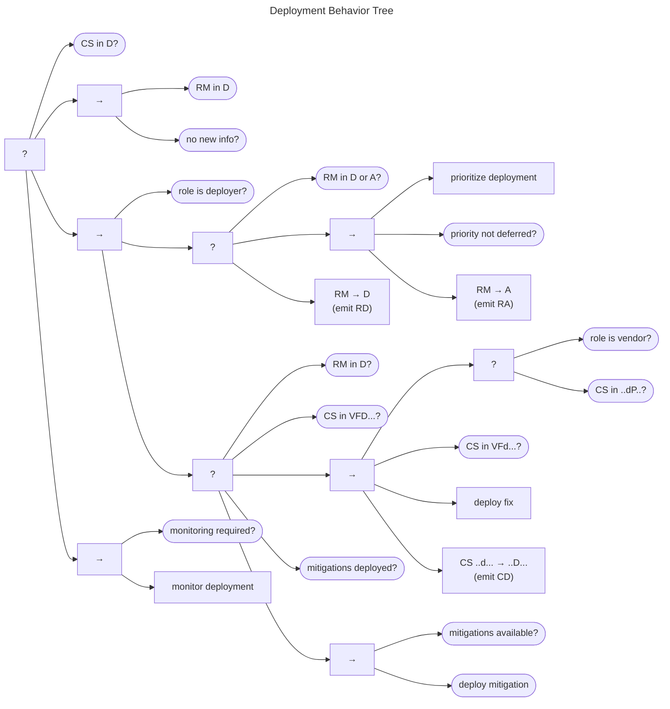

# Do Work Behavior Tree

Although it is not directly addressed by the [formal MPCVD protocol](/reference/formal_protocol), the *do work* node
of the [RM Behavior Tree](/topics/behavior_logic/rm_bt/) is where much of the CVD effort happens.
As a result, it is worth spending some time reviewing what some of the underlying work actually entails.

In this section, we will expand on the set of behaviors shown in Figure
[\[fig:bt_do_work\]](#fig:bt_do_work){reference-type="ref"
reference="fig:bt_do_work"}. Specifically, we will cover the following
tasks, each in its own subsection.

-   Deployment

-   Developing a fix

-   Reporting to others

-   Publication

-   Monitoring threats

-   Assigning CVE IDs

-   Acquiring exploits

The *other work* task is included as a placeholder for any
Participant-specific tasks not represented here.

Note that Figure
[\[fig:bt_do_work\]](#fig:bt_do_work){reference-type="ref"
reference="fig:bt_do_work"} models this behavior as a parallel Behavior
Tree node, although we intentionally do not specify any *Success*
criteria regarding what fraction of its children must succeed. Decisions
about which (and how many) of the following tasks are necessary for a
Participant to complete work on their $Accepted$
CVD cases are left
to the discretion of individual Participants.

## Deployment Behavior {#sec:deployment_bt}

The Deployment Behavior Tree is shown in the figure below.
The goal of this behavior is either for the case to reach the $q^{cs} \in D$ state or for the Participant to be
comfortable with remaining in a *Deferred* deployment state.

Assuming neither of these conditions has been met, the main deployment sequence falls to the Developer role.
It consists of two subprocesses: prioritize deployment and deploy.
The prioritize deployment behavior is shown in the fallback node in the center of the diagram.
The subgoal is for the deployment priority to be established, as indicated by the Deployer's RM state $q^{rm} \in \{D,A\}$.
For example, a Deployer might use the [SSVC Deployer Tree](https://github.com/CERTCC/SSVC) to decide whether (and when) 
to deploy a fix or mitigation.
If the deployment priority evaluation indicates further action is needed,

- the report management state is set to $q^{rm} \in A$
- an $RA$ message is emitted, and 
- the overall prioritization behavior succeeds

Otherwise, when the deployment is *Deferred*, it results in a transition to state $q^{rm} \in D$ and
emission of an $RD$ message.

The deploy behavior is shown in the second fallback node of the center sequence.
It short-circuits to *Success* if either the deployment is *Deferred* or has already occurred.
The main sequence can fire in two cases:

1.  when the Deployer is also the Vendor and a fix is ready
    ($q^{cs} \in F$)
2.  when the Deployer is not the Vendor but the fix is both ready and
    public ($q^{cs} \in P$ and $q^{cs} \in F$)

Assuming either of these conditions is met,

- the deploy fix task can run, 
- the case status is updated to $q^{cs} \in D$, and 
- $CD$ emits on *Success*
 
Should the deployment sequence fail for any reason, a fallback is possible if undeployed mitigations are available.

Finally, returning to the top part of the tree, Participants might choose to monitor the deployment process should they 
have the need to.

## Fix Development Behavior {#sec:fix_dev_bt}

The Fix Development Behavior Tree is shown in Figure
[\[fig:bt_fix_development\]](#fig:bt_fix_development){reference-type="ref"
reference="fig:bt_fix_development"}. Fix development is relegated to the
Vendor role, so Non-Vendors just return *Success* since they have
nothing further to do. For Vendors, if a fix is ready (i.e., the case is
in $q^{cs} \in VF\cdot\cdot\cdot\cdot$), the tree returns *Success*. Otherwise,
engaged Vendors ($q^{rm} \in A$) can create fixes, set
$q^{cs} \in Vfd\cdot\cdot\cdot \xrightarrow{\mathbf{F}} VFd\cdot\cdot\cdot$ and emit
$CF$ upon completion.

## Reporting Behavior {#sec:reporting_bt}

The *CERT Guide to Coordinated Vulnerability Disclosure* describes the
reporting phase as the process of identifying parties that need to be
informed about the vulnerability and then notifying them
[@householder2017cert]. Reporting only works if the intended recipient
has the ability to receive reports, as outlined in
§[1.2](#sec:receive_reports_bt){reference-type="ref"
reference="sec:receive_reports_bt"}.

The Reporting Behavior Tree is shown in Figure
[\[fig:bt_reporting\]](#fig:bt_reporting){reference-type="ref"
reference="fig:bt_reporting"}. The tree describes a Participant that
performs reporting until either their effort limit is met, or they run
out of Participants to notify.

### Identify Participants Behavior {#sec:identify_participants}

The Identify Participants Behavior Tree, shown in Figure
[\[fig:bt_identify_participants\]](#fig:bt_identify_participants){reference-type="ref"
reference="fig:bt_identify_participants"}, ends when all relevant
parties have been identified. Until that condition is met, the
Participant can proceed with identifying Vendors, Coordinators, or other
parties relevant to the coordination of the case. Note that we are
intentionally avoiding setting any requirements about *who* is relevant
to a case since we leave that to each Participant's judgment.

### Notify Others Behavior {#sec:notify_others}

The Notify Others Behavior Tree is shown in Figure
[\[fig:bt_notify_others\]](#fig:bt_notify_others){reference-type="ref"
reference="fig:bt_notify_others"}. Its goal is for all intended
recipients to receive the report, thereby reaching the $q^{rm} \in R$
state. Each pass through this part of the tree chooses a Participant
from a list of eligible recipients constructed in the Identify
Participants Behavior. The method for choosing the recipient is left
unspecified since Participants can prioritize recipients how they see
fit.

The process proceeds to clean up the eligible recipients list when
either the recipient is already believed to be in $q^{rm} \in R$ or if
the effort expended in trying to reach the recipient has exceeded the
Participant's limit. Such limits are entirely left to the discretion of
each Participant. If the chosen recipient is pruned by this branch, the
branch returns *Success*.

If the chosen recipient was not pruned, then the cleanup branch fails
and execution transfers to the second branch to notify the recipient.
The first step in the notification branch is a check for an existing
embargo. If the embargo management state is one of
$q^{em} \in \{ N,P,X\}$, there is no active embargo, and the Participant
can proceed with notification. Otherwise, in the case of an already
active embargo (i.e., $q^{em} \in \{A,R\}$), there is an additional
check to ensure that the potential recipient's policy is compatible with
any existing embargo. This check allows for a reporting Participant to
skip a recipient if they are likely to cause premature termination of an
extant embargo.

Once at least one of these checks is passed, the notification sequence
proceeds through finding the recipient's contact information, sending
the report, and updating the Participant's knowledge of the recipient's
report management state.

## Publication Behavior {#sec:publication_bt}

The Publication Behavior Tree is shown in Figure
[\[fig:bt_publication\]](#fig:bt_publication){reference-type="ref"
reference="fig:bt_publication"}. It begins by ensuring that the
Participant knows what they intend to publish, followed by a check to
see if that publication has been achieved. Assuming that work remains to
be done, the main publish sequence commences on the right-hand branch.

The process begins with preparation for publication, described in
§[1.5.4.1](#sec:prepare_publication_bt){reference-type="ref"
reference="sec:prepare_publication_bt"}, followed by a pre-publication
embargo check. This behavior is a simple check to ensure that no embargo
remains active prior to publication. Note that the embargo management
process may result in early termination of an existing embargo if the
Participant has sufficient cause to do so. (See the detailed description
of the EM behavior in{== §[1.4](#sec:em_bt){reference-type="ref"
reference="sec:em_bt"} ==}.)

Once these subprocesses complete, the publish task fires, the case state
is updated to $q^{cs} \in P$, and a $CP$ message emits.

### Prepare Publication Behavior {#sec:prepare_publication_bt}

The Prepare Publication Behavior Tree is shown in Figure
[\[fig:bt_prepare_publication\]](#fig:bt_prepare_publication){reference-type="ref"
reference="fig:bt_prepare_publication"}. There are separate branches for
publishing exploits, fixes, and reports. The publish exploit branch
succeeds if either no exploit publication is intended, if it is intended
and ready, or if it can be acquired and prepared for publication. The
publish fix branch succeeds if the Participant does not intend to
publish a fix (e.g., if they are not the Vendor), if a fix is ready, or
if it can be developed and prepared for publication. The publish report
branch is the simplest and succeeds if either no publication is intended
or if the report is ready to go.

Once all three branches have completed, the behavior returns *Success*.

## Monitor Threats Behavior {#sec:monitor_threats_bt}

The Monitor Threats Behavior Tree is shown in Figure
[\[fig:bt_monitor_threats\]](#fig:bt_monitor_threats){reference-type="ref"
reference="fig:bt_monitor_threats"}. For our purposes, monitoring
consists of a set of parallel tasks, any one of which can lead to
embargo termination. The three conditions of interest are taken straight
from the embargo exit criteria:

-   If attacks are observed, the $q^{cs} \xrightarrow{\mathbf{A}} A$
    transition occurs, and a $CA$ message is emitted.

-   If a public exploit is observed, the
    $q^{cs} \xrightarrow{\mathbf{X}} X$ transition occurs, and a $CX$
    message is emitted. In the special case where the exploit is made
    public prior to the vulnerability itself being made public,[^1]
    there is an additional $q^{cs} \xrightarrow{\mathbf{P}} P$
    transition and $CP$ emission.

-   Finally, if the vulnerability information has been made public, then
    the $q^{cs} \xrightarrow{\mathbf{P}} P$ and emits $CP$.

In the event that one or more of these events is detected, the terminate
embargo behavior is triggered.

There are many other good reasons to monitor and maintain awareness of
cybersecurity threats. The behavior shown here is intended as a minimal
set of things that CVD Participants should watch out for in the
course of performing their CVD practice.

## CVE ID Assignment Behavior {#sec:assign_id_bt}

Many CVD
practitioners want to assign identifiers to the vulnerabilities they
coordinate. The most common of these is a CVE ID, so we provide an example CVE ID
Assignment Behavior Tree, shown in Figure
[\[fig:bt_cve_assignment\]](#fig:bt_cve_assignment){reference-type="ref"
reference="fig:bt_cve_assignment"}. While this tree is constructed
around the CVE ID
assignment process, it could be easily adapted to any other identifier
process as well.

The goal is to end with an ID assigned. If that has not yet happened,
the first check is whether the vulnerability is in scope for an ID
assignment. If it is, the Participant might be able to assign IDs
directly, assuming they are a CNA and the vulnerability meets the criteria
for assigning IDs.

Otherwise, if the Participant is not a CNA, they will have to request an ID from a
CNA.

Should both assignment branches fail, the behavior fails. Otherwise, as
long as one of them succeeds, the behavior succeeds.

## Acquire Exploit Behavior {#sec:exploit_acq_bt}

Some Vendors or other CVD Participants might require a
proof-of-concept exploit to accompany an incoming report for it to pass
their validation checks. To that end, an Acquire Exploit Behavior Tree
is shown in Figure
[\[fig:bt_exploit_acquisition\]](#fig:bt_exploit_acquisition){reference-type="ref"
reference="fig:bt_exploit_acquisition"}. The goal of this behavior is
for the Participant to be in possession of an exploit.

If the Participant does not already have one, the main acquisition
sequence is triggered. The sequence begins by ensuring that the exploit
acquisition activity has sufficient priority to continue. If it does,
the Participant has one of three options to choose from: they can find
one somewhere else, develop it themselves, or pay someone for the
privilege.

The overall behavior returns *Success* when either an exploit is
acquired or when one is not desired and is therefore deferred. It can
fail in the scenario where an exploit is desired but not acquired.

