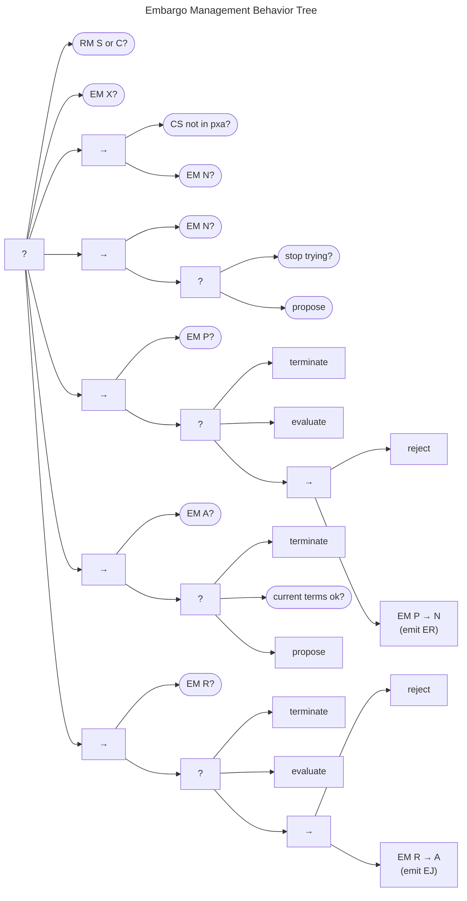

# Embargo Management Behavior Tree {#sec:em_bt}

The Embargo Management Behavior Tree is shown in the figure below.
It follows the state transition function in the
[Embargo Management Process Model](http://127.0.0.1:80(../process_models/em/#em-state-transitions).
Recall that the EM process begins in the $q^{em} \in N$ state and ends in one of two states:

-   in the *eXited* ($q^{em} \in X$) state after having established an
    *Active* embargo, or
-   in the *None* ($q^{em} \in N$) state after having exhausted all
    attempts to reach an agreement

The tree starts with a check to see whether no report has arrived or
whether the report has already *Closed* ($q^{rm} \in \{S{,}C\}$). If
either of these conditions is met, no further effort is needed, and the
tree succeeds. Next, the tree checks whether the embargo has already
*eXited* ($q^{em} \in X$). If it has, that leads the tree to succeed.
Failing that, the treat checks to see if the case has moved outside the
"habitable zone" for embargoes. The ${q^{cs}\not\in\cdot\cdot\cdot pxa}$
condition is true when attacks have been observed, an exploit has been
made public, or information about the vulnerability has been made
public. If one of those conditions is met and the embargo state is
*None* ($q^{em} \in N$), the check returns *Success*, and the tree
terminates, consistent with
[Negotiating Embargoes]((../process_models/em/negotiating/).

Otherwise, we continue through each remaining EM state. 
When there is no embargo and there are no outstanding proposals ($q^{em} \in N$), the only options are to
either stop trying or [propose]((./em_propose_bt/) a new embargo.
The decision to stop trying to achieve an embargo is left to individual Participants, although we did provide some relevant guidance in
[Negotiating Embargoes]((../process_models/em/negotiating/).

When there is an outstanding embargo proposal ($q^{em} \in P$), we first attempt the [terminate]((./em_terminate_bt/) task.
This task returns *Success* if there is a reason for ${q^{em} \in P \xrightarrow{r} N}$.

At this point, if there is no reason to [terminate]((./em_terminate_bt/),
we proceed to the [evaluate]((./em_eval_bt/) task described below.
The evaluate task returns *Success* if either the proposal is accepted or a counterproposal is made.

Assuming neither of these succeeds, we proceed to reject the proposal, returning to
$q^{em} \in N$ and emitting a corresponding $ER$ message.

The process within the *Active* ($q^{em} \in A$) state is similarly straightforward.
If there is reason to [terminate]((./em_terminate_bt/) the embargo, do so.
Otherwise, either the current embargo terms are acceptable, or a new embargo should be proposed.

Finally, we handle the *Revise* EM state ($q^{em} \in R$).
The structure of this branch mirrors that of the *Proposed* state discussed above.
Again, we check to see if there is cause to [terminate]((./em_terminate_bt/) doing so, if needed.
If termination is not indicated, we proceed once again to [evaluate the proposed revision]((./em_eval_bt/), either accepting
or countering the proposal. 
When neither of these succeed, the revision is rejected and the EM state returns to $q^{em} \in A$ with the
original embargo terms intact.
An $EJ$ message conveys this information to the other Participants.

