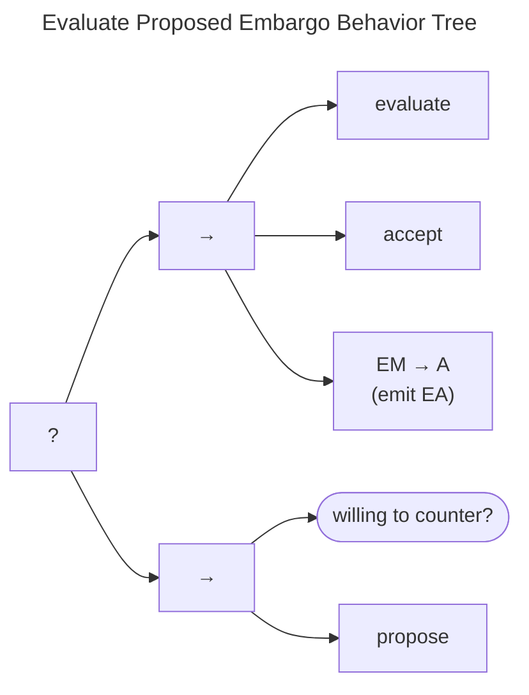
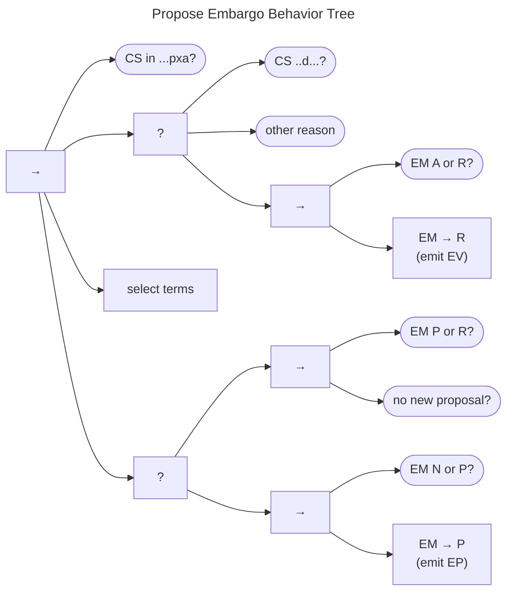
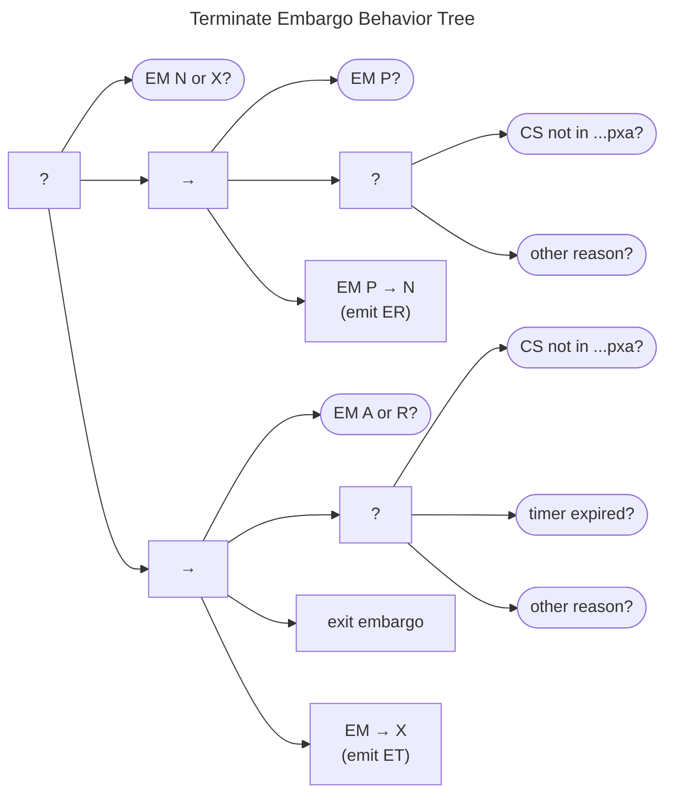

# Embargo Management Behavior Tree {#sec:em_bt}

The Embargo Management Behavior Tree is shown in the figure below.
It follows the state transition function in the
[Embargo Management Process Model](http://127.0.0.1:8000/topics/process_models/em/#em-state-transitions).
Recall that the EM process begins in the $q^{em} \in N$ state and ends in one of two states:

-   in the *eXited* ($q^{em} \in X$) state after having established an
    *Active* embargo, or
-   in the *None* ($q^{em} \in N$) state after having exhausted all
    attempts to reach an agreement

The tree starts with a check to see whether no report has arrived or
whether the report has already *Closed* ($q^{rm} \in \{S{,}C\}$). If
either of these conditions is met, no further effort is needed, and the
tree succeeds. Next, the tree checks whether the embargo has already
*eXited* ($q^{em} \in X$). If it has, that leads the tree to succeed.
Failing that, the treat checks to see if the case has moved outside the
"habitable zone" for embargoes. The ${q^{cs}\not\in\cdot\cdot\cdot pxa}$
condition is true when attacks have been observed, an exploit has been
made public, or information about the vulnerability has been made
public. If one of those conditions is met and the embargo state is
*None* ($q^{em} \in N$), the check returns *Success*, and the tree
terminates, consistent with
§[\[sec:entering_an_embargo\]](#sec:entering_an_embargo){reference-type="ref"
reference="sec:entering_an_embargo"}.

Otherwise, we continue through each remaining EM state. 
When there is no embargo and there are no outstanding proposals ($q^{em} \in N$), the only options are to
either stop trying or [propose](#propose-embargo-behavior) a new embargo.
The decision to stop trying to achieve an embargo is left to individual Participants, although we did provide some relevant guidance in
[Negotiating Embargoes](/topics/process_models/em/negotiating/).

When there is an outstanding embargo proposal ($q^{em} \in P$), we first attempt the [terminate](#terminate-embargo-behavior) task.
This task returns *Success* if there is a reason for ${q^{em} \in P \xrightarrow{r} N}$.

At this point, if there is no reason to [terminate](#terminate-embargo-behavior),
we proceed to the [evaluate](#evaluate-proposed-embargo-behavior) task described below.
The evaluate task returns *Success* if either the proposal is accepted or a counterproposal is made.

Assuming neither of these succeeds, we proceed to reject the proposal, returning to
$q^{em} \in N$ and emitting a corresponding $ER$ message.

The process within the *Active* ($q^{em} \in A$) state is similarly straightforward.
If there is reason to [terminate](#terminate-embargo-behavior) the embargo, do so.
Otherwise, either the current embargo terms are acceptable, or a new embargo should be proposed.

Finally, we handle the *Revise* EM state ($q^{em} \in R$).
The structure of this branch mirrors that of the *Proposed* state discussed above.
Again, we check to see if there is cause to [terminate](#terminate-embargo-behavior) doing so, if needed.
If termination is not indicated, we proceed once again to [evaluate the proposed revision](#evaluate-proposed-embargo-behavior), either accepting
or countering the proposal. 
When neither of these succeed, the revision is rejected and the EM state returns to $q^{em} \in A$ with the
original embargo terms intact.
An $EJ$ message conveys this information to the other Participants.

## Evaluate Proposed Embargo Behavior

The acceptance or counterproposal of an embargo is handled by the Evaluate Proposed Embargo Behavior Tree shown in the
figure below.

As noted above, the same process applies to both the *Proposed* and *Revise* EM states ($q^{em} \in \{P,R\}$).
An evaluation task is followed by an accept task.
These tasks are placeholders for the actual decision-making process, which is left to individual Participants.
In both cases, acceptance leads to an EM state transition to $q^{em} \in A$ and emission of an $EA$ message.

On the other hand, the proposed terms may not be acceptable.
In this case, the Participant might be willing to offer a counterproposal.
The counterproposal is covered by the [propose](#propose-embargo-behavior) behavior described below.

## Propose Embargo Behavior

The Propose Embargo Behavior Tree is shown in the figure below. 

It consists of a sequence that begins with a check for embargo viability as outlined in
[Negotiating Embargoes](/topics/process_models/em/negotiating/).
Once the checks succeed, it proceeds to selecting embargo terms to propose.
Implementations of this task might simply draw from a default policy, as in 
[Default Embargoes](/topics/process_models/em/defaults/), or it might be a case-specific decision made by a Participant.
Embargo terms can be proposed from any of the non-*eXited* states ($q^{em} \in \{N,P,A,R\}$).
If a new or revised embargo has already been proposed, the tree then checks whether a counterproposal is desired.
Assuming it is not, no proposal is made, and the behavior succeeds.
Otherwise, proposals from state $q^{em} \in N$ emit $EP$ and transition $q^{em} \xrightarrow{p} P$, 
whereas those from $q^{em} \in A$ emit $EV$ and move to $q^{em} \xrightarrow{p} R$.
Proposals from states $q^{em} \in P$ or $q^{em} \in R$ represent counterproposals and, therefore, do not change
the EM state.
They do, however, emit $EP$ or $EV$ messages as appropriate.

## Terminate Embargo Behavior

The Terminate Embargo Behavior Tree is shown in the diagram below.
It consists of two major behaviors depending on whether an embargo has been established or not.

If the EM state is
*None* or *eXited*, ($q^{em} \in \{N{,}X\}$), the tree succeeds
immediately. The next node handles the scenario where no embargo has
been established. The behavior descends into a sequence that checks
whether we are in $Proposed$ ($q^{em} \in P$). If we are, we check to see
if there is a reason to exit the embargo negotiation process. One such
reason is that the case state is outside the embargo "habitable zone,"
but there may be others that we leave unspecified. If any reason is
found, then the proposal is rejected, the state returns to *None*, and
an $ER$ message is sent.

Should that branch fail, we still need to handle the situation where an
embargo has already been established. Following a confirmation that we
are in either *Active* or *Revise*, we again look for reasons to exit,
this time adding the possibility of timer expiration to the conditions
explicitly called out. Terminating an existing embargo might have some
other teardown procedures to be completed, which we represent as the
*exit embargo* task. Finally, the EM state is updated to *eXited* and an $ET$
message is emitted.

The Terminate Embargo Behavior Tree appears in multiple locations in the
larger tree.
We will encounter it again as a possible response to evidence collected via
[threat monitoring](/topics/behavior_logic/do_work_bt/#threat-monitoring)
as well as in response to certain [CS or EM messages](/topics/behavior_logic/receive_messages_bt/)
in states when an embargo is no longer viable.
