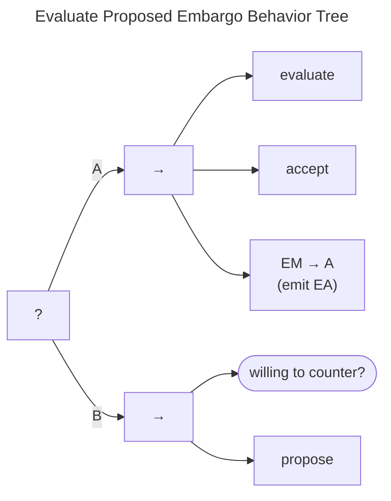

# Evaluate Proposed Embargo Behavior

The acceptance or counterproposal of an embargo is handled by the Evaluate Proposed Embargo Behavior Tree shown in the
figure below.

(A) As noted [above](em_bt.md), the same process applies to both the *Proposed* and *Revise* EM states ($q^{em} \in \{P,R\}$).
An evaluation task is followed by an accept task.
These tasks are placeholders for the actual decision-making process, which is left to individual Participants.
In both cases, acceptance leads to an EM state transition to $q^{em} \in A$ and emission of an $EA$ message.

!!! tip inline end "See also"

    - [Propose Embargo Behavior](em_propose_bt.md)

(B) On the other hand, the proposed terms may not be acceptable.
In this case, the Participant might be willing to offer a counterproposal.
The counterproposal is covered by the [propose](em_propose_bt.md) behavior.

