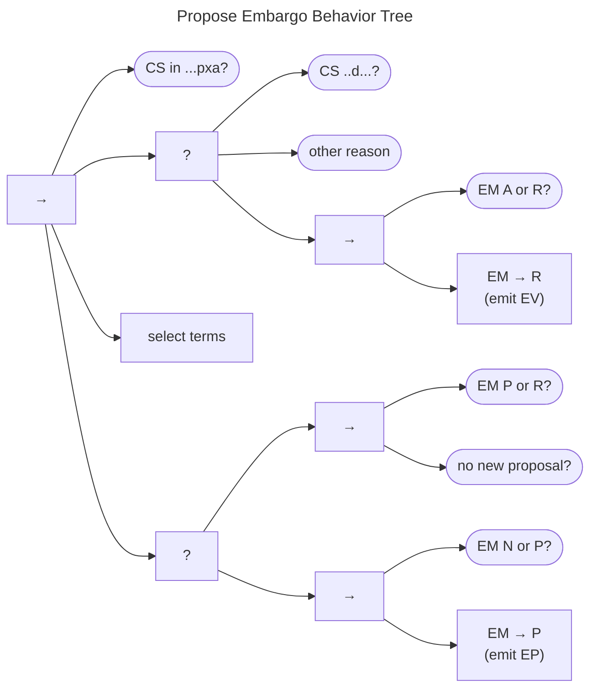

# Propose Embargo Behavior

The Propose Embargo Behavior Tree is shown in the figure below. 

It consists of a sequence that begins with a check for embargo viability as outlined in
[Negotiating Embargoes](../process_models/em/negotiating/).
Once the checks succeed, it proceeds to selecting embargo terms to propose.
Implementations of this task might simply draw from a default policy, as in 
[Default Embargoes](../process_models/em/defaults.md), or it might be a case-specific decision made by a Participant.
Embargo terms can be proposed from any of the non-*eXited* states ($q^{em} \in \{N,P,A,R\}$).
If a new or revised embargo has already been proposed, the tree then checks whether a counterproposal is desired.
Assuming it is not, no proposal is made, and the behavior succeeds.
Otherwise, proposals from state $q^{em} \in N$ emit $EP$ and transition $q^{em} \xrightarrow{p} P$, 
whereas those from $q^{em} \in A$ emit $EV$ and move to $q^{em} \xrightarrow{p} R$.
Proposals from states $q^{em} \in P$ or $q^{em} \in R$ represent counterproposals and, therefore, do not change
the EM state.
They do, however, emit $EP$ or $EV$ messages as appropriate.

