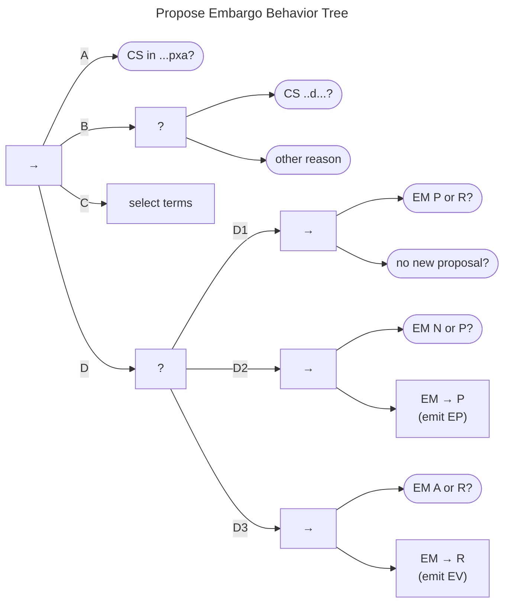

# Propose Embargo Behavior

The Propose Embargo Behavior Tree is shown in the figure below. 

!!! tip inline end "See also"

    - [Negotiate Embargoes](../process_models/em/negotiating.md)
    - [Default Embargoes](../process_models/em/defaults.md)

It consists of a sequence that begins with (A,B) a check for embargo viability as outlined in
[Negotiating Embargoes](../process_models/em/negotiating.md).

Once the checks succeed, it proceeds to (C) selecting embargo terms to propose.
Implementations of this task might simply draw from a default policy, as in 
[Default Embargoes](../process_models/em/defaults.md), or it might be a case-specific decision made by a Participant.

(D) Embargo terms can be proposed from any of the non-*eXited* states ($q^{em} \in \{N,P,A,R\}$).

(D1) If a new or revised embargo has already been proposed ($q^{em} \in \{P,R\}$, the tree then checks whether a counterproposal is desired.
Assuming it is not, no proposal is made, and the behavior succeeds.

Otherwise, (D2) proposals from state $q^{em} \in N$ emit $EP$ and transition $q^{em} \xrightarrow{p} P$, 
whereas (D3) those from $q^{em} \in A$ emit $EV$ and move to $q^{em} \xrightarrow{p} R$.

Proposals from states $q^{em} \in P$ (D2) or $q^{em} \in R$ (D3) represent counterproposals and, therefore, do not change
the EM state.
They do, however, emit $EP$ or $EV$ messages as appropriate.

