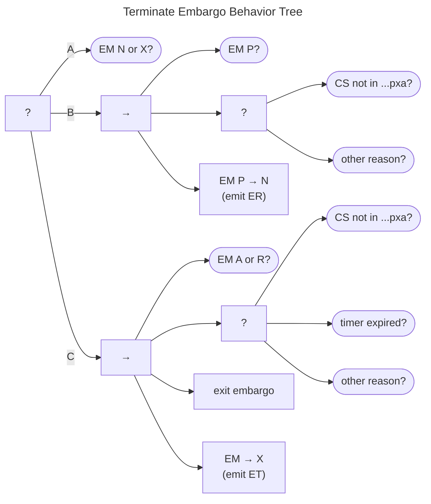

# Terminate Embargo Behavior

The Terminate Embargo Behavior Tree is shown in the diagram below.
It consists of two major behaviors depending on whether an embargo has been established or not.

(A) If the EM state is *None* or *eXited*, ($q^{em} \in \{N{,}X\}$), the tree succeeds immediately.

(B) The next node handles the scenario where no embargo has been established.
The behavior descends into a sequence that checks whether we are in $Proposed$ ($q^{em} \in P$).
If we are, we check to see if there is a reason to exit the embargo negotiation process.
One such reason is that the case state is outside the embargo "habitable zone," but there may be others that we leave
unspecified.
If any reason is found, then the proposal is rejected, the state returns to *None*, and an $ER$ message is sent.

(C) Should that branch fail, we still need to handle the situation where an embargo has already been established.
Following a confirmation that we are in either *Active* or *Revise*, we again look for reasons to exit, this time
adding the possibility of timer expiration to the conditions explicitly called out.
Terminating an existing embargo might have some other teardown procedures to be completed, which we represent as the
*exit embargo* task.
Finally, the EM state is updated to *eXited* and an $ET$ message is emitted.

!!! tip inline end "See also"

    - [Early Termination](../process_models/em/early_termination.md)
    - [Threat Monitoring Behavior](monitor_threats_bt.md)
    - [Message Handling Behavior](msg_intro_bt.md)

The Terminate Embargo Behavior Tree appears in multiple locations in the
larger tree.
We will encounter it again as a possible response to evidence collected via
[threat monitoring](monitor_threats_bt.md)
as well as in response to certain [CS or EM messages](msg_intro_bt.md)
in states when an embargo is no longer viable.
