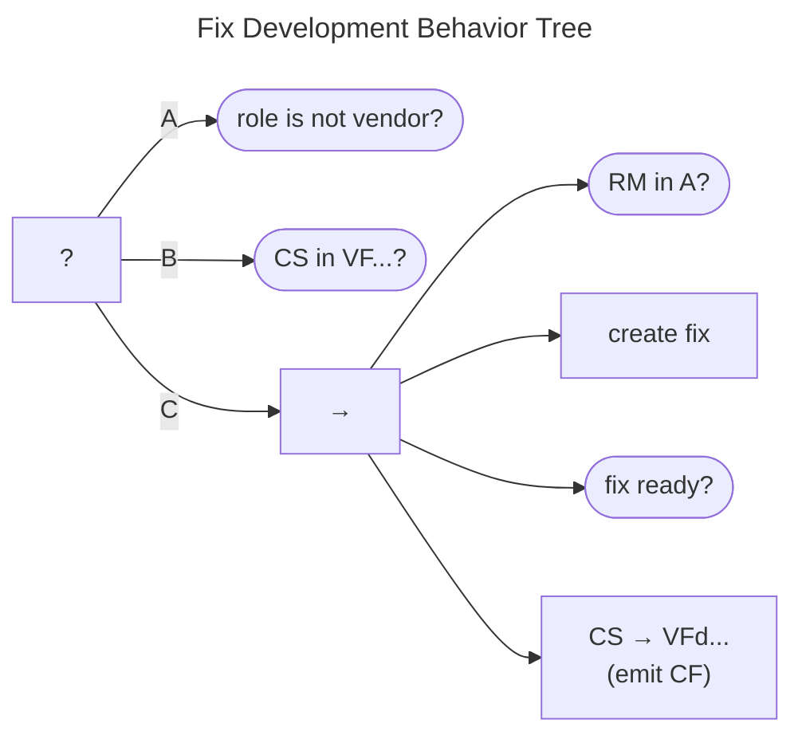

# Fix Development Behavior

## Requirements

The behavioral requirements for this tree are specified in the
[Domain Specifications](../../reference/specs/domain.md):

- [CSB-09](../../reference/specs/domain.md#csb-09) — Enter CS V (Vendor Aware)
- [CSB-10](../../reference/specs/domain.md#csb-10) — Enter CS F (Fix Ready)

!!! note "Implementation approach"

    The behavior tree diagram below illustrates one conformant implementation of these requirements.
    Implementations are not required to use behavior trees — any approach that satisfies the
    requirements above is conformant.

The Fix Development Behavior Tree is shown below.

```mermaid
---
title: Fix Development Behavior Tree
---
flowchart LR
    fb["?"]
    role_not_vendor(["role is not vendor?"])
    fb -->|A| role_not_vendor
    cs_in_VF(["CS in VF...?"])
    fb -->|B| cs_in_VF
    seq["&rarr;"]
    fb -->|C| seq
    rm_in_a(["RM in A?"])
    seq --> rm_in_a
    create_fix["create fix"]
    seq --> create_fix
    fix_ready(["fix ready?"])
    seq --> fix_ready
    cs_to_VF["CS &rarr; VFd...<br/>(emit CF)"]
    seq --> cs_to_VF
```

(A) Fix development is relegated to the Vendor role, so Non-Vendors just return *Success* since they have nothing further to do.

(B) For Vendors, if a fix is ready (i.e., the case is in $q^{cs} \in VF\cdot\cdot\cdot\cdot$), the tree returns *Success*.

(C) Otherwise, engaged Vendors ($q^{rm} \in A$) can

- create fixes
- set $q^{cs} \in Vfd\cdot\cdot\cdot \xrightarrow{\mathbf{F}} VFd\cdot\cdot\cdot$
- emit $CF$ upon completion
