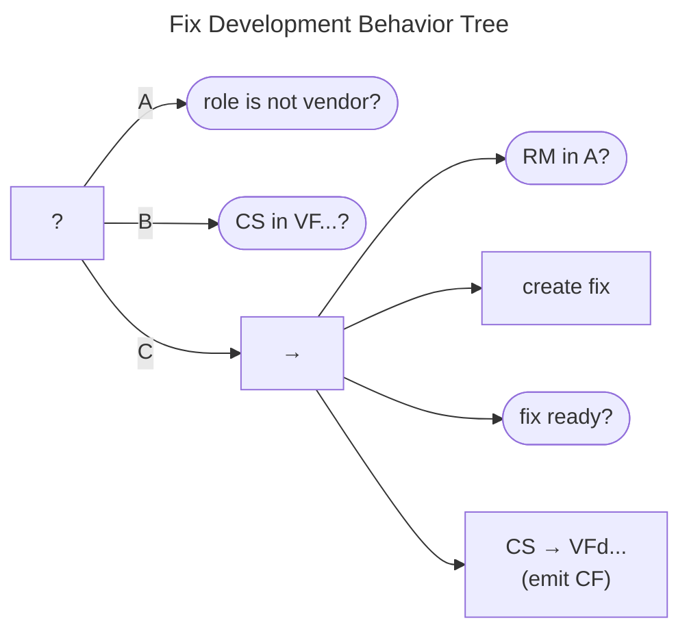

# Fix Development Behavior

The Fix Development Behavior Tree is shown below. 

(A) Fix development is relegated to the Vendor role, so Non-Vendors just return *Success* since they have nothing further to do.

(B) For Vendors, if a fix is ready (i.e., the case is in $q^{cs} \in VF\cdot\cdot\cdot\cdot$), the tree returns *Success*.

(C) Otherwise, engaged Vendors ($q^{rm} \in A$) can 

- create fixes
- set $q^{cs} \in Vfd\cdot\cdot\cdot \xrightarrow{\mathbf{F}} VFd\cdot\cdot\cdot$ 
- emit $CF$ upon completion
