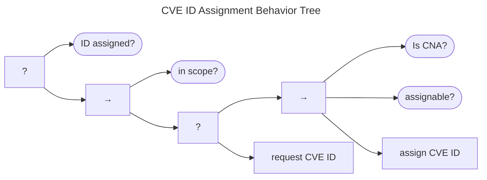

# CVE ID Assignment Behavior

Many CVD practitioners want to assign identifiers to the vulnerabilities they coordinate.
The most common of these is a CVE ID, so we provide an example CVE ID Assignment Behavior Tree, shown below.

While this tree is constructed around the [CVE ID assignment process](https://www.cve.org/About/Process),
it could be easily adapted to any other identifier process as well.

The goal is to end with an ID assigned.
If that has not yet happened, the first check is whether the vulnerability is in scope for an ID assignment.
If it is, the Participant might be able to assign IDs directly, assuming they are a [CVE Numbering Authority](https://www.cve.org/ProgramOrganization/CNAs)
([CNA](https://www.cve.org/ProgramOrganization/CNAs)) and the vulnerability meets the [criteria
for assigning an ID](https://www.cve.org/ResourcesSupport/AllResources/CNARules#section_7_assignment_rules).

Otherwise, if the Participant is not a CNA, they will have to [request an ID from a CNA](https://www.cve.org/About/Process).

Should both assignment branches fail, the behavior fails. 
Otherwise, as long as one of them succeeds, the behavior succeeds.

