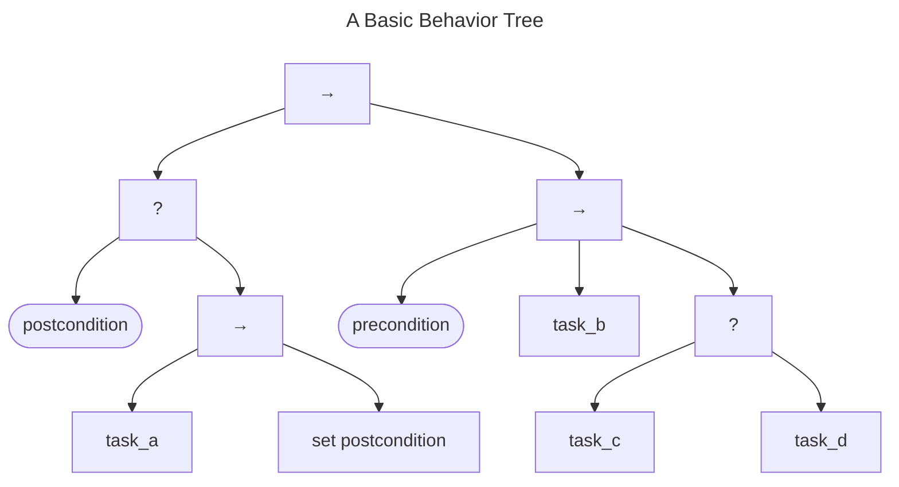
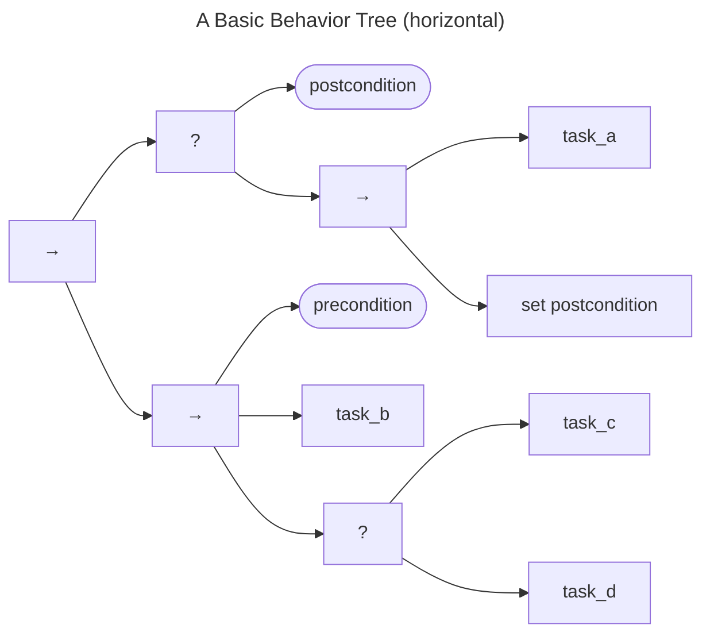

# Modeling an MPCVD AI Using Behavior Trees {#ch:behavior_trees}

With the formal definition of our proposed MPCVD protocol behind us, we now turn our
attention to reflect on one of many possible paths toward
implementation. We find that Behavior Trees have a number of desirable
properties when it comes to automating the kinds of complex behaviors
our protocol demands.

Behavior Trees are a way of designing and programming hierarchical
behaviors{== [@colledanchise2017behavior] ==}. They originated in the computer
gaming industry to develop realistic AIs to control NPCs{== [@mateas2002behavior; @isla2005halo] ==} in
games. More recently, Behavior Trees have been used in robotics to
create adaptive behaviors using autonomous AI
agents {== [@ogren2012increasing; @bagnell2012integrated] ==}. Behavior Trees
offer a high potential for automating complex tasks. Agent processes can
be modeled as sets of behaviors (pre-conditions, actions, and
post-conditions) and the logic that joins them. Behavior Trees offer a
way to organize and describe agent behaviors in a straightforward,
understandable way.

In this section, we use Behavior Trees as a method for describing
MPCVD Participant activities and their interactions with the [formal protocol](/reference/formal_protocol).
These behaviors map approximately to the activities described in the [*CVD Guide*](https://vuls.cert.org/confluence/display/CVD)
(e.g., validate report, prioritize report, create fix, publish report, publish fix, deploy fix).

If Behavior Trees were merely a notational convention, they would
already have been useful enough to include here to structure the
high-level business logic of the MPCVD protocol. But they also offer a way to
prototype software agents that reflect the activities of
CVD Participants.
Because Behavior Trees are inherently hierarchical, they are composable.
Both conditions and actions can be composed into small task-oriented
behaviors, which can, in turn, be composed to represent more complex
agent behaviors. As a result, independent agents using Behavior Trees
can be composed into multi-agent behaviors that achieve goals.

##### A Brief Introduction to Behavior Tree Notation.

Behavior Trees consist of a hierarchy of nodes represented as a
Directed Acyclic Graph (DAG).
A Behavior Tree execution always begins at the root node, and execution is passed
along the tree by *ticking* each child node according to the logic built
into the tree. When *ticked*, each node does its job and returns one of
three statuses: *Success*, *Failure*, or *Running*. A full introduction
to Behavior Trees can be found in Colledanchise and Ögren's book
*Behavior Trees in Robotics and AI: An
Introduction*{== [@colledanchise2017behavior] ==}.

!!! info "Behavior Tree Node Types"

    | Node Type | Shape or Symbol       | Description |
    | :--- |:----------------------| :--- |
    | Root | any control flow type | has no parent nodes, has one or more child nodes, and can be of any of the control-flow types. |
    | Condition | rounded oval          | does not change the state of the world, has no child nodes, and returns only *Success* or *Failure*. |
    | Task | rectangle             | has no child nodes; performs a task, which might change the state of the world; and returns *Success*, *Failure*, or *Running*. |
    | Sequence | &rarr;                | ticks each child node, returning the last *Success* or the first *Failure*, or *Running* if a child returns *Running*. |
    | Fallback | ?                     | ticks each child node, returning the first *Success* or the last *Failure*, or *Running* if a child returns *Running*. |
    | Loop | &#8634;               | repeatedly ticks child nodes until an exit condition is met. |
    | Parallel | &#8649;               | ticks all child nodes simultaneously, and returns *Success* when $m$ of $n$ children have returned *Success*. |

A basic Behavior Tree is shown below.
When a tree is presented in the vertical orientation, each node's children should be read left to right.
In the example below, we see two motifs that come up through the remainder of this section.
On the left side is a Fallback node ($\boxed{?}$), which short-circuits to *Success* when the $postcondition$ is already met.
Otherwise, some activity will occur in $task_a$ and, assuming that it succeeds, the $postcondition$ is set.
As a result, the fallback node ensures that *Success* means that the $postcondition$ is met.

On the right side is a sequence ($\boxed{\rightarrow}$) that hinges on a
$precondition$ being met prior to some set of actions being taken.
Assuming the $precondition$ is met, $task_b$ fires and, assuming it
succeeds execution, proceeds to another fallback node. This fallback
node represents a set of tasks in which one only needs to succeed for
the fallback to return *Success*. If $task_c$ succeeds, then $task_d$
does not run.

Behavior Trees can sometimes be wider than they are tall, so we sometimes
display them in a horizontal orientation to save space. The
semantics remain the same, but each node's children should be read top-to-bottom
rather than left-to-right. The same tree as above is shown below in
horizontal form.

Behavior Trees are composable&mdash;that is, a task node in one tree can be replaced with a more refined Behavior Tree in another.
We leverage this feature throughout the remainder of this chapter to describe an agent model for an MPCVD Participant
as a set of nested Behavior Trees that reflect the protocol described in the previous chapters.

