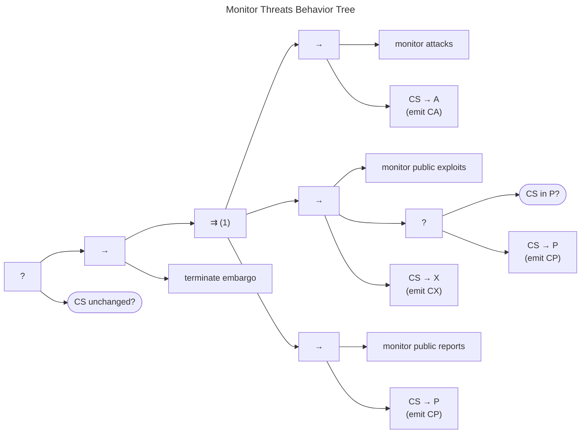

# Monitor Threats Behavior Tree

The Monitor Threats Behavior Tree is shown below.

For our purposes, monitoring consists of a set of parallel tasks, any one of which can lead to embargo termination.
The three conditions of interest are taken straight from the [embargo exit criteria](../topics/process_models/em/early_termination/).

-   If attacks are observed, the $q^{cs} \xrightarrow{\mathbf{A}} A$ transition occurs, and a $CA$ message is emitted.

-   If a public exploit is observed, the $q^{cs} \xrightarrow{\mathbf{X}} X$ transition occurs, and a $CX$ message is emitted.
    In the special case where the exploit is made public prior to the vulnerability itself being made public,[^1]
    there is an additional $q^{cs} \xrightarrow{\mathbf{P}} P$ transition and $CP$ emission.

-   Finally, if the vulnerability information has been made public, then the $q^{cs} \xrightarrow{\mathbf{P}} P$ and emits $CP$.

In the event that one or more of these events is detected, the [Terminate Embargo Behavior Tree](../topics/behavior_logic/em_terminate_bt/) is triggered.

There are many other good reasons to monitor and maintain awareness of cybersecurity threats.
The behavior shown here is intended as a minimal set of things that CVD Participants should watch out for in the
course of performing their CVD practice.

See also: [Terminate Embargo Behavior Tree](../topics/behavior_logic/em_terminate_bt/)

[^1]: Corresponding to a Type 3 Zero Day Exploit as defined in {== §6.5.1 of
    [@householder2021state] ==}
