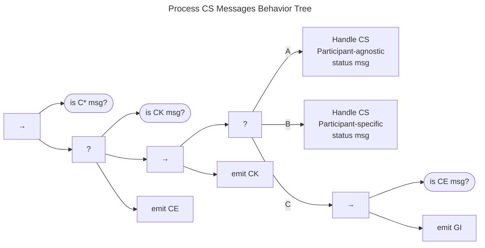
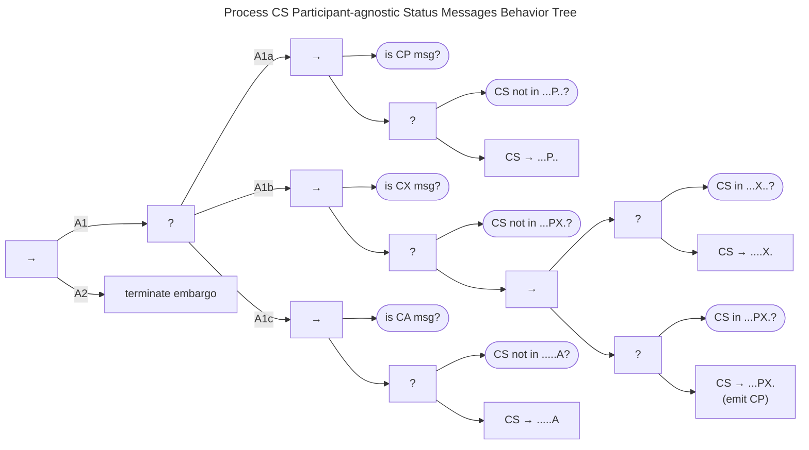
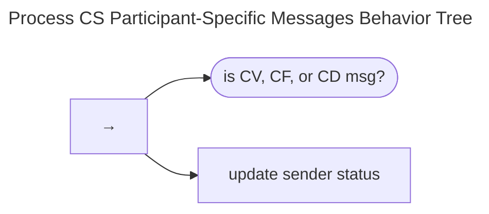

# Process CS Messages Behavior {#sec:process_cs_messages_bt}

The Process CS Messages Behavior Tree is shown below.

We are still working through the children of [Receive Messages](msg_intro_bt.md) behavior tree.
And as we've come to expect, a precondition check leads to a fallback node in which CS acknowledgement
messages (*CK*) receive no further attention and return *Success*.

The main CS message-handling sequence comes next, with all matching incoming messages resulting in emission of an
acknowledgment message (*CK*).
These messages are presented as sub-trees below:

- (A) [Participant-agnostic CS Status Messages](#participant-agnostic-cs-status-messages)
- (B) [Participant-Specific CS Status Messages](#participant-specific-cs-status-messages)

Returning from handling regular CS messages, the tree next (C) handles error messages (*CE*) with the familiar motif
of an error (*CE*) triggering a general inquiry (*GI*) to seek resolution.

Finally, the tree has handled all expected messages, so anything else would result in an error
condition and emission of a *CE* message accordingly.

## Participant-agnostic CS Status Messages

The tree first handles messages indicating a Participant-agnostic CS change.

(A1a) Information that the vulnerability has been made public (*CP*) is met
with a transition to the *Public Aware* state in the CS model when
necessary.

(A1b) Similarly, information that an exploit has been made public
forces both the **X** and **P** transitions, as necessary.
Because the **P** transition, should it occur in response to a
*CX* message, represents possibly new information to the case, it
triggers the emission of a *CP* message to convey this information to
the other Participants.

(A1c) Likewise, a message indicating attacks underway
triggers the **A** transition.

Again, we note that any of the **P**, **X**, or
**A** transitions in the CS model imply that no new embargo should be
entered, and any existing embargo should be terminated. Hence, the
sequence described in the previous paragraph leads to the [embargo
termination tree](em_terminate_bt.md).

## Participant-Specific CS Status Messages

Next, we see that messages indicating *Vendor Awareness* (*CV*), *Fix
Readiness* (*CF*), and *Fix Deployed* (*CD*) are treated as mere status
updates for the Participant because they are participant-specific.
They are recognized and acknowledged but trigger no further action directly.

Recall from
[Model Interactions](../process_models/model_interactions/index.md) and
the [Formal Protocol](../../reference/formal_protocol/index.md) that the
$vfd\cdot\cdot\cdot \rightarrow \dots \rightarrow VFD\cdot\cdot\cdot$ portion of the
CS model is unique to each Vendor Participant, and similarly that the
$\cdot\cdot d \cdot\cdot\cdot \rightarrow \cdot\cdot D \cdot\cdot\cdot$ portion is unique to
each Participant in the Deployer role.
Therefore, messages representing another Participant's status change for this portion of the
CS do not directly affect the receiving Participant's status.
This is not to say that the Participant might not choose to take some action based on their knowledge of a
Vendor's (or Deployer's) status.
Rather, such follow-up would be expected to occur as part of the Participant's [*do work* process](do_work_bt.md).
