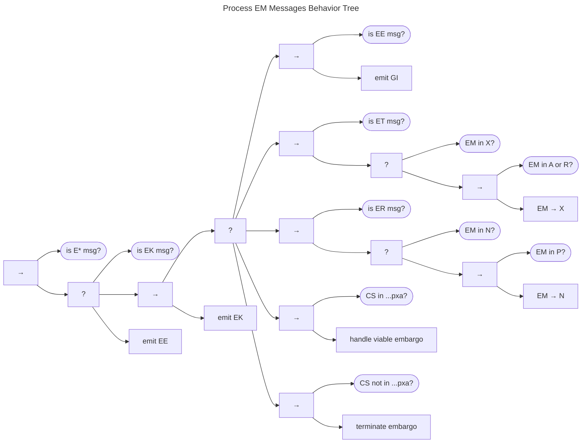
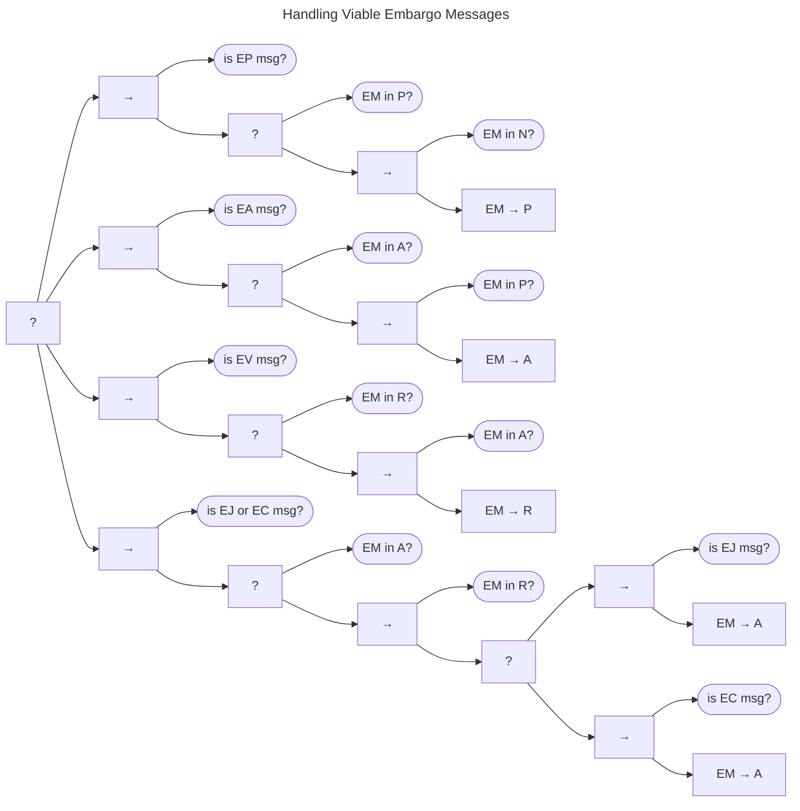

# Process EM Messages Behavior {#sec:process_em_messages_bt}

The Process EM Messages Behavior Tree is shown below.

It is a child of the fallback node started in [Receiving Messages Behavior]((./msg_intro_bt.md).
A precondition check for EM message types is followed by a fallback node. 
EM acknowledgment messages (_EK_) receive no further attention and return *Success*.

## Messages That Lead to a Simple Acknowledgment.

Next is a branch handling all the messages that will result in a simple acknowledgment (_EK_). 
First, we handle embargo error messages (_EE_), which additionally trigger a general inquiry (_GI_) message to attempt
to resolve the problem. 
Second are embargo termination messages (_ET_).
If the Participant is already in the EM *eXited* state (_X_), no further action is taken (aside from the _EK_).
Otherwise, if the Participant is in either *Active* or *Revise* EM states, the _ET_ message triggers a state
transition $q^{em} \xrightarrow{t} X$.
Embargo rejections are handled next in a simple sequence that returns the state from *Proposed* to *None*.

### Handling Viable Embargo Messages

The final chunk of the simple acknowledge branch handles EM messages received when the case state permits embargo viability
($q^{cs} \in \cdot\cdot\cdot pxa$).
A variety of actions can be taken in this case state, as shown in the next diagram.

An embargo proposal (_EP_)
results in either a move from *None* to *Proposed* or stays in
*Proposed*, if that was already the case. An embargo acceptance (_EA_)
transitions from *Proposed* to *Active*. Similar to the _EP_ behavior,
an embargo revision proposal (_EV_) either moves from *Active* to
*Revise* or stays in *Revise*, as appropriate. Finally, we deal with
revision rejection (_EJ_) or acceptance (_EC_) when in the *Revise*
state. Climbing back up the tree, we see that *Success* in any of the
branches in this or the previous paragraph results in an acknowledgment
message _EK_.

## Messages That Require More than a Simple Acknowledgment.

Returning to the the tree at the top of the page, we come to a branch focused on
handling EM messages when an embargo is no longer viable---in other words, when the case has
reached a point where attacks are occurring, or either the exploit or the vulnerability has been made public
($q^{cs} \not \in \cdot\cdot\cdot pxa$).
This branch takes us to the [Terminate Embargo tree]((./em_terminate_bt.md), which may lead to
other messages being emitted.

Finally, back at the end of the tree at the top of the page, when no other branch has succeeded,
we emit an embargo error (_EE_) message to relay the failure.

