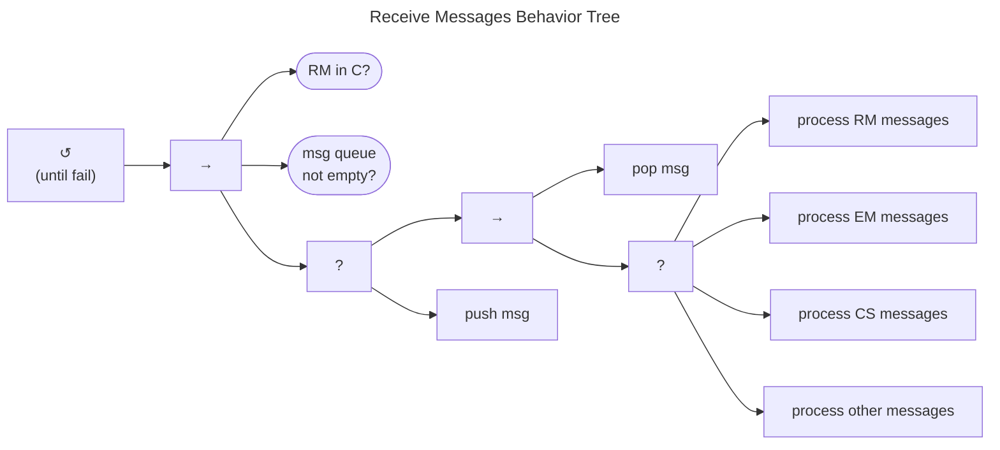

# Receiving and Processing Messages Behavior

Now we return to the [CVD Behavior Tree]((./cvd_bt.md) to pick up the last unexplored branch, Receive Messages.
The Receive Messages Behavior Tree is shown below.

!!! tip inline end "All models are wrong, some models are useful"

    At this level, the behavior tree is modeling a basic queue servicing loop.
    There is nothing particularly special about this loop, and we probably wouldn't recommend 
    implementing a queue servicing loop with a behavior tree anyway. Instead, we're using this loop to represent
    that there is _some_ process by which individual messages are received and processed.
    The important part of this tree are the message-type specific behaviors that follow.

The tree represents a loop that continues until all currently received messages have been processed.
Each iteration checks for unprocessed messages and handles them.

First, we encounter a case closure check. We assume that messages to
existing cases will have a case ID associated with all messages about
that case and that new report submissions will not have a case ID
assigned yet, implying they are in the RM *Start* state ($q^{rm} \in S$).
Therefore, new reports will pass this check every time. However,
messages received on an already *Closed* case will short-circuit here
and take no further action.

Assuming the message is regarding a new or unclosed case and the message
has not yet been processed, each message type is handled by a
process-specific Behavior Tree, which we discuss in the following
sections. Although each process-specific behavior is described in a
subsection and shown in its own figure, they are all part of the same
fallback node shown here.

