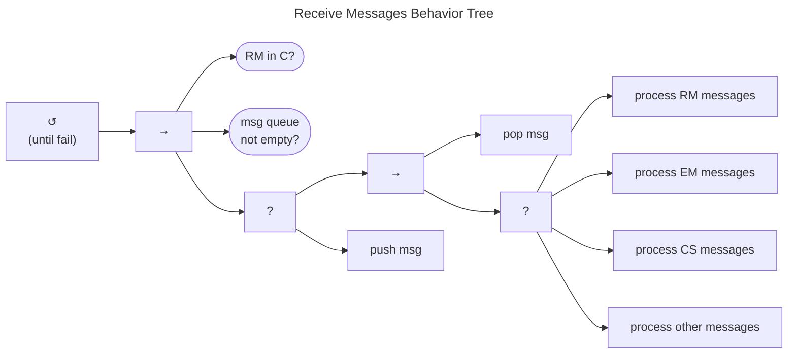

# Receiving and Processing Messages Behavior

## Requirements

The behavioral requirements for the message-receive behaviors are specified in the
[Protocol Specifications](../../reference/specs/protocol.md):

**Report Management Messages** ([RMB](../../reference/specs/protocol.md#rmb)):

- [RMB-01](../../reference/specs/protocol.md#rmb-01) — Receive RS (Report Submission)
- [RMB-02](../../reference/specs/protocol.md#rmb-02) — Receive RI (Report Invalid)
- [RMB-03](../../reference/specs/protocol.md#rmb-03) — Receive RV (Report Valid)
- [RMB-04](../../reference/specs/protocol.md#rmb-04) — Receive RD (Report Deferred)
- [RMB-05](../../reference/specs/protocol.md#rmb-05) — Receive RA (Report Accepted)
- [RMB-06](../../reference/specs/protocol.md#rmb-06) — Receive RC (Report Closed)
- [RMB-07](../../reference/specs/protocol.md#rmb-07) — Receive RE (Report Error)
- [RMB-08](../../reference/specs/protocol.md#rmb-08) — Receive RK (Report Acknowledgment)

**Embargo Management Messages** ([EMB](../../reference/specs/protocol.md#emb)):

- [EMB-01](../../reference/specs/protocol.md#emb-01) — Receive EP (Embargo Proposed)
- [EMB-02](../../reference/specs/protocol.md#emb-02) — Receive EA (Embargo Accepted)
- [EMB-03](../../reference/specs/protocol.md#emb-03) — Receive EV (Embargo Revision Proposed)
- [EMB-04](../../reference/specs/protocol.md#emb-04) — Receive EJ (Embargo Revision Rejected)
- [EMB-05](../../reference/specs/protocol.md#emb-05) — Receive EC (Embargo Revision Accepted)
- [EMB-06](../../reference/specs/protocol.md#emb-06) — Receive ER (Embargo Rejected)
- [EMB-07](../../reference/specs/protocol.md#emb-07) — Receive ET (Embargo Terminated)
- [EMB-08](../../reference/specs/protocol.md#emb-08) — Receive EE (Embargo Error)
- [EMB-09](../../reference/specs/protocol.md#emb-09) — Receive EK (Embargo Acknowledgment)

**Case State Messages** ([CSB](../../reference/specs/protocol.md#csb)):

- [CSB-01](../../reference/specs/protocol.md#csb-01) — Receive CV (Vendor Aware)
- [CSB-02](../../reference/specs/protocol.md#csb-02) — Receive CF (Fix Ready)
- [CSB-03](../../reference/specs/protocol.md#csb-03) — Receive CD (Fix Deployed)
- [CSB-04](../../reference/specs/protocol.md#csb-04) — Receive CP (Public Aware)
- [CSB-05](../../reference/specs/protocol.md#csb-05) — Receive CX (Exploit Public)
- [CSB-06](../../reference/specs/protocol.md#csb-06) — Receive CA (Attacks Observed)
- [CSB-07](../../reference/specs/protocol.md#csb-07) — Receive CE (CS Error)
- [CSB-08](../../reference/specs/protocol.md#csb-08) — Receive CK (CS Acknowledgment)

!!! note "Implementation approach"

    The behavior tree diagram below illustrates one conformant implementation of these requirements.
    Implementations are not required to use behavior trees — any approach that satisfies the
    requirements above is conformant.

Now we return to the [CVD Behavior Tree](cvd_bt.md) to pick up the last unexplored branch, Receive Messages.
The Receive Messages Behavior Tree is shown below.

```mermaid
---
title: Receive Messages Behavior Tree
---
flowchart LR
    loop["#8634;<br/>(until fail)"]
    seq["&rarr;"]
    loop --> seq
    rm_in_C(["RM in C?"])
    seq --> rm_in_C
    msg_avail(["msg queue<br/>not empty?"])
    seq --> msg_avail
    fb["?"]
    seq --> fb
    seq2["&rarr;"]
    fb --> seq2
    pop_msg["pop msg"]
    seq2 --> pop_msg
    fb2["?"]
    seq2 --> fb2
    proc_rm_msg["process RM messages"]
    fb2 --> proc_rm_msg
    proc_em_msg["process EM messages"]
    fb2 --> proc_em_msg
    proc_cs_msg["process CS messages"]
    fb2 --> proc_cs_msg
    proc_other_msg["process other messages"]
    fb2 --> proc_other_msg
    push_msg["push msg"]
    fb --> push_msg
    
```

!!! tip inline end "All models are wrong, some models are useful"

    At this level, the behavior tree is modeling a basic queue servicing loop.
    There is nothing particularly special about this loop, and we probably wouldn't recommend 
    implementing a queue servicing loop with a behavior tree anyway. Instead, we're using this loop to represent
    that there is _some_ process by which individual messages are received and processed.
    The important part of this tree are the message-type specific behaviors that follow.

The tree represents a loop that continues until all currently received messages have been processed.
Each iteration checks for unprocessed messages and handles them.

First, we encounter a case closure check. We assume that messages to
existing cases will have a case ID associated with all messages about
that case and that new report submissions will not have a case ID
assigned yet, implying they are in the RM *Start* state ($q^{rm} \in S$).
Therefore, new reports will pass this check every time. However,
messages received on an already *Closed* case will short-circuit here
and take no further action.

Assuming the message is regarding a new or unclosed case and the message
has not yet been processed, each message type is handled by a
process-specific Behavior Tree, which we discuss in the following
sections. Although each process-specific behavior is described in a
subsection and shown in its own figure, they are all part of the same
fallback node shown here.
