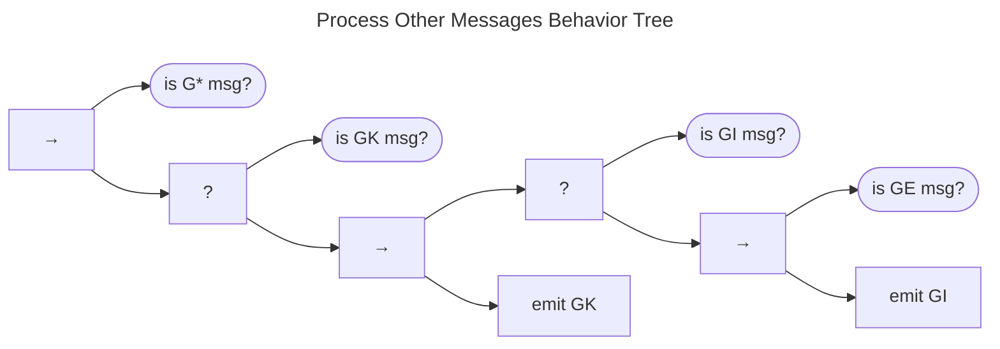

# Process Other Messages Behavior {#sec:process_gen_messages_bt}

The Process Other Messages Behavior Tree is shown below.

This tree represents the final chunk of the fallback node in the [Receive Messages Behavior](msg_intro_bt.md). 
And here, for the final time, we see a message type check and that general acknowledgment messages (_GK_)
receive no further attention and return *Success*. 
General inquiries (_GI_) get at least an acknowledgment, with any follow-up to be handled by [*do work*](do_work_bt.md).
As usual, errors (_GE_) also trigger follow-up inquiries (_GI_) in the interest of resolution.

