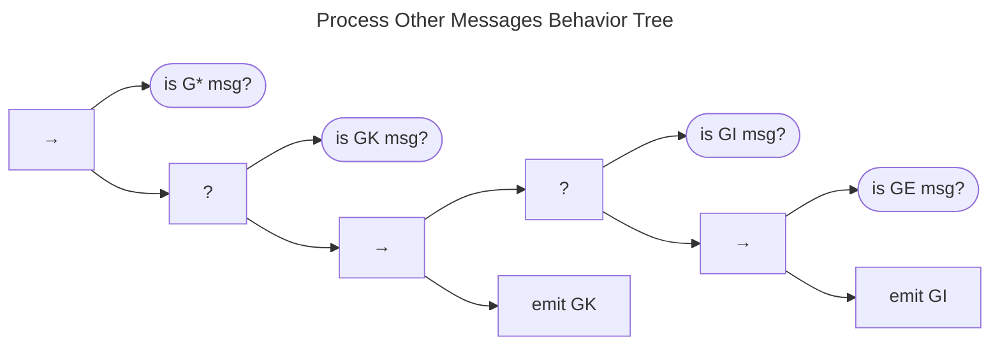

# Process Other Messages Behavior

The Process Other Messages Behavior Tree is shown below.

!!! note "Legacy design diagram"

    The diagram on this page reflects the simulator-era design from `vultron/bt/` and may not
    match the current implementation in `vultron/core/behaviors/`.
    See the [Behaviors Reference](../../reference/behaviors/index.md) for
    auto-generated documentation from the current implementation.

!!! note "No normative spec group"

    This behavior has no corresponding normative RMB, EMB, or CSB spec group in the
    [Protocol Specifications](../../reference/specs/protocol.md).

```mermaid
---
title: Process Other Messages Behavior Tree
---
flowchart LR
    seq["&rarr;"]
    is_G_msg(["is G* msg?"])
    seq --> is_G_msg
    fb["?"]
    seq --> fb
    is_GK_msg(["is GK msg?"])
    fb --> is_GK_msg
    seq2["&rarr;"]
    fb --> seq2
    fb2["?"]
    seq2 --> fb2
    is_GI_msg(["is GI msg?"])
    fb2 --> is_GI_msg
    gi_seq["&rarr;"]
    fb2 --> gi_seq
    is_GE_msg(["is GE msg?"])
    gi_seq --> is_GE_msg
    ge_emit_GI["emit GI"]
    gi_seq --> ge_emit_GI
    gi_emit_GK["emit GK"]
    seq2 --> gi_emit_GK
```

This tree represents the final chunk of the fallback node in the [Receive Messages Behavior](msg_intro_bt.md).
And here, for the final time, we see a message type check and that general acknowledgment messages (*GK*)
receive no further attention and return *Success*.
General inquiries (*GI*) get at least an acknowledgment, with any follow-up to be handled by [*do work*](do_work_bt.md).
As usual, errors (*GE*) also trigger follow-up inquiries (*GI*) in the interest of resolution.
