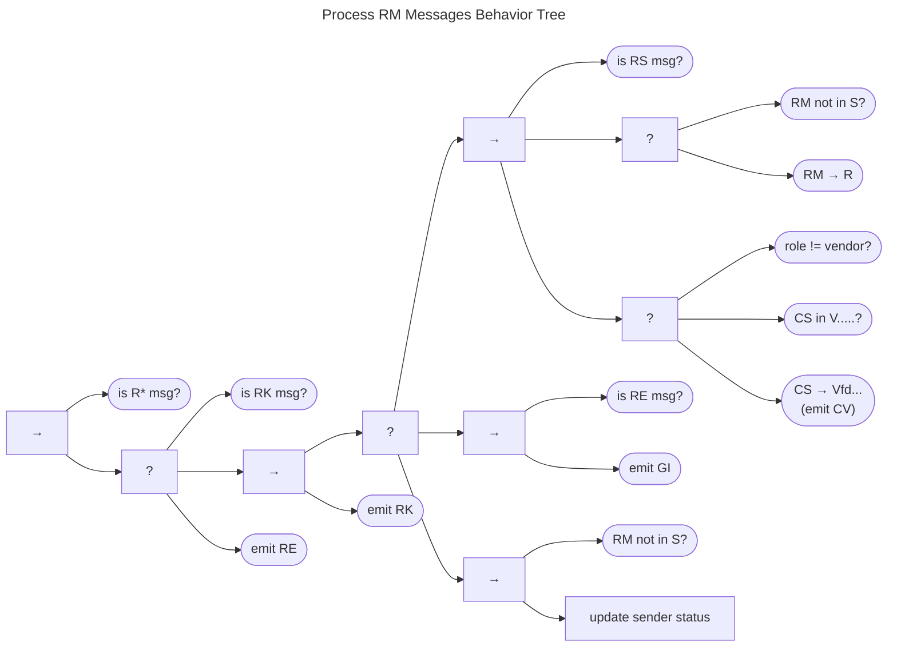

# Process RM Messages Behavior {#sec:process_rm_messages_bt}

The Process RM Messages Behavior Tree is shown below.

This tree is a child of the fallback node started in [Receiving Messages Behavior](/topics/behavior_logic/msg_intro_bt/).
Beginning with a precondition check for any RM message type, the tree proceeds to a fallback node.
RM acknowledgment messages (_RK_) receive no further attention and return *Success*.

Next comes the main RM message processing sequence.
A fallback node covers three major cases:

-   First comes a sequence that handles new reports (_RS_ when
    $q^{rm} \in S$). This branch changes the recipient's
    RM state
    regardless of the Participant's role. If the Participant happens to
    be a Vendor and the Vendor was previously unaware of the
    vulnerability described by the report, the Vendor would also note
    the CS
    transition from $q^{cs} \in vfd \xrightarrow{\mathbf{V}} Vfd$ and
    emit a corresponding _CV_ message.

-   Next, we see that an RM Error (_RE_) results in the emission
    of a general inquiry (_GI_) for Participants to sort out what the
    problem is, along with an _RK_ to acknowledge receipt of the error.

-   Finally, recall that the RM process is unique to each
    CVD
    Participant, so most of the remaining RM messages are simply informational
    messages about other Participants' statuses that do not directly
    affect the receiver's status. Therefore, if there is already an
    associated case ($q^{rm} \not\in S$), the recipient might update
    their record of the sender's state, but no further action is needed.

For all three cases, an _RK_ message acknowledges receipt of the
message. Any unhandled message results in an _RE_ response, indicating
an error.

